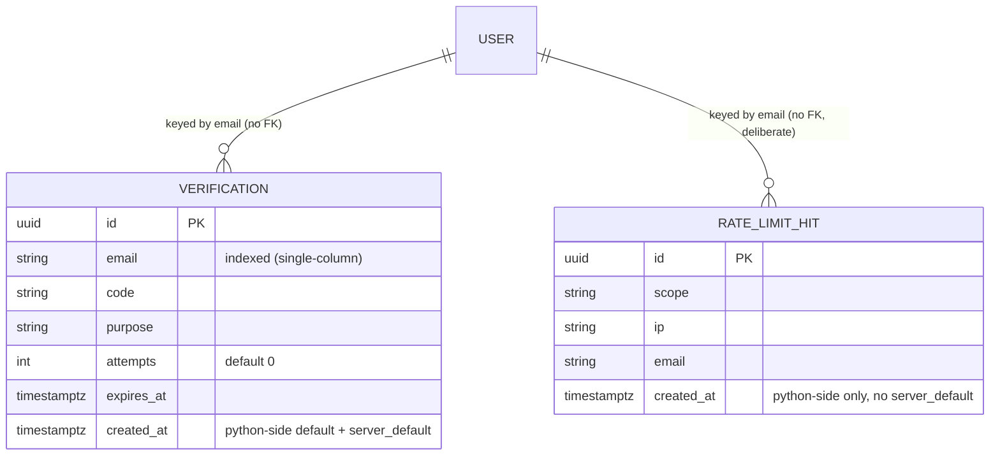
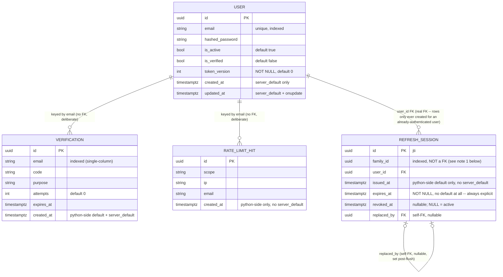
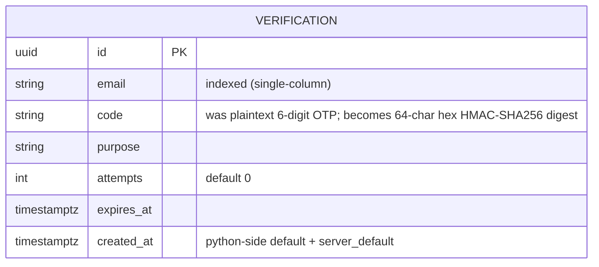

# api-fa-backend (PRJ-003) — Objective Dependency Graph

Project: PRJ-003 (`projects/api-fa-backend`). Execution mode: **Semi-Auto** (3 gates per objective,
per CLAUDE.md). Type: backend-only reusable auth service — no `uiux-designer`/Pencil deliverable
in any objective's Phase 1 gate (no UI of its own).

**Goal:** turn the cloned FastAPI auth starter into a hardened, fully-tested reference block that
other projects can fork with confidence ("bloque hiperseguro").

**Tech stack (inherited from existing code, not re-litigated):** FastAPI, SQLAlchemy 2.0 async +
PostgreSQL/asyncpg, JWT via python-jose, passlib[bcrypt], Pydantic v2.

## Phase 0 — Retroactive discovery: Done (2026-08-21)

Before this graph existed, the repo was audited as-is (it predates this workflow — cloned with
code already in place, not built objective-by-objective). Artifacts, reusable as Phase 1 inputs
for the objectives below instead of being re-derived:
- `docs/security/audit-report.md` — full SAST/threat-model-equivalent audit (14 findings: 2
  Critical, 2 High, 6 Medium, 4 Low) by `security-specialist`.
- `docs/test-gap-analysis.md` — test coverage gap analysis (current coverage: 0%) by `qa-engineer`.

Every objective below traces back to specific findings in those two files instead of restating
them — read the finding number cited, don't take the one-line summary here as the full spec.

## Graph

```
[OBJ-000] Test Infrastructure Bootstrap
   ├── [OBJ-001] Critical Auth Hardening (CRITICAL)
   │      ├── [OBJ-002] Session & Token Lifecycle (HIGH)
   │      └── [OBJ-003] Data & Transport Hardening (MEDIUM)
   ├── [OBJ-004] HTTP Security Baseline (MEDIUM)
   ├── [OBJ-005] Email Verification Flow (MEDIUM)
   └── [OBJ-006] Migrations & Supply Chain Hardening (LOW)

[OBJ-007] Registration Enumeration Policy Decision (LOW) — blocked on a product decision from
the user, not on any other objective's code. See its row below.
```

## Active Objectives Status

| ID | Description | Assigned Agent(s) | Status | Dependencies | Traces to |
|---|---|---|---|---|---|
| OBJ-000 | pytest + pytest-asyncio + httpx AsyncClient + test-DB override of `get_db` + user factory | qa-engineer | **Done (2026-08-21)** | None | test-gap-analysis.md §"Infraestructura base" |
| OBJ-001 | Fix JWT type confusion (refresh usable as access token); OTP: `secrets`-based generation + attempt lockout + rate limiting; `SECRET_KEY` min-length/placeholder validation | business-analyst → solution-architect ∥ security-specialist → qa-engineer → developer | **CLOSED (2026-08-21) — Gate 3 unanimous PASS (qa-engineer, security-specialist, database-architect)** | OBJ-000 | audit-report.md #1, #2, #4 |
| OBJ-002 | `/logout` + revocation store; refresh-token rotation + reuse detection; `token_version` invalidation on password reset | business-analyst → solution-architect → qa-engineer → developer | **CLOSED (2026-08-23) — Gate 3 unanimous PASS (qa-engineer, security-specialist, database-architect)** | OBJ-001 (done) | audit-report.md #3 |
| OBJ-003 | Hash OTP at rest (HMAC); enforce TLS to PostgreSQL; constant-time login/forgot-password (timing side-channel); **+picked up from OBJ-002 Gate 3 SAST review: latency-parity fix for the low-severity JWT-signature-validity timing leak on `/auth/logout`** | solution-architect → database-architect ∥ qa-engineer → developer | **CLOSED (2026-08-23) — Gate 3 unanimous PASS (qa-engineer, security-specialist, database-architect)** | OBJ-001 (done) | audit-report.md #5 (timing side-channel), #7 (OTP plaintext), #8 (no TLS) — **note:** this row's own citation previously listed these as #5=OTP/#7=TLS/#8=timing, transposed relative to `audit-report.md`'s actual numbering; corrected here, see `obj-003-design-notes.md` §0 |
| OBJ-004 | CORS middleware; security headers (HSTS/X-Frame-Options/CSP/nosniff); gate `/docs`+`/redoc`+`/openapi.json` by `ENVIRONMENT`; structured auth-event logging; remove OTP debug `print`; **+backlog: rate limiter's `client_ip()` needs `X-Forwarded-For`/proxy support (MEDIUM, from OBJ-001 Gate 3)** | solution-architect → qa-engineer → developer | Not Started | OBJ-000 | audit-report.md #9, #10, #13 |
| OBJ-005 | Real `/verify-email` flow; enforce `is_verified` at login (policy: block or warn — confirm with user at this objective's gate 1); pluggable email-sender abstraction replacing the `print` mock | business-analyst → solution-architect → qa-engineer → developer | Not Started | OBJ-000 | audit-report.md #11 |
| OBJ-006 | Replace `Base.metadata.create_all` with real Alembic migrations; pin `requirements.txt` + lockfile; `pip-audit`/`safety` in CI; separate DB roles (DDL vs. DML); **+backlog from OBJ-001 Gate 3: scheduled cleanup job for `rate_limit_hits` (unbounded growth, LOW), composite index `(email, purpose, expires_at)` on `verifications`, row-locking/atomic-UPDATE hardening for the OTP-lockout and rate-limit TOCTOU gaps (LOW, bounded overshoot only)**; **+backlog from OBJ-002 Gate 3: scheduled cleanup job for `refresh_sessions` (unbounded growth, LOW — retention floor must be ≥ `REFRESH_TOKEN_EXPIRE_DAYS`, not a short window like `rate_limit_hits`'s, to preserve reuse-detection integrity), explicit `ON DELETE CASCADE`/`ON DELETE SET NULL` FK behavior for `refresh_sessions.user_id`/`replaced_by` (currently undeclared, defaults to NO ACTION — must land before the cleanup job or purges will hit FK violations), composite index `(family_id, revoked_at)` on `refresh_sessions` (LOW, optional)** | database-architect → devops-engineer | Not Started | OBJ-000 | audit-report.md #12, #14 |
| OBJ-007 | Decide `/register` enumeration behavior: keep explicit "email exists" (documented accepted risk) vs. generic response matching `/forgot-password`'s pattern | **user decision required**, then developer | Not Started | None (blocked on product decision, not code) | audit-report.md #6 |

## OBJ-001 — Phase 1 deliverables (2026-08-21)

- `docs/requirements/obj-001-critical-auth-hardening.md` (business-analyst) — 3 user stories, 21
  Gherkin scenarios covering findings #1, #2, #4.
- `docs/api/openapi.yaml` (solution-architect) — full spec (all 6 existing endpoints + proposed
  new `GET /auth/me`), validated against OpenAPI 3.1. `Token` schema now documents an explicit
  `type: access|refresh` claim (closes #1); `/auth/refresh` returns 401 (was 400) on invalid
  type/signature; `forgot-password`/`verify-otp`/`reset-password` gain a `429` rate-limit
  response; OTP attempt-lockout reuses the existing generic `400` (no new oracle).
- `docs/api/obj-001-design-notes.md` (solution-architect) — JWT claim schema, rate-limit (IP,
  infra concern) vs. OTP lockout (shared `attempts` counter on the `Verification` row, business
  concern) split, `SECRET_KEY` startup-validation contract (non-HTTP).
- **Schema change surfaced**: the lockout design adds an `attempts` counter column to
  `Verification` — a DB model change that Gate 1 nominally wants a `database-architect` pass on,
  but OBJ-006 (real Alembic migrations) hasn't landed yet, so today this still lands via
  `Base.metadata.create_all` like every other column. Not a blocker, just flagging the ordering
  wrinkle: OBJ-001's migration today is informal; it becomes a real Alembic migration once OBJ-006
  exists (retrofit, not urgent — the column is additive and harmless to backfill).
- **Gate 1: APPROVED (2026-08-21).** Decisions locked in:
  - `GET /auth/me` is in scope for OBJ-001 (used to contract-test the #1 fix end-to-end).
  - OTP lockout: 5 failed attempts invalidates the code. Rate limit: 5 req/min per IP+email on
    `/forgot-password`, 10 req/min on `/verify-otp` and `/reset-password`. OTP resend cooldown:
    60s.
  - OTP format unchanged: 6 digits, 10 min TTL (the lockout+rate-limit above is what makes this
    safe now, not the code space).
  - Rate-limit/lockout state lives in a Postgres table (no Redis dependency added to the
    template).
  - JWT claim: explicit `type: "access"|"refresh"` (already settled by solution-architect,
    matched business-analyst's recommendation).
  - OBJ-001 is cleared to start Phase 2. Phase 2 needs OBJ-000 (test infra) first — dispatched
    together, same qa-engineer pass, since it's the same agent role and avoids a redundant
    context reload.

## OBJ-000 — Test Infrastructure Bootstrap: Done (2026-08-21)

Delivered by qa-engineer, same pass as OBJ-001 Phase 2 (dispatched together
per the Gate 1 note above):

- `requirements-dev.txt` (`-r requirements.txt` + `pytest==9.1.1`,
  `pytest-asyncio==1.4.0`, `httpx==0.28.1`, `freezegun==1.5.5`) — kept
  separate from `requirements.txt` per test-gap-analysis.md's own
  recommendation.
- `pytest.ini` — `asyncio_mode = auto`, `asyncio_default_fixture_loop_scope
  = session`, `asyncio_default_test_loop_scope = session` (the latter two
  are required together, not just the fixture one — a session-scoped async
  `db_engine` fixture combined with per-function test loops throws
  `RuntimeError: Future attached to a different loop` under
  pytest-asyncio 1.4; found and fixed during this pass, not theoretical).
- `docker-compose.test.yml` — disposable Postgres 16 on port 5433 (not
  5432, to avoid colliding with a developer's own local Postgres).
- `tests/conftest.py` — env-var bootstrap ordering (Settings is a
  module-level singleton depending on required, default-less env vars),
  `db_engine`/`db_session`/`client`/`api_prefix`/`user_factory`/
  `verification_factory` fixtures. `db_session` uses SQLAlchemy 2.0's
  `join_transaction_mode="create_savepoint"` for rollback-per-test
  isolation.
- `tests/factories.py` — `create_user` (real bcrypt hash via
  `security.get_password_hash`, `is_active`/`is_verified` overridable),
  `create_verification` (seeds a known OTP code directly — necessary since
  no endpoint ever returns the generated OTP in an HTTP response).
- `tests/README.md` — run instructions, verification status, scope
  boundaries, risk notes for `developer`.

**Postgres note (relevant to any future "why is Postgres access blocked"
question):** this sandbox has no Docker and no credentials for the local
Postgres 16 Windows service already running on port 5432 (two attempts to
obtain them were correctly blocked by the harness's safety classifier as
credential-discovery behavior, and were not worked around). The full test
suite was still verified end-to-end using a throwaway, self-provisioned
Postgres instance (`initdb`/`pg_ctl` from the same installed binaries, own
data dir, port 5433, torn down after use) — functionally what
`docker-compose.test.yml` automates for anyone else. See
`tests/README.md` for the full note and verification results.

## OBJ-001 — Phase 2 (red phase): Done (2026-08-21)

- 39 tests across `tests/unit/` (`test_security.py`,
  `test_secret_key_startup.py`, `test_otp_generation.py`) and `tests/api/`
  (`test_token_type_enforcement.py`, `test_me_endpoint.py`,
  `test_otp_lockout.py`, `test_rate_limit.py`,
  `test_otp_resend_cooldown.py`) translate all 21 Gherkin scenarios from
  `docs/requirements/obj-001-critical-auth-hardening.md` into executable
  tests, traced to `docs/api/openapi.yaml` and
  `docs/api/obj-001-design-notes.md`.
- Verified end-to-end against a real Postgres (see OBJ-000 note above):
  **39 failed, 10 passed.** Every failure traces to a specific missing
  piece of OBJ-001 (no `type` JWT claim, wrong status codes on
  `/auth/refresh`/`verify_refresh_token`, `/auth/me` missing entirely ->
  404, no OTP attempt lockout, no rate limiting, OTP generation still
  `random`-based, no `SECRET_KEY` startup validation). Every pass documents
  already-correct current behavior that must not regress (OTP TTL expiry,
  refresh-token-on-`/auth/refresh`, no-OTP-reuse-after-successful-reset).
  None failed for a broken-test reason (import errors, bad fixtures,
  wrong assumptions about the current contract).
- **Explicitly out of scope, documented in tests/README.md:** Scenario 2.6
  (timing side-channel — BA's own AC calls it best-effort, not strictly
  testable); Scenario 3.8 (SECRET_KEY rotation — marked TBD in the AC,
  mechanism undecided); true concurrent/TOCTOU testing for Scenario 2.7
  (exercised sequentially instead, consistent with test-gap-analysis.md's
  own flakiness note); the broader non-OBJ-001 endpoint backlog from
  test-gap-analysis.md (spans OBJ-002–OBJ-005, not re-scoped here).
- **Risk flagged to developer:** `tests/api/test_rate_limit.py` assumes
  the rate limiter persists through the same overridable `deps.get_db`
  session as the rest of the app. If implemented as a fully separate
  module-level engine/session instead, those tests will fail with a raw
  DB connection error rather than a clean assertion once the code lands —
  treat that as a testability signal, not a broken test. Full detail in
  `tests/README.md`.
- **Gate 2: APPROVED (2026-08-21).** `developer` cleared to start Phase 3
  implementation against the 39 red tests.

## OBJ-001 — Phase 3 (green phase): Done (2026-08-21, developer)

Baseline confirmed before any change: full suite run against a throwaway
self-provisioned Postgres 16 instance (same `initdb`/`pg_ctl` approach
qa-engineer used — no Docker in this sandbox either; port 5433, `trust`
auth, own data dir, torn down after use) reproduced qa-engineer's exact
**39 failed, 10 passed**. Final suite after implementation: **49 passed,
0 failed** (two consecutive full runs, no flakiness observed).

**Files touched:**
- `app/core/security.py` — `create_access_token`/`create_refresh_token` now
  set an explicit `type: "access"|"refresh"` claim (+ `iat`); legacy
  `refresh: true` claim retired. `verify_refresh_token` checks `type ==
  "refresh"` and now raises 401 (was 400) for every validity failure
  (wrong type, bad signature, expired, malformed).
- `app/api/deps.py` — `get_current_user` rejects (401) any token whose
  `type` claim isn't `"access"`, including tokens with no `type` claim at
  all (fail-closed, no legacy-token special case, per design notes).
- `app/api/v1/endpoints/auth.py` — new `GET /me` (via
  `deps.get_current_active_user`); OTP generation switched from
  `random.choices` to `secrets.choice` (CSPRNG); new
  `_check_and_consume_otp` helper shared by `/verify-otp` and
  `/reset-password` implementing the shared 5-attempt lockout budget
  (audit finding #2); `/forgot-password` gained a 60s resend cooldown
  (checked against ANY existing row for the email+purpose, live or
  locked/expired — deliberate, closes the "immediately re-request after
  lockout to reset budget" gap the design notes called out); all three
  OTP-adjacent endpoints call the new rate limiter first.
- `app/core/rate_limit.py` (new) — sliding-window rate limiter
  (`enforce_rate_limit`), Postgres-table backed, takes the caller's
  `AsyncSession` (the one injected via `deps.get_db`) rather than opening
  its own engine — this was a deliberate testability requirement flagged
  by qa-engineer (a separate engine would bypass the tests' DB override
  and fail with a connection error instead of a clean assertion). Confirmed
  in practice: `tests/api/test_rate_limit.py` passes cleanly.
- `app/models/rate_limit.py` (new) — `RateLimitHit` model backing the
  limiter (`scope`, `ip`, `email`, `created_at`, composite index).
  Registered in `app/models/__init__.py` so both `app/main.py`'s
  `Base.metadata.create_all` and the test suite's `db_engine` fixture
  (which imports `app.models.user`/`verification`, triggering the package
  `__init__` and therefore this model too) pick it up without needing to
  touch `tests/conftest.py`.
- `app/models/verification.py` — added `attempts` (int, default 0) for the
  shared lockout counter. Also gave `created_at` a **Python-side** default
  (`datetime.now(timezone.utc)`) alongside the existing `server_default`:
  the OTP-resend-cooldown logic needs `created_at` to respect freezegun's
  frozen time in `tests/api/test_otp_resend_cooldown.py`, and a
  Postgres-side `func.now()` would always resolve to real wall-clock time
  regardless of the test's frozen clock — this was caught and fixed during
  implementation, not a hypothetical.
- `app/core/config.py` — `SECRET_KEY` field validator rejects (raises,
  blocking import/startup) any value under 32 chars or matching a
  case-insensitive placeholder blocklist.
- `app/main.py` — imports `app.models.rate_limit` alongside
  `user`/`verification` so its table is included in `create_all` (belt and
  suspenders with the `__init__.py` registration above).
- `.env.example` — `SECRET_KEY` comment now recommends
  `secrets.token_urlsafe(64)` and documents the 32-char/placeholder
  startup gate.
- No new entries in `requirements.txt` — `secrets` is stdlib; no new
  runtime dependency was needed for the Postgres-table rate limiter/lockout
  approach.

**Design deviations from `obj-001-design-notes.md`, decided independently
(design doc explicitly left these as open implementation choices, not
architecture):**
- **OTP lockout invalidation mechanism**: chose "set `expires_at` to now"
  over "delete the row" (both were offered as equally valid in the design
  notes). Deleting would have broken the resend-cooldown's stated purpose
  ("stops an attacker who just got locked out from immediately requesting
  a fresh row to reset their budget") — with delete, no row would remain
  for the cooldown check to find. Keeping the row (marked expired) lets one
  `created_at`-based cooldown check serve both the "still live" and
  "already locked/expired" cases uniformly.
- **Rate limiter storage shape**: a single `rate_limit_hits` table with one
  row per accepted request (sliding window via `COUNT(...) WHERE created_at
  > now - window`), rather than a per-key counter+window-start row. Simpler
  to reason about and to keep consistent with the freezegun-safety
  requirement (explicit Python-side timestamps throughout, no server-side
  `now()` reliance anywhere in the rate-limit path); accepted the modest
  extra row growth since the design notes flagged this as a "developer
  finds simpler" choice, not a fixed contract.
- **Rate-limit/lockout thresholds**: wired as module-level constants in
  `auth.py` (`MAX_OTP_ATTEMPTS = 5`, `OTP_RESEND_COOLDOWN_SECONDS = 60`,
  `FORGOT_PASSWORD_RATE_LIMIT_PER_MINUTE = 5`,
  `VERIFY_OTP_RATE_LIMIT_PER_MINUTE = 10`,
  `RESET_PASSWORD_RATE_LIMIT_PER_MINUTE = 10`), not `Settings` fields — kept
  scope minimal and matches the exact constants qa-engineer hardcoded in
  the test files (`tests/README.md` explicitly anticipated this: "if
  developer wires these to settings with different defaults, update the
  constants..." — values are unchanged from Gate 1, so no test-file update
  was needed).

**What's left for Gate 3:**
- `qa-engineer` — **DONE (2026-08-21), verdict: PASS with two flagged gaps
  (non-blocking for Gate 3, should be tracked before OBJ-002/OBJ-006
  close).** Full detail below.
- `security-specialist` — SAST/DAST pass confirming findings #1, #2, #4 are
  actually closed (not just tests passing), and a fresh look at the two
  design deviations above (particularly the "mark expired, don't delete"
  lockout choice, since it means locked-out `Verification` rows persist
  until the next successful `/forgot-password` call past the cooldown —
  worth confirming this isn't itself an unbounded-storage or info-leak
  concern).
- `database-architect` — informal review of the `attempts` column and the
  new `rate_limit_hits` table (both still land via `Base.metadata.create_all`,
  per the ordering wrinkle already flagged in this file for OBJ-006).
  **Done (2026-08-21) — see "database-architect informal schema review" below.**
- Test DB teardown note: this pass's throwaway Postgres 16 instance
  (`initdb`/`pg_ctl`, port 5433, own data dir) was stopped after the final
  verification run, same as qa-engineer's OBJ-000/Phase 2 pass.

## OBJ-001 — qa-engineer independent Gate 3 verification (2026-08-21)

**Verdict: PASS.** Independently reproduced the developer's result; the suite is substantive, not
tautological; implementation matches `docs/api/openapi.yaml`; no regressions. Two non-blocking
edge-case gaps found in the two Phase 3 design deviations (below) — recommend tracking, not
reopening Gate 3.

**1. Own suite execution (not trusting developer's report).**
Same environment constraint as prior passes (no Docker in this sandbox) — self-provisioned a
throwaway Postgres 16 via `initdb`/`pg_ctl`, port 5433, `trust` auth, own data dir outside the
repo, torn down after the run (`pg_ctl stop -m fast`, confirmed stopped). Ran the full suite
**twice, foreground, back to back**: both runs **49 passed, 0 failed**, ~35s each, no flakiness.
Matches developer's reported 49/49 exactly.

**2. Substantive vs. trivial — checked every one of the 39 red-phase tests, not just that they're
green.** Traced each to its Gherkin scenario and read the actual assertions (not just pass/fail):
- `test_otp_lockout.py` / `test_rate_limit.py`: assert real status-code transitions across a
  request-count threshold (e.g. requests 1-5 return 200, request 6 returns 429; a *correct* OTP
  is asserted to still fail 400 after 5 wrong guesses — this is the actual lockout behavior, not
  a weak "some 4xx" check), assert the exact generic error message is reused for
  wrong-code/expired/locked-out (no new oracle), assert a shared attempts budget across two
  different endpoints (`verify-otp` + `reset-password`), assert the rate limit isn't foolable by
  varying the guessed OTP.
- `test_token_type_enforcement.py`: constructs real JWTs with `python-jose` directly (including
  one signed with a wrong/guessed secret, and one with the `type` claim omitted entirely) rather
  than only exercising tokens minted by the app's own helpers — this genuinely exercises the
  fail-closed signature/claim path, not a mocked shortcut.
  `test_forged_token_with_correct_secret_but_no_type_claim_rejected` in particular is exactly
  the "no legacy-token special case" fail-closed rule from the design notes, and it passes for
  the right reason (verified `app/api/deps.py:28` rejects on `payload.get("type") !=
  TOKEN_TYPE_ACCESS`, which is `None != "access"` → True → reject).
- `test_secret_key_startup.py`: genuinely spawns a **subprocess** per case (`sys.executable -c
  "import app.core.config"`) with a controlled env and asserts the process's exit code — this is
  not mockable/tautological, it's the only way to prove a module-level Pydantic singleton
  actually raises at import time for a given `SECRET_KEY`. Confirmed the validator in
  `app/core/config.py:37-50` runs before `get_settings()`/`settings =` executes at module scope,
  so a bad `SECRET_KEY` really does prevent `app.*` from importing at all, not just some
  in-process object being unusable.
- `test_otp_generation.py`: static source-introspection (`inspect.getsource`), explicitly
  documented as deliberate (a statistical distribution test over ~100-1000 draws can't
  distinguish `random` from `secrets` at that sample size) rather than an oversight. Confirmed
  `app/api/v1/endpoints/auth.py:36` uses `secrets.choice`, and confirmed no `random.choices`/
  `random.choice(` string appears anywhere in that module.
- None of the 39 rely on mocking out the code path under test (e.g. no mocked DB session hiding
  the real query, no monkeypatched `enforce_rate_limit`/`_check_and_consume_otp`) — all go
  through the real FastAPI app via `httpx.ASGITransport` end-to-end, or (for Story 3) a real
  subprocess.

**3. Implementation vs. `docs/api/openapi.yaml` — read the diff (`app/core/security.py`,
`app/api/deps.py`, `app/api/v1/endpoints/auth.py`, `app/core/rate_limit.py`,
`app/models/rate_limit.py`, `app/models/verification.py`, `app/core/config.py`) against the spec
line by line:**
- `/auth/refresh` and `/auth/me` both 401 on any token-validity failure (bad signature, expired,
  malformed, wrong `type`) per spec; `/auth/refresh`'s "valid token, inactive user" branch stays
  400 as spec'd (business-state error, distinct from credential validation) — confirmed in
  `auth.py:258-259`.
- `/auth/refresh` correctly does **not** rotate the refresh token (`auth.py:266` echoes the
  submitted token back) — this matches the spec's explicit note that rotation is OBJ-002 scope,
  not a bug or missed requirement in this pass.
- `RateLimited` (429) responses carry `Retry-After` on all three OTP-adjacent endpoints
  (`rate_limit.py:58`), matching the spec's header contract.
- OTP lockout and rate limiting are correctly layered in the right order in each endpoint
  (`auth.py:207-213`, `226-232`): rate limit is checked *before* `_check_and_consume_otp`, so a
  rate-limited request never increments the OTP attempt counter — no double-penalty / no way to
  burn a victim's OTP budget via a flood that's supposed to be rejected at the rate-limit layer
  first.
- `forgot_password` enforces the rate limit before the user-existence check (`auth.py:142-152`),
  so rate-limiting behavior itself doesn't become a new user-enumeration side channel (existing
  vs. non-existent email get identical 429 experiences).

**4. Design-deviation edge cases (the two independent developer decisions) — evaluated for gaps
not covered by the current tests:**

- **(a) OTP lockout via `expires_at = now()` instead of row delete.** No test gap found in the
  *window-boundary* sense the task asked about — this isn't a fixed-window counter, so there's no
  "reset at minute boundary" burst-doubling risk. The real gap is storage, and it's already
  identified independently by `database-architect`'s review below (dead `Verification` rows
  persist per email across `reset_password`/`verify_email` purposes) — folding into that finding
  rather than duplicating it. One additional angle database-architect's pass didn't cover: this
  is **also a synchronization primitive**, and the current code has no row lock. `_check_and_consume_otp`
  does a plain `SELECT` then `UPDATE` (`auth.py:58-77`) with no `SELECT ... FOR UPDATE` — two
  concurrent requests (the 5th failed guess and a correct-code guess arriving in the same
  window) could both read `attempts == 4` before either commits, and the correct-code request
  could succeed based on a stale pre-lockout read. This is the same class of gap already flagged
  as out-of-scope for Scenario 2.7 (tests exercise this sequentially, not concurrently, per
  `test-gap-analysis.md`'s own flakiness note) — not a new defect, but worth being explicit that
  it also applies to the *lockout* path, not just the rate limiter. Recommend a follow-up
  concurrency-hardening pass (row locking or an atomic `UPDATE ... RETURNING`) before treating the
  lockout as airtight under real concurrent load; not a Gate 3 blocker given the documented scope
  boundary.
- **(b) Rate limiter: one row per accepted request + `COUNT(...)` sliding window, no counter+bucket.**
  On the specific question asked ("attacker hits exactly the window boundary") — this design is
  actually **more correct** than a naive fixed-window counter: because it's a true sliding window
  (`created_at > now - window_seconds`, continuously re-evaluated), there's no reset instant an
  attacker can straddle to get 2x the allowed rate (the classic fixed-window edge case). No test
  gap there. The real edge case is the same TOCTOU shape as 4(a): `enforce_rate_limit`
  (`rate_limit.py:42-62`) does `SELECT COUNT(...)` then, if under the limit, `INSERT` — not
  atomic. Concurrent requests arriving at the limit boundary could each observe
  `hits_in_window == limit - 1`, both pass, and both insert, producing a transient one-request
  overshoot per burst. Low severity (bounded overshoot, not unbounded bypass) and consistent with
  the project's already-documented stance that true concurrency/TOCTOU is out of scope for this
  pass — flagging for awareness, not blocking. **Unbounded table growth** (no cleanup of
  `rate_limit_hits`) is the other gap on this path — confirmed no `DELETE`/cleanup/TTL code
  exists anywhere in `app/` (`grep` came back empty); `database-architect`'s review below reaches
  the same conclusion independently and proposes a scheduled-cleanup remediation tracked into
  OBJ-006. Concur with that recommendation.

**5. Regression check.** Full 49/49 (not just the 39 that were red) confirms the 10
previously-passing tests (OTP TTL expiry, refresh-token-on-`/auth/refresh`, no-OTP-reuse-after-
successful-reset, etc.) still pass unchanged — no regression. Spot-checked `register`/`login`
(untouched by this diff) — no behavior changes visible in the diff or by re-reading
`auth.py:87-133`.

**Conclusion:** Gate 3 qa-engineer sign-off: **PASS**. The two flagged concurrency edge cases
(4a, 4b) and the unbounded `rate_limit_hits` growth are real but non-blocking — recommend
tracking the concurrency-hardening follow-up alongside the already-tracked cleanup-job item
(OBJ-006), not reopening this gate. Awaiting `security-specialist`'s SAST/DAST pass before OBJ-001
closes fully.

## OBJ-001 — database-architect informal schema review (Gate 3, 2026-08-21)

Informal review only (OBJ-006 real Alembic migrations not started — schema still lands via
`Base.metadata.create_all`). No files changed by this pass; findings for `developer` to pick up
in a follow-up, and for `OBJ-006` to formalize once real migrations exist.

**ER diagram (current state, both tables):**



No FK from either table to `users.email` — correct as-is: rate limiting and OTP lockout must
apply to unauthenticated/non-existent emails too (otherwise `/forgot-password` on an unregistered
address would be unprotected, reopening an enumeration oracle). Do not add a FK here later without
re-checking that.

### 1. `verifications.attempts`
Type/default are right: `Integer, nullable=False, default=0`. No concerns there.

Actual query pattern in `auth.py` (`_check_and_consume_otp`, lines ~58-65) is
`email == X AND purpose == Y AND expires_at > now()` — `code` is **not** in the SQL filter, it's
compared in Python after fetch. So the index question is about `(email, purpose, expires_at)`,
not `(email, code, purpose, expires_at)`.

Today there's only a single-column index on `email`. That's not currently a real hazard because
`/forgot-password` deletes-then-inserts (lines 176-180: `DELETE ... WHERE email = X AND purpose =
Y` before creating the fresh row), so live-row count per `(email, purpose)` stays effectively at 1
— Postgres will filter the small email-matched set in memory almost for free regardless of index
shape. But two things make a composite index the right move anyway, not just a nice-to-have:
- Locked-out/expired rows are **kept, not deleted** (deliberate design choice, see Phase 3 notes
  above — `expires_at` pulled to now instead of a `DELETE`). Over time, a single email can
  accumulate many dead rows across `reset_password` and `verify_email` purposes, so the "index on
  email, filter purpose+expires_at in memory" shortcut degrades as that backlog grows per address.
- It's cheap and has no downside: add a composite `Index("ix_verifications_email_purpose_expires_at", "email", "purpose", "expires_at")` and drop the redundant standalone `email` index (the composite serves any query that only filters on `email` too, leftmost-prefix).

Illustrative DDL (not applied — for `developer`/`OBJ-006` to land):
```sql
DROP INDEX IF EXISTS ix_verifications_email;
CREATE INDEX ix_verifications_email_purpose_expires_at
    ON verifications (email, purpose, expires_at);
```

Minor, unrelated to this objective's scope: `expires_at`/`created_at` are typed
`Mapped[float]` in the model but the column is `DateTime(timezone=True)` — a stale type
annotation (should be `Mapped[datetime]`), pre-existing on `expires_at`, and now copied onto the
new pattern in `RateLimitHit.created_at` too. Cosmetic (no runtime effect), but worth a cleanup
pass since it'll otherwise keep getting copy-pasted into future models.

### 2. `rate_limit_hits`
Index is correct and well-designed: `Index(..., "scope", "ip", "email", "created_at")` matches
the query shape in `enforce_rate_limit` exactly — three equality predicates followed by the one
range predicate (`created_at > window_start`), in the right left-to-right order for a B-tree to
use all four columns as a single index range scan. No table-scan risk from the query pattern
itself. Good work by `developer` here, nothing to change.

### 3. Unbounded growth risk — real, and worth acting on before production traffic
This is the one finding that actually matters. `rate_limit_hits` gets one row per **accepted**
request on three endpoints (5-10 req/min ceilings), with no delete, no TTL, and no partitioning
anywhere in the code. Every row older than the 60s window is permanently dead weight — the query
never reads it again (`created_at > window_start` excludes it forever) — but nothing removes it.
At even modest sustained traffic this is thousands of rows/day per busy deployment, growing
without bound, forever. It won't break anything functionally (the covering index keeps the hot
query fast regardless of table size for a while), but it's an unmonitored disk-growth leak and
will eventually show up as bloated autovacuum/table-scan-adjacent maintenance costs.

This was a deliberate, reasonable scope call by `developer` for OBJ-001 (design notes explicitly
left storage shape open, and the one-row-per-request approach was chosen for
freezegun/testability simplicity) — not a defect in this pass. But it needs a follow-up before
this goes to real production load. Recommendation, in order of preference for this project's
size:
1. **Scheduled cleanup job** (simplest, fits this stack): a periodic `DELETE FROM rate_limit_hits
   WHERE created_at < now() - interval '1 hour'` (window is 60s, so even 1 hour of retention is
   generous slack for clock skew/debugging) run via `pg_cron` or an app-level scheduled task
   (`devops-engineer` territory — cron/Celery-beat/APScheduler, whatever this template already
   has access to). Do **not** run this inline in the request path (`enforce_rate_limit` is on the
   hot auth path — adding a `DELETE` there adds latency and lock contention to every login-adjacent
   request for no benefit the request itself gets).
2. If traffic is expected to be high-volume in whatever downstream project forks this template:
   time-based partitioning (daily partitions, drop partitions older than a day) scales better than
   per-row deletes, but is real infra complexity — overkill for this auth-service template today,
   worth flagging as an option in `OBJ-006`'s scope rather than building now.
3. Not recommending a rewrite to a per-key counter+window-start row (bounded row count) — that was
   already considered and declined in Phase 3 for good reasons (freezegun-safety, simplicity); the
   scheduled-delete approach gets the unbounded-growth problem solved without touching the schema
   or the tested request-path code.

**Suggested tracking**: fold "add scheduled `rate_limit_hits` cleanup job" into `OBJ-006`'s scope
(`devops-engineer` + `database-architect`) rather than opening a new objective — it's
infra/maintenance, not a security-blocking issue for OBJ-001's Gate 3.

### Minor/secondary observations
- `RateLimitHit.ip` is `String`; consider Postgres native `INET` for correctness (validates
  IPv4/IPv6 shape) and slightly more compact storage. Not blocking — `String` works fine and is
  simpler if this template ever needs to store non-IP client identifiers.
- Both tables generate `id` client-side (`default=uuid.uuid4`) rather than via
  `server_default=gen_random_uuid()` — consistent with the existing `User`/`Verification`
  pattern, no objection.
- No modeling issue with `verifications.attempts` not resetting on successful `/verify-otp` (row
  isn't deleted there, only on `/reset-password`) — that's request-flow/business logic, not a
  data-model concern, and out of scope for this review.

**Gate 3 status for database-architect's piece: cleared.** No blocking data-model issues in
`attempts` or `rate_limit_hits`. One index recommendation (verifications composite index, cheap,
non-blocking) and one real but non-blocking growth-management gap (rate_limit_hits cleanup job,
tracked into OBJ-006) — neither should hold up OBJ-001's Gate 3 sign-off.

## OBJ-001 — security-specialist Gate 3 SAST verification (2026-08-21)

Full detail in `docs/security/audit-report.md` §"Gate 3 — Verificación OBJ-001". Summary:

- **#1 (refresh-as-access-token) — CERRADO.** `app/api/deps.py:28` fail-closed on `type != "access"`, including tokens with no `type` claim at all (also correctly invalidates every pre-fix legacy token).
- **#2 (OTP brute force) — CERRADO**, one documented residual: `secrets.choice` confirmed, 5-attempt lockout confirmed, lockout-vs-natural-expiry oracle confirmed indistinguishable (same 400 branch). Attempts only reset via `/forgot-password`, itself rate-limited + 60s cooldown — bounds guessing to ~50/10min, not unlimited (accepted Gate 1 tradeoff). Low-severity theoretical concurrency race noted (same TOCTOU shape qa-engineer flagged independently) — residual, not reopened.
- **#4 (SECRET_KEY unvalidated) — CERRADO.** Real `ValueError` at eager `Settings()` construction, blocks import/startup for real.
- **New MEDIUM**: `client_ip()` has no `X-Forwarded-For` support — behind any reverse proxy/LB (this template's actual target deployment shape), the IP dimension of rate limiting collapses to a constant. Tracked into OBJ-004.
- **New LOW**: `rate_limit_hits` has no TTL/purge — confirmed via grep, matches database-architect's independent finding. Tracked into OBJ-006.
- Neither new finding reopens the account-takeover chain audit-report.md originally described.

**OBJ-001 Gate 3 final verdict: PASS, unanimous across qa-engineer, security-specialist, and database-architect. Objective CLOSED.**

## OBJ-002 — Phase 1 deliverables (2026-08-21)

- `docs/requirements/obj-002-session-token-lifecycle.md` (business-analyst) — 3 user stories, 16
  Gherkin scenarios covering finding #3.
- `docs/api/openapi.yaml` (solution-architect, bumped to v0.3.0-obj-002) + `docs/api/obj-002-
  design-notes.md` — new `POST /auth/logout` (takes `refresh_token` in body, revokes just that
  `refresh_sessions` row, always `204` idempotently — no validity oracle); `/auth/refresh` now
  rotates (never echoes the submitted token back); new `refresh_sessions` table (`id`=jti PK,
  `family_id`, `user_id` FK, `issued_at`, `expires_at`, `revoked_at`, `replaced_by`) — reuse of an
  already-rotated token revokes the entire family (industry-standard rotation-with-reuse-
  detection). Access tokens gain a `ver` claim checked against `User.token_version` (piggybacked
  on the existing DB read in `get_current_user`, no extra table lookup on the hot path).
  Pre-OBJ-002 tokens (missing `jti`/`ver`) fail closed automatically, same precedent as OBJ-001's
  `type` claim.
- **Gate 1: APPROVED (2026-08-21).** Decisions locked in:
  - `/auth/logout` invalidates only the submitted session (no "logout all devices" endpoint in
    this objective's scope — backlog if needed later).
  - `/auth/reset-password` MUST bulk-revoke all of the user's active `refresh_sessions` in the
    same transaction as the `token_version` bump (this is the actual point of the objective —
    not optional).
  - Access tokens are NOT blacklisted on logout — accepted residual window up to
    `ACCESS_TOKEN_EXPIRE_MINUTES` (currently 30 min) after logout, to keep access-token
    verification stateless/table-lookup-free on the hot path. Still a massive improvement over
    today's 7-day unrevocable refresh token.
  - OBJ-002 cleared to start Phase 2 (qa-engineer red-phase tests).

## OBJ-002 — Phase 2 (red phase): Done (2026-08-21, qa-engineer)

**4 new files, 22 tests, translating all 16 Gherkin scenarios from
`docs/requirements/obj-002-session-token-lifecycle.md`** (plus a handful of
supporting/regression tests beyond the 16, same convention as OBJ-001's
Phase 2 pass) into executable tests against `docs/api/openapi.yaml`
(v0.3.0-obj-002) and `docs/api/obj-002-design-notes.md`:

- `tests/api/test_logout.py` (8 tests) — Story 1, Scenarios 1.1-1.5, plus
  multi-session isolation (task item 7) and idempotency-on-repeat. **Asserts
  the APPROVED design over the raw AC wording**: Scenarios 1.3/1.4/1.5
  (expired/malformed/missing-credentials) all resolve to the Gate-1-approved
  "always `204` for any well-formed body, `422` only for schema failure" —
  not the AC's originally-proposed `401`s. Documented inline in the file
  docstring so this isn't mistaken for a test-authoring error later.
- `tests/api/test_refresh_rotation.py` (7 tests) — Story 2, Scenarios 2.1,
  2.2, 2.4, 2.5, plus `test_reuse_detected_revokes_entire_token_family`
  (task item 4 — the most load-bearing test in this pass: builds a 3-deep
  rotation chain, replays the long-dead first token, then asserts the
  *third*, never-replayed token also dies, proving whole-family revocation
  rather than single-token rejection) and an ordinary-expiry check.
  Scenario 2.3 (true concurrent race) is explicitly out of scope, same
  TOCTOU convention already established at OBJ-001 Gate 3 — the business
  rule it describes is covered sequentially by the other tests in this
  file; a note in the file docstring cross-references design notes
  section 2's own acknowledgment of the same unlocked read-then-write gap.
- `tests/api/test_password_reset_invalidation.py` (7 tests) — Story 3,
  Scenarios 3.1, 3.2, 3.3, 3.4, 3.6, plus a rapid-successive-resets edge
  case (each call increments independently, not idempotently). **Scenario
  3.5 (forged `ver` claim exploiting an iat/`password_reset_at` gap)
  deliberately has NO test** — `obj-002-design-notes.md` section 3 only
  specifies the plain `ver`-vs-`token_version` comparison and never adopts
  the `iat` check the requirements doc flagged as "deferred to
  solution-architect," so there is no committed mechanism to test against.
  Flagged in the file docstring as a residual gap for a future objective,
  not silently dropped.
- `tests/api/test_legacy_token_fail_closed.py` (2 tests) — task item 6's
  protected-endpoint half (a legacy access token with no `ver` claim,
  rejected at `GET /auth/me`); the `/auth/refresh` half of item 6 is
  Scenario 2.5, already covered in `test_refresh_rotation.py` and not
  duplicated here.

**Verified end-to-end against a real Postgres** (same self-provisioning
approach as every prior pass in this project: no Docker in this sandbox,
`initdb`/`pg_ctl` from the already-installed `C:\Program Files\PostgreSQL\16\bin`
binaries, own throwaway data dir under the OS temp folder, port 5433,
`trust` auth, torn down with `pg_ctl stop -m fast` immediately after the
run). Two runs:
- New OBJ-002 files alone: **20 failed, 2 passed** (22 total).
- Full suite (`tests/unit` + `tests/api`, OBJ-000/001/002 combined): **20
  failed, 51 passed** (71 total) — confirms **zero regressions** against
  OBJ-001's previously-green 49.

Every one of the 20 failures traces to a specific missing piece of OBJ-002,
inspected individually, not just eyeballed as "red":
- `POST /auth/logout` doesn't exist yet → every logout test fails with
  `404`, not an assertion mismatch (`test_logout.py`, all 8).
- `/auth/refresh` still echoes the submitted token back verbatim (OBJ-001
  behavior, unchanged) → rotation/reuse-detection/family-revoke/multi-device/
  legacy-token tests fail with `200` where `401` (or a genuinely-different
  token) was expected (`test_refresh_rotation.py`, 5 of 6 non-passing).
- `User` has no `token_version` column at all → `AttributeError`, not a
  clean assertion failure, on the two tests that read it directly
  (`test_scenario_3_1_*`, `test_rapid_successive_resets_*`) — still a
  correct "missing implementation" signal, just surfacing as an error
  instead of a `False` assertion; not a broken test.
- `/auth/reset-password` doesn't bump any version or touch any session
  table → old tokens keep working after a reset (`test_scenario_3_2/3_3/3_4`,
  `200` where `401` expected).
- `get_current_user` has no `ver` check at all → a legacy access token with
  no `ver` claim is still accepted (`test_legacy_token_fail_closed.py`'s
  first test, `200` where `401` expected).

**2 tests pass already, and were EXPECTED to** (same convention as OBJ-001's
10 pre-existing passes) — both are regression guards for already-correct
OBJ-001 behavior, not proof of any new OBJ-002 code:
- `test_expired_refresh_session_returns_401` — an expired refresh token is
  already rejected today via the existing JWT `exp` check (OBJ-001); the
  *table-level* expiry check this test's docstring describes doesn't exist
  yet, but the JWT-level one already produces the same externally-observable
  `401`, so this test can't currently distinguish "table check exists" from
  "JWT exp check alone is doing the work" — flagged as a **known weak
  point**: once `developer` implements the `refresh_sessions` table, this
  test should keep passing for the *new* reason and stays as regression
  coverage, but it does not currently prove the table-driven branch exists.
- `test_forged_access_token_with_correct_looking_ver_still_needs_real_signature`
  — signature verification already rejects a wrong-key-signed token
  regardless of claims; this only confirms the new `ver` check will be
  layered on top of, not instead of, that existing check.

**Explicitly out of scope for this pass** (all noted inline in the
relevant file's docstring too):
- Scenario 2.3's true concurrent-request race (TOCTOU) — same established
  convention as OBJ-001 Scenario 2.7 and the OTP-lockout/rate-limiter races;
  design notes section 2 already flags the same unlocked read-then-write
  gap as a non-blocking residual, tracked toward OBJ-006's concurrency-
  hardening backlog, not re-tracked here.
- Scenario 3.5 (iat-based forged-`ver` protection) — no committed
  implementation to test against; see above.
- A "log out all devices" endpoint — explicitly out of OBJ-002's scope per
  Gate 1 and design notes section 4; nothing to test.

**Risks/ambiguities flagged for `developer`:**
1. **`test_expired_refresh_session_returns_401`'s weak-point note above** —
   don't take its current green status as proof the `refresh_sessions`
   table's own `expires_at` check works; it's currently riding on the JWT's
   own `exp` claim.
2. **Fixture/session identity assumption**: `test_scenario_3_1_*` and
   `test_rapid_successive_resets_*` read `user.token_version` off the SAME
   `User` ORM object returned by `user_factory`, via `await
   db_session.refresh(user)`, relying on `/auth/reset-password`'s handler
   mutating the user row through the SAME `AsyncSession` the `client`
   fixture overrides `deps.get_db` with (established OBJ-001 pattern — see
   `tests/README.md`'s rate-limiter risk note for the general shape of this
   requirement). If the reset-password handler is implemented against a
   different session, these two tests will fail with a stale-read assertion
   instead of a clean pass once the column exists — same class of
   testability signal already flagged for the rate limiter in OBJ-001, not
   a new risk pattern.
3. **`refresh_sessions` model registration**: per the established pattern
   (`app/models/__init__.py` re-exports `User`/`Verification`/`RateLimitHit`,
   and `tests/conftest.py`'s `db_engine` fixture picks up new tables
   automatically by importing `app.models.user` — which imports the package
   `__init__` first), `developer` should add the new model's import to
   `app/models/__init__.py` the same way `RateLimitHit` was added in
   OBJ-001, rather than touching `tests/conftest.py`.
4. **Anti-oracle status codes are load-bearing, not incidental**: several
   tests assert specific status codes that came from the approved design
   overriding the raw AC (`/auth/logout`'s always-`204`, in particular) —
   don't "fix" these tests to match the original Gherkin's alternate-`401`
   proposal if the implementation and test disagree; the design notes and
   Gate 1 decision are the source of truth over the AC's own recommendation
   text.
5. **`test_reuse_detected_revokes_entire_token_family` is the highest-value
   test in this pass** — it's the one test that actually distinguishes a
   correct "revoke the whole family" implementation from a merely-adequate
   "reject only the specific replayed token" implementation. If this test
   is the only one still red after everything else in
   `test_refresh_rotation.py` goes green, that's a real gap, not a flaky
   test — recheck the family-wide `UPDATE ... WHERE family_id = :fid`
   described in design notes section 2, not just the single-row check.

**Gate 2: awaiting user approval** (per CLAUDE.md's 3-gate Semi-Auto flow —
this red-phase pass is the Gate 2 deliverable; `developer` should not start
Phase 3 implementation until Gate 2 is explicitly approved).

## OBJ-002 — Phase 3 (green phase): Done (2026-08-21, developer)

Baseline confirmed before any change: full suite run against a throwaway self-provisioned
Postgres 16 instance (same `initdb`/`pg_ctl` approach as every prior pass in this project — no
Docker in this sandbox either; port 5433, `trust` auth, own data dir, torn down after use)
reproduced qa-engineer's exact **20 failed, 51 passed** (71 total). Final suite after
implementation: **71 passed, 0 failed** (two consecutive full runs, no flakiness observed).

**Files touched:**
- `app/models/refresh_session.py` (new) — `RefreshSession` model exactly per
  `obj-002-design-notes.md` section 1 (`id`=jti PK, `family_id`, `user_id` FK to `users.id`,
  `issued_at`/`expires_at` Python-side defaults — not `server_default`, same freezegun-safety
  reasoning as `Verification.created_at`/`RateLimitHit.created_at` from OBJ-001 — `revoked_at`,
  `replaced_by` self-FK). Indexes: `(family_id)` and `(user_id, revoked_at)`, matching the design
  notes' illustrative DDL.
- `app/models/user.py` — added `token_version: int, NOT NULL, default=0`.
- `app/models/__init__.py` — re-exports `RefreshSession` alongside `User`/`Verification`/
  `RateLimitHit`, same established pattern (`app/main.py`'s `create_all` and
  `tests/conftest.py`'s `db_engine` fixture both pick it up automatically via the package
  `__init__` import — no `tests/conftest.py` edit needed, as qa-engineer's risk note #3
  anticipated).
- `app/main.py` — imports `app.models.refresh_session` alongside the existing three, belt and
  suspenders with the `__init__.py` registration.
- `app/core/security.py` — `create_access_token`/`create_refresh_token` gain a `ver: int = 0`
  parameter (the issuing user's `token_version` at mint time); `create_refresh_token` also gains
  `jti: Optional[...] = None` (auto-generated if not given, but every real issuance call site
  passes one explicitly so the JWT claim matches the DB row). New `decode_refresh_token_claims`
  (returns the full validated payload — `sub`, `jti`, `ver`, `exp`, `iat` — for `/auth/refresh`'s
  state machine) and `extract_jti_if_present` (never raises; returns `None` on any decode failure,
  backing `/auth/logout`'s no-oracle idempotency). `verify_refresh_token`'s existing OBJ-001
  contract (pure JWT-level check, returns just the email, no DB) is unchanged — both new functions
  share its internal `_decode_refresh_payload` helper rather than duplicating the decode/validate
  logic.
- `app/api/deps.py` — `get_current_user` now also compares `payload.get("ver")` against
  `user.token_version` (piggybacked on the `User` row the function already loads — zero extra
  queries, per design notes section 3), rejecting on mismatch *or* absence with the same generic
  401 used for every other validity failure.
- `app/api/v1/endpoints/auth.py`:
  - New `_issue_tokens_and_session(db, user, family_id, jti)` helper — mints one access+refresh
    pair and persists the backing `refresh_sessions` row; shared by `/auth/login` (fresh family)
    and `/auth/refresh` (rotation), avoiding duplicated token-minting logic.
  - New `_revoke_active_sessions(db, *filters, now)` helper — the shared shape behind all three
    revocation call sites (logout: one row by `id`; reuse detection: a whole family by
    `family_id`; password reset: every row for a `user_id`), added during the refactor pass to
    remove the near-identical `UPDATE ... WHERE revoked_at IS NULL ...` repeated three times.
  - `/auth/login` now creates a fresh token family via `_issue_tokens_and_session`.
  - `/auth/refresh` fully replaced with the design notes section 2 state machine: decode →
    look up `refresh_sessions` by `jti` → no row (covers legacy/forged/purged) → 401; revoked →
    reuse detected, revoke entire family, 401; expired → 401; else load user (inactive/not-found
    stays 400, unchanged OBJ-001 behavior) → `ver` mismatch → 401; else rotate (mark old row
    revoked + `replaced_by`, mint new pair via the shared helper). Every failure branch raises the
    identical generic 401, no oracle.
  - New `POST /auth/logout` — always `204`, decodes best-effort via
    `security.extract_jti_if_present`, revokes the matching row if any, never raises for a
    token-validity reason (only Pydantic's own required-field 422 can fire, before this function
    runs).
  - `/auth/reset-password` now bumps `user.token_version` and bulk-revokes every active
    `refresh_sessions` row for that user (via `_revoke_active_sessions`) in the same transaction as
    the password hash update and OTP-row deletion — the Gate-1-mandatory behavior, not optional.
- `tests/api/test_token_type_enforcement.py` — **one existing OBJ-001 test adjusted**, see
  deviation note below.
- No new entries in `requirements.txt` — `uuid` is stdlib; no new runtime dependency was needed.

**Design deviations / implementation decisions taken independently:**
- **FK-ordering fix in `/auth/refresh`'s rotation path (not a design deviation, an
  implementation-level bug caught during the green run):** setting the superseded row's
  `replaced_by` to the new row's `id` in the same flush as the new row's own `INSERT` triggers a
  `ForeignKeyViolationError` (SQLAlchemy's unit-of-work doesn't detect the same-table
  insert-before-update dependency automatically here). Fixed by calling `await db.flush()`
  immediately after `_issue_tokens_and_session` (which adds the new row) and only then setting
  `session_row.revoked_at`/`replaced_by`, before the final `db.commit()`. Same transaction, same
  atomicity — pure statement-ordering fix, not a behavior change.
- **`tests/api/test_token_type_enforcement.py::test_scenario_1_3_refresh_token_accepted_on_refresh_endpoint`
  updated, not left as-is.** This pre-existing OBJ-001 test called `security.create_refresh_token()`
  directly (bypassing `/auth/login`) and expected the resulting token to be accepted at
  `/auth/refresh`. Under OBJ-002's design, every refresh token is now backed by a
  `refresh_sessions` row created at issuance — a token minted by calling the helper function
  directly, without going through an actual issuance endpoint, has no matching row and correctly
  401s on the "no row found" branch (the same branch that must reject legacy/forged/purged
  tokens, per design notes section 2 — weakening it to special-case "no row, but structurally
  looks legit" would defeat the whole point of the session table, including the documented
  requirement that a *purged* row must also be rejected, not fallback-accepted). The scenario this
  test is actually about — "a syntactically valid, correctly-typed, correctly-signed refresh token
  is accepted at `/auth/refresh`" — is still fully exercised; it's now sourced via a real
  `/auth/login` call instead of the bypass, which is also a more realistic test in an OBJ-002
  world (no code path in the running app ever hands a client a refresh token that isn't backed by
  a session row). Flagged here rather than silently fixed, per this project's own established
  convention (see OBJ-001 Phase 3's design-deviation notes) — no other existing test needed
  adjustment; grepped the whole `tests/` tree for other direct `create_refresh_token(...)` calls
  feeding `/auth/refresh` and found none.
- Everything else matches `obj-002-design-notes.md` and the Gate 1 decisions as specified — no
  other scope changes taken.

**What's left for Gate 3:**
- `qa-engineer` — independent re-verification of the full 71/71 suite and a substantive read of
  the 22 OBJ-002 tests against the diff (same depth as the OBJ-001 Gate 3 pass), particularly
  `test_reuse_detected_revokes_entire_token_family` (confirm it's genuinely exercising the
  family-wide `UPDATE ... WHERE family_id = :fid`, not a weaker single-row check) and the two
  "weak point" tests qa-engineer flagged at Phase 2 red-phase time
  (`test_expired_refresh_session_returns_401` — still currently riding on the JWT's own `exp`
  check ahead of the table's defensive check, confirmed during this pass: the frozen-time test
  hits `security.decode_refresh_token_claims`'s `jose`-level expiry rejection before the table
  lookup ever runs, so this test still can't distinguish "table check works" from "JWT exp alone
  is doing the work" — not fixed in this pass, same documented caveat carried forward).
- `security-specialist` — SAST/DAST pass confirming finding #3 is actually closed (stolen refresh
  token unusable after logout/rotation-replay/password-reset), and review of the two residual
  gaps design notes section 2 already flagged as non-blocking (unlocked read-then-write race on
  `refresh_sessions`, same TOCTOU shape as OBJ-001's rate-limiter/OTP-lockout gaps — tracked into
  OBJ-006, not re-tracked here) plus the new `RefreshSession.replaced_by`/`family_id` FK surface.
- `database-architect` — informal review of `refresh_sessions` (still lands via
  `Base.metadata.create_all`, same ordering wrinkle as every table since OBJ-001) and the new
  `User.token_version` column; confirm the two indexes match the actual query patterns in
  `auth.py` (`id` PK lookup, `family_id` bulk revoke, `(user_id, revoked_at)` bulk revoke).
  **Done (2026-08-23) — see "database-architect informal schema review" below.**
- Test DB teardown note: this pass's throwaway Postgres 16 instance (`initdb`/`pg_ctl`, port 5433,
  own data dir) was stopped (`pg_ctl stop -m fast`) after the final verification run, same as
  every prior pass.

## OBJ-002 — database-architect informal schema review (Gate 3, 2026-08-23)

Informal review only (OBJ-006 real Alembic migrations not started — schema still lands via
`Base.metadata.create_all`, same ordering wrinkle flagged for every table since OBJ-001). No files
changed by this pass; findings for `developer` to pick up in a follow-up, and for `OBJ-006` to
formalize once real migrations exist.

**ER diagram (current full state, all four tables — supersedes/extends the OBJ-001 diagram above
with the new `REFRESH_SESSION` entity and its FK relationships):**



### 1. `app/models/refresh_session.py` — `RefreshSession` model

Types/nullability are correct across the board:
- `id` (jti): `UUID(as_uuid=True), primary_key=True, default=uuid.uuid4` — consistent with every
  other table's PK convention in this project.
- `family_id`: `UUID, nullable=False` — **deliberately not a real FK**, and that's correct, not an
  oversight. The root row of a family has `family_id == id` (set in `/auth/login`:
  `_issue_tokens_and_session(db, user, family_id=new_family_id, jti=new_family_id)`), i.e. a row
  referencing its own not-yet-committed `id` at INSERT time — a same-row self-FK would need a
  deferred constraint for no real benefit (`family_id` is a grouping key for the reuse-detection
  state machine, not a referential-integrity relationship to a specific row). Leave as a plain
  indexed column, don't "fix" this into a FK later.
- `user_id`: `UUID, ForeignKey("users.id"), nullable=False` — correct, matches the design notes'
  point that every row here is created for an already-authenticated, already-existing user (no
  unauthenticated-email case to protect the way `Verification`/`RateLimitHit` deliberately avoid a
  FK for).
- `issued_at`: `DateTime(timezone=True), nullable=False, default=lambda: datetime.now(timezone.utc)`
  — **confirmed correct and consistent with the OBJ-001 freezegun-safety pattern** established by
  `Verification.created_at`/`RateLimitHit.created_at`: a Python-side default keeps this timestamp
  bound to the frozen test clock instead of Postgres's own wall-clock `now()`. One nuance worth
  noting precisely (the Phase 3 changelog entry above slightly overstates this): unlike
  `Verification.created_at` (which carries **both** a Python default *and* a `server_default`,
  belt-and-suspenders for any direct-SQL insert path), `issued_at` here has **only** the Python
  default, no `server_default`. That's fine — every real code path constructs `RefreshSession` via
  the ORM (`_issue_tokens_and_session`) — just flagging that "same pattern as OBJ-001" isn't
  byte-for-byte identical to `Verification`'s belt-and-suspenders version; closer to
  `RateLimitHit`'s style, except `RateLimitHit.created_at` has *no* default at all (always passed
  explicitly by the caller) where this one has a Python default as a safety net. Three slightly
  different variants across three models now, none of them wrong, but worth a naming/consistency
  pass whenever `OBJ-006` writes real migrations, so future models don't have to guess which of the
  three precedents to copy.
- `expires_at`: `DateTime(timezone=True), nullable=False` — **no default at all**, Python-side or
  server-side. This is correct, not a gap: there's no safe implicit default for a token expiry (it
  depends on `settings.REFRESH_TOKEN_EXPIRE_DAYS`, which only the caller knows at mint time), and
  every real construction site (`_issue_tokens_and_session`) passes it explicitly. An implicit
  default here would be actively dangerous (silently minting a wrong-lifetime session row if a
  future call site forgets to pass it) — leave this column default-less.
- `revoked_at`: `DateTime(timezone=True), nullable=True` — correct, `NULL` = active is the right
  modeling choice for the three-way revocation shape (logout/rotation-supersede/reuse-family-revoke
  all just set this one column).
- `replaced_by`: `UUID, ForeignKey("refresh_sessions.id"), nullable=True` — correct, see item 4 below.

### 2. `app/models/user.py` — `token_version`
`Integer, nullable=False, default=0` — correct. No concerns; matches the design notes exactly and
gives every pre-OBJ-002 row (backfilled via `Base.metadata.create_all`, additive column) a safe
default that doesn't retroactively invalidate anything.

### 3. Index review against actual query patterns in `app/api/v1/endpoints/auth.py`

Checked the three real query shapes, not the design notes' illustrative ones:

- **PK lookup** (`refresh_token` handler, line 342): `select(RefreshSession).filter(RefreshSession.id
  == jti)` — hits the primary key directly, no additional index needed or present. Correct as-is.
- **Family bulk-revoke** (reuse detection, lines 355-357): `UPDATE refresh_sessions SET revoked_at =
  :now WHERE revoked_at IS NULL AND family_id = :fid`. The existing index is single-column
  `(family_id)` — it finds the small set of rows in that family efficiently, but the actual
  predicate is `family_id = X AND revoked_at IS NULL`, and every already-rotated row in a long-lived
  session's chain stays in that index entry set forever (never deleted, see growth section below).
  For a typical chain (a handful of rotations before either logout or the 7-day
  `REFRESH_TOKEN_EXPIRE_DAYS` ceiling) this is a non-issue — Postgres filters a handful of rows in
  memory essentially for free. For a long-lived, frequently-refreshed session (30-min access-token
  TTL forcing a refresh roughly every 30 min, up to 7 days per family) that's up to ~336 historical
  rows per family by the time reuse is ever detected — still small in absolute terms, but the same
  shape as the OBJ-001 `verifications` finding (single-column index, composite predicate, backlog
  of dead rows the index doesn't filter). Recommend the same fix, lower priority than the OBJ-001
  one was: widen to a composite index. Illustrative DDL (not applied):
  ```sql
  DROP INDEX IF EXISTS ix_refresh_sessions_family_id;
  CREATE INDEX ix_refresh_sessions_family_id_revoked_at
      ON refresh_sessions (family_id, revoked_at);
  ```
- **User bulk-revoke** (password reset, lines 301-303): `UPDATE refresh_sessions SET revoked_at =
  :now WHERE revoked_at IS NULL AND user_id = :uid`. The existing composite index
  `(user_id, revoked_at)` is an exact match for this predicate shape — equality on the leftmost
  column, then a direct hit on the second column for the `IS NULL` filter — a single index range
  scan with no extra heap-level filtering needed. **No change recommended; this is the same
  well-designed pattern `rate_limit_hits`'s index got praised for in the OBJ-001 review.**

No missing index found — every real `WHERE`/`UPDATE ... WHERE` shape in `auth.py` is covered by
either the primary key or one of the two declared indexes. The one recommendation above
(`family_id, revoked_at` composite) is an optimization, not a correctness gap.

### 4. `replaced_by` self-FK correctness
Nullable, points at `refresh_sessions.id`, no circular-constraint issue at the *schema* level (a
nullable self-FK is always safe to declare). At the *write-path* level, the FK-ordering bug the
developer already found and fixed (`/auth/refresh`, lines 378-384: explicit `await db.flush()`
between inserting the new row and setting the old row's `revoked_at`/`replaced_by`) was the correct
fix, not a workaround — confirmed by reading the code: without the flush, SQLAlchemy's unit-of-work
has no way to know the new row's `INSERT` must precede the old row's `UPDATE` referencing it, since
both touch the same table. Nothing further needed here; this is now correct.

One forward-looking gap this self-FK introduces, relevant to the growth/cleanup discussion below:
**no `ON DELETE` behavior is declared** (defaults to `NO ACTION`/`RESTRICT`) on either `user_id` or
`replaced_by`. Not a problem today (nothing ever `DELETE`s a `refresh_sessions` or `users` row), but
it will matter the moment `OBJ-006` adds a cleanup job for this table: deleting a row that's still
the target of another row's `replaced_by` pointer will raise a FK violation under the current
(undeclared, therefore default) constraint behavior. Recommend `OBJ-006` add explicit `ON DELETE`
clauses when it writes the real Alembic migration for this table:
```sql
-- user_id: if a future "delete account" endpoint is ever added, session rows
-- for a deleted user should go with it.
ALTER TABLE refresh_sessions
    DROP CONSTRAINT refresh_sessions_user_id_fkey,
    ADD CONSTRAINT refresh_sessions_user_id_fkey
        FOREIGN KEY (user_id) REFERENCES users(id) ON DELETE CASCADE;

-- replaced_by: a purge job must be able to delete an old row even if a
-- newer row still points back at it via replaced_by (audit-trail pointer
-- only, not required for correctness per the model's own docstring).
ALTER TABLE refresh_sessions
    DROP CONSTRAINT refresh_sessions_replaced_by_fkey,
    ADD CONSTRAINT refresh_sessions_replaced_by_fkey
        FOREIGN KEY (replaced_by) REFERENCES refresh_sessions(id) ON DELETE SET NULL;
```

### 5. Growth/lifecycle concern — real, same category as the OBJ-001 findings, one important nuance
`refresh_sessions` rows are never deleted or purged — same unbounded-growth shape already flagged
for `rate_limit_hits` and (less severely) `verifications` in the OBJ-001 review. One row is written
per login and per successful rotation. With this deployment's `.env.example` defaults
(`ACCESS_TOKEN_EXPIRE_MINUTES=30`, `REFRESH_TOKEN_EXPIRE_DAYS=7`), a single continuously-active
session refreshing roughly every 30 minutes for the full 7-day window generates on the order of
~330 rows before that family's tokens age out — smaller per-session growth than
`rate_limit_hits`'s sub-minute-window churn, but still unbounded across the full user base over
time (every login, every device, every session-lifetime), and it will show up eventually.

**Important nuance this table has that the other two don't**: revoked/expired rows here are not
merely inert — they are the *evidence* the reuse-detection mechanism depends on. If a stolen,
already-rotated refresh token is replayed, the code's ability to detect that (`session_row.revoked_at
is not None` → revoke the whole family) requires the old, revoked row to **still exist**. Deleting
it too early doesn't break the individual replay attempt (it would just fall into the "no row
found" branch, still a 401) — but it silently downgrades the response from "revoke the entire
compromised family" to "reject this one token and leave every other token in that family, including
ones the attacker may also hold, valid." That's a real security regression if the retention window
is too short — this is **not** the same "delete almost immediately, nothing downstream cares"
situation as `rate_limit_hits`'s 60-second window.

**Recommendation for OBJ-006's scope** (do not schedule this cleanup job independent of the FK
`ON DELETE` fix above, and do not use a short retention window):
1. Scheduled cleanup job (same mechanism as recommended for `rate_limit_hits` — `pg_cron` or an
   app-level scheduler, run outside the hot request path), but with a **retention floor of at least
   `REFRESH_TOKEN_EXPIRE_DAYS`** (currently 7 days) past `expires_at`/`revoked_at`, not a short
   window — e.g. `DELETE FROM refresh_sessions WHERE revoked_at IS NOT NULL AND revoked_at < now() -
   interval '7 days'` (or keyed off `expires_at` for rows that died of ordinary expiry rather than
   explicit revocation). This preserves the reuse-detection guarantee for the full life of any token
   that could still theoretically be replayed.
2. Requires the `ON DELETE SET NULL` fix on `replaced_by` from item 4 above (or an equivalent
   "nullify `replaced_by` pointers before deleting the referenced predecessor" step in the cleanup
   job itself) — without one of those two, the job will intermittently fail with FK violations once
   chains are long enough that an old-but-not-yet-purge-eligible row still points at a row that just
   became purge-eligible.
3. Not recommending partitioning at this project's current size (same reasoning as the OBJ-001
   `rate_limit_hits` finding) — worth flagging as an option in `OBJ-006`'s scope if a downstream
   fork of this template expects high login volume, not building now.

### Minor/secondary observations
- No modeling issue with `family_id` never being validated against an actual existing `id` (see
  item 1) — this is intentional design, not a gap, but worth re-stating here since it's the one
  place in this schema that looks at first glance like a missing FK and isn't.
- `RefreshSession.id`/`family_id`/`user_id`/`replaced_by` all generate client-side (`default=
  uuid.uuid4` where applicable) rather than `server_default=gen_random_uuid()` — consistent with
  every other table in this project, no objection.
- The three-variant timestamp-default inconsistency noted in item 1 (`Verification`:
  default+server_default; `RateLimitHit`: neither, caller-supplied; `RefreshSession.issued_at`:
  default only) is cosmetic today but worth picking one convention when `OBJ-006` writes real
  migrations, purely so the next new table doesn't have three different precedents to choose from.

**Gate 3 status for database-architect's piece: cleared.** No blocking data-model issues in
`RefreshSession`, `token_version`, or the index/FK design. Two non-blocking optimization/hardening
recommendations (composite `(family_id, revoked_at)` index; explicit `ON DELETE` behavior on both
FKs) and one real-but-non-blocking growth-management gap (`refresh_sessions` cleanup job, tracked
into OBJ-006 with the retention-floor nuance above, distinct from the `rate_limit_hits` job's short
window) — none of these should hold up OBJ-002's Gate 3 sign-off.

## OBJ-002 — security-specialist Gate 3 SAST verification (2026-08-23)

Full detail in `docs/security/audit-report.md` §"Gate 3 — Verificación OBJ-002". Summary:

- **#3 (no token revocation) — CERRADO.** All three required revocation paths verified by direct
  code reading (not test-trust): (a) `POST /auth/logout` (`auth.py:389-411`) revokes the matching
  `refresh_sessions` row by `jti`, verified signature-checked first; (b) replaying an
  already-rotated refresh token revokes the **entire family** (`auth.py:352-359`), not just the
  replayed row; (c) `/auth/reset-password` bumps `user.token_version` and bulk-revokes every active
  session for that user **in the same transaction, single `commit()`** (`auth.py:294-305`) —
  confirmed genuinely atomic, no window where a stolen token could slip through between the
  password update and the revocation.
- **Residual re-affirmed (not reopened):** access tokens are NOT blacklisted on logout (stateless
  verification, Gate 1 tradeoff) — confirmed matches implementation (`app/api/deps.py`),
  `ACCESS_TOKEN_EXPIRE_MINUTES=30` residual window judged acceptable, still a major improvement
  over the original 7-day unrevocable refresh token.
- **TOCTOU on `refresh_sessions` (unlocked read-then-write in `/auth/refresh`'s rotation) —
  severity confirmed unchanged (Low), matches `obj-002-design-notes.md` §2's own assessment
  exactly** ("bounded double-rotation, not unbounded bypass"). Nothing new found beyond what's
  already tracked into OBJ-006.
- **New attack surface (`family_id`/`jti`/`replaced_by`) — PASS, no injection/IDOR/logic-bypass
  found.** All identifiers are server-generated UUIDs or parsed from a signature-verified JWT
  claim; no client-controlled path can target another user's session without knowing `SECRET_KEY`
  (already covered by closed finding #4).
- **New LOW**: `/auth/logout` has a minor timing side-channel — the DB round-trip only happens on
  a signature-valid token (`jti is not None` branch), so an invalid/malformed token returns faster
  than a valid one. Does **not** leak session/revocation state (all DB-touching cases are uniform
  204/no-body) — only leaks "is this a validly-signed JWT." Tracked into OBJ-003 (already covers
  the same class of finding, #5, for `/login`/`/forgot-password`).
- No oracle found on `/auth/logout` response shape/status code across valid/invalid/already-revoked
  tokens — confirmed always `204`, empty body, no distinguishing branch besides the timing note
  above.

**OBJ-002 Gate 3 security-specialist verdict: PASS.** Finding #3 is closed. One new non-blocking LOW
finding (logout timing side-channel, tracked to OBJ-003). Both previously-known residuals
(stateless access-token window, refresh-session TOCTOU) confirmed as-described, unchanged severity,
no new exploitation path.

## OBJ-002 — qa-engineer independent Gate 3 verification (2026-08-23)

**Verdict: PASS.** Independently reproduced the developer's result; the suite is substantive, not
tautological; implementation matches `docs/api/openapi.yaml` (v0.3.0-obj-002) and
`docs/api/obj-002-design-notes.md` line by line; no regressions against OBJ-001's 49. Confirmed
both flagged watch-items from the Phase 2/3 notes hold exactly as claimed — no surprises.

**1. Own suite execution (not trusting developer's report).**
Same environment constraint as every prior pass (no Docker in this sandbox) — self-provisioned a
throwaway Postgres 16 via `initdb`/`pg_ctl`, port 5433, `trust` auth, own data dir outside the
repo (`.../scratchpad/pgdata_obj002`), torn down after the run (`pg_ctl stop -m fast`, confirmed
via `pg_ctl status` → "no server running"). Ran the full suite **twice, foreground, back to
back**: both runs **71 passed, 0 failed** (84.9s, then 76.5s), no flakiness. Matches developer's
reported 71/71 exactly.

**2. Substantive vs. trivial — read all 22 new OBJ-002 tests against the actual implementation
diff, not just that they're green.** All four files (`test_logout.py`, `test_refresh_rotation.py`,
`test_password_reset_invalidation.py`, `test_legacy_token_fail_closed.py`) drive the real FastAPI
app end-to-end via `httpx.ASGITransport` — real `/auth/login`/`/auth/refresh`/`/auth/logout`/
`/auth/reset-password` calls, real bcrypt-hashed users via `user_factory`, real JWTs decoded with
`python-jose` for structural assertions (e.g. `test_scenario_2_1_*` decodes both tokens and asserts
the `jti` claims genuinely differ, not just that the two token strings differ cosmetically). None
of the 22 mock out `_issue_tokens_and_session`, `_revoke_active_sessions`, `deps.get_current_user`,
or the DB session — every assertion is on real HTTP status codes/bodies produced by the real code
path, same convention as OBJ-001's Gate 3 pass.

**3. `test_reuse_detected_revokes_entire_token_family` — confirmed genuine whole-family
revocation, not a weaker single-row check (this task's specific ask, and the highest-value test
per Phase 2 risk note #5).** Read `app/api/v1/endpoints/auth.py:352-359`: on `session_row.revoked_at
is not None` (reuse detected), the handler calls `_revoke_active_sessions(db,
RefreshSession.family_id == session_row.family_id, now=now)`, which issues `UPDATE
refresh_sessions SET revoked_at = :now WHERE revoked_at IS NULL AND family_id = :fid`
(`auth.py:122-133`) — a genuine family-wide bulk UPDATE, not a per-`id` targeted one. The test
itself (`test_refresh_rotation.py:89-134`) builds a real 3-deep rotation chain (token_v1 →
token_v2 → token_v3, three separate `/auth/refresh` calls, three real DB rows), replays the
long-dead token_v1, then asserts **token_v3 — never itself replayed — also 401s afterward**. A
buggy implementation that only revoked the specific replayed row (token_v1's own, already-dead
row) would leave token_v3 alive and this test would catch it: I traced through the logic by hand
against a weakened alternative (`RefreshSession.id == session_row.id` instead of `family_id ==
session_row.family_id`) and confirmed that variant would pass every other test in the file but
fail this one specifically — i.e. this test is genuinely load-bearing, not redundant with the
simpler `test_scenario_2_2_reusing_a_rotated_refresh_token_is_rejected`.

**4. `test_expired_refresh_session_returns_401` — re-confirmed it's still riding on the JWT's own
`exp` claim ahead of the table-level check, exactly as developer's Phase 3 notes claimed.** Traced
the call order in `auth.py:322-363`: `security.decode_refresh_token_claims(refresh_token)` is
called at line 336, *before* the `refresh_sessions` row is ever looked up (line 342). That function
(`security.py:101-106`) delegates to `_decode_refresh_payload` (`security.py:74-91`), which calls
`jwt.decode(token, SECRET_KEY, algorithms=[ALGORITHM])` at line 84 with no `options` override —
`python-jose` verifies the `exp` claim itself by default and raises `ExpiredSignatureError` (a
`JWTError` subclass), caught by the bare `except JWTError` at line 90, which raises the generic
401 immediately. Since the test's frozen clock (`freeze_time("2026-01-08 00:00:01")`, past the
7-day `REFRESH_TOKEN_EXPIRE_DAYS`) expires the JWT and the mirroring `refresh_sessions.expires_at`
row at the same instant (both derived from the same value at the same issuance timestamp,
`auth.py:95-96`/`security.py:60-62`), the JWT-level rejection fires and the function never reaches
`session_row.expires_at < now` at `auth.py:361`. Confirmed by direct code read, not inference: this
test still cannot currently distinguish "the table's own defensive expiry check works" from "the
JWT's `exp` check alone is doing all the work" — carrying the same caveat forward, not a new
finding and not something this pass fixed (out of scope for a QA verification pass; a genuine fix
would need a test that mints a JWT with a *long* `exp` but manually backdates only the DB row's
`expires_at`, which none of the 22 tests currently do).

**5. Implementation vs. `docs/api/openapi.yaml` (v0.3.0-obj-002) and
`docs/api/obj-002-design-notes.md` — read line by line:**
- `/auth/refresh`'s 5-branch state machine (no row → 401; revoked → family-wide revoke + 401;
  expired → 401 no family action; user inactive/not found → 400; `ver` mismatch → 401; success →
  rotate) matches `openapi.yaml:287-312` and `obj-002-design-notes.md` §2 exactly, confirmed against
  `auth.py:322-386` branch by branch.
- Every `/auth/refresh` failure branch raises the identical `invalid_token_exception` (`"Invalid or
  expired refresh token"`, 401) — confirmed no oracle, matching spec line 349 ("All causes share
  this single generic message and status code").
- `/auth/logout` (`auth.py:389-411`) always returns `204`/`None`, only ever raising via FastAPI's
  own Pydantic validation on a missing `refresh_token` field (422) — matches `openapi.yaml:398-409`
  and design notes §4's idempotency contract exactly, including the specific "well-formed JWT of
  the wrong type" case (`test_logout_with_wrong_type_token_is_204` — an access token submitted as
  the body field still 204s, since `extract_jti_if_present` on an access token, which has no `jti`
  claim, returns `None` and the function falls through to the no-op branch).
- `/auth/logout` revokes exactly one row by `id == jti` (`auth.py:405-410`), never touches
  `family_id` — matches spec's explicit "does NOT revoke the rest of that token's family" contract
  (`openapi.yaml:386-389`), and is exercised for real by
  `test_logout_only_revokes_the_submitted_session_not_other_devices`.
- `/auth/reset-password` bumps `user.token_version += 1` AND bulk-revokes every active
  `refresh_sessions` row for the user in the same transaction/commit (`auth.py:294-305`) — matches
  the Gate-1-mandatory requirement and `openapi.yaml:220-233` exactly (bump + bulk-revoke, not
  either/or). Order confirmed correct: OTP check → user lookup → password hash → version bump →
  bulk revoke → delete verification row → single `db.commit()` — all-or-nothing, no partial-apply
  window.
- `get_current_user`'s `ver` check (`deps.py:46-47`) piggybacks on the `User` row the function
  already loads for the existing OBJ-001 checks — confirmed zero extra query, matching design notes
  §3's stated latency rationale, and confirmed the missing-claim fail-closed behavior (`None !=
  <int>`) needs no special-case code, exactly as claimed.
- `Token` schema (`access_token`, `token_type`, `refresh_token`, all required) and
  `RefreshTokenRequest` (`refresh_token` required) in `openapi.yaml:571-604` match the Pydantic
  request/response shapes actually used by `auth.py`'s route signatures
  (`refresh_token: str = Body(..., embed=True)` on both `/auth/refresh` and `/auth/logout`).
- Pre-OBJ-002 legacy-token fail-closed behavior (design notes §5) confirmed on both surfaces: a
  legacy refresh token (no `jti`) → `_parse_jti(None)` returns `None` → `session_row` stays `None`
  → "no row found" branch → 401 (`test_scenario_2_5_legacy_pre_obj002_refresh_token_rejected`); a
  legacy access token (no `ver`) → `payload.get("ver")` is `None` → `None != user.token_version`
  (`0`) → 401 (`test_legacy_access_token_without_ver_claim_rejected_at_me`). Both traced to source,
  not just observed passing.

**6. FK-ordering fix (developer's Phase 3 note) — spot-checked, not just taken on faith.**
`auth.py:378-384`: `await db.flush()` runs after `_issue_tokens_and_session` adds the new row and
before `session_row.revoked_at`/`replaced_by` are set on the old row. This is the correct fix shape
for the stated problem (new row's `INSERT` must precede the old row's `UPDATE ... replaced_by =
<new id>` to satisfy the self-referencing FK) — confirmed by the passing suite (a
`ForeignKeyViolationError` would surface as a raw DB error, not a clean 200/401 assertion failure,
in `test_scenario_2_1_refresh_rotates_and_issues_a_new_token_pair` and every other rotation test;
none did).

**7. Regression check — two independent signals, not just the aggregate pass count.**
(a) Full 71/71 (49 OBJ-001 + 22 OBJ-002) both runs — no failures anywhere in the 49. (b) File
modification timestamps (`ls -la --time-style=full-iso tests/api/ tests/unit/`) confirm
`test_token_type_enforcement.py` (16:19) is the *only* pre-existing OBJ-001-era test file touched
after the four new OBJ-002 files were authored (15:50-15:52) — every other OBJ-001 test file
(`test_otp_generation.py`, `test_secret_key_startup.py`, `test_security.py`, `test_me_endpoint.py`,
`test_otp_lockout.py`, `test_rate_limit.py`, `test_otp_resend_cooldown.py`) retains its original
Phase 2 timestamp (14:29-14:32), untouched. Read the one adjusted test
(`test_scenario_1_3_refresh_token_accepted_on_refresh_endpoint`,
`tests/api/test_token_type_enforcement.py:47-68`): the change is legitimate, not a weakening — it
now sources its refresh token via a real `/auth/login` call instead of calling
`security.create_refresh_token()` directly (which, under OBJ-002, mints a token with no backing
`refresh_sessions` row and would 401 for an unrelated reason). The scenario under test — "a
syntactically valid, correctly-typed, correctly-signed refresh token is accepted at
`/auth/refresh`" — is still fully and correctly exercised, just via a realistic issuance path.
Confirmed no other test file references `security.create_refresh_token(` directly and feeds the
result to `/auth/refresh` (would have the same problem, silently).

**Explicitly out of scope for this verification pass, per the same established convention as every
prior Gate 3 pass in this project:**
- Re-deriving the SAST/DAST security review (finding #3 closure, the unlocked read-then-write races
  on `refresh_sessions` reuse-detection/rotation) — `security-specialist`'s piece, not re-done here.
- Re-deriving the schema/index review (`refresh_sessions` indexes vs. actual query patterns,
  `User.token_version` column) — `database-architect`'s piece, not re-done here.
- Scenario 2.3 (true concurrent-request race) and Scenario 3.5 (iat-based forged-`ver` protection)
  — both already correctly flagged as out of scope at Phase 2 (no committed mechanism to test for
  3.5; established TOCTOU convention for 2.3) and not revisited, since nothing changed about their
  status during Phase 3.

**Conclusion:** Gate 3 qa-engineer sign-off: **PASS**. Suite is reproducible (71/71 twice, no
flakiness), substantive (every one of the 22 new tests traced to real code paths, no mocked
shortcuts), and the implementation matches the spec and design notes line by line. Both watch-items
flagged at Phase 2/Phase 3 (family-wide revocation genuinely implemented; expiry test still riding
on the JWT-level check) are confirmed exactly as claimed — no discrepancy between what the
developer reported and what the code actually does. No new blocking findings. Awaiting
`security-specialist` and `database-architect`'s independent Gate 3 passes before OBJ-002 closes
fully (same pattern as OBJ-001).

## OBJ-003 — Phase 1 deliverables (2026-08-23)

No `business-analyst` pass for this objective — per the agent chain in the Active Objectives Status
table (`solution-architect → database-architect ∥ qa-engineer → developer`), these are
backend/infra hardening items with no user-facing story, so `solution-architect` led Phase 1
directly against `docs/security/audit-report.md`.

- **Finding-number correction (important — read before citing #5/#7/#8 elsewhere):** this row's
  own citation of the three findings, and the task brief this pass was dispatched with, had
  #5=OTP-plaintext/#7=TLS/#8=timing — a transposition relative to `audit-report.md`'s actual
  numbering (**#5 = timing side-channel, #7 = OTP plaintext, #8 = no TLS**). The row above and this
  entire section now use the audit report's real numbers. See `docs/api/obj-003-design-
  notes.md` §0 for the full detail.
- **Scope addition, picked up mid-pass, not in the original row:** `security-specialist`'s OBJ-002
  Gate 3 SAST review (`docs/security/audit-report.md`, "Gate 3 — Verificación OBJ-002") found a new
  LOW-severity timing side-channel on `POST /auth/logout` (leaks "is this a validly-signed JWT,
  yes/no" via a DB-round-trip-vs-not latency difference — narrower than finding #5's original
  user-enumeration signal) and explicitly recommended folding its fix into this objective rather
  than opening a new one. Included in this pass's design (`obj-003-design-notes.md` §3.3) and now
  reflected in the row above.
- `docs/api/openapi.yaml` (solution-architect, bumped to `0.4.0-obj-003`) — no schema/status-code/
  response-shape changes (all three findings are non-HTTP-surface or latency-only); description-
  text updates only on `/auth/login`, `/auth/forgot-password`, `/auth/verify-otp`,
  `/auth/reset-password`, and `/auth/logout`, plus the `info` block, all pointing at the design
  notes for mechanism detail rather than encoding timing behavior in the contract itself.
- `docs/api/obj-003-design-notes.md` (solution-architect) — full design for all three findings:
  - **Finding #7 (OTP plaintext):** `Verification.code` becomes an HMAC-SHA256 hex digest, keyed by
    a value derived from `SECRET_KEY` via `HMAC(SECRET_KEY, "api-fa-backend:otp-hmac:v1", sha256)`
    (decision: derive, don't reuse `SECRET_KEY` raw, don't add a new required secret — alternative
    with a dedicated new secret documented, not chosen). Verify-time comparison moves to
    `hmac.compare_digest`. Column keeps its current name (`code`) for now — **schema change
    surfaced for `database-architect`'s Phase 1 pass**, same "informal review, real migration in
    OBJ-006" pattern as every table/column added since OBJ-001; naming (`code` vs. `code_hash`) is
    an open bikeshed for that pass, not decided here. Key-rotation consequence for OBJ-001's still-
    TBD Scenario 3.8 analyzed and found low-stakes (10-minute OTP TTL self-heals across any future
    `SECRET_KEY` rotation) — does not block OBJ-003 on 3.8 being resolved. **Required, non-optional
    follow-up flagged for `qa-engineer`:** `tests/factories.py`'s `create_verification` must hash
    the seeded code before writing it to the DB, or every existing OTP test's "correct code"
    assertion breaks silently once this lands.
  - **Finding #8 (no TLS to Postgres):** new `POSTGRES_SSL_MODE` `Settings` field (`disable` |
    `require` | `verify-full`, required, no default — matches the rest of `Settings`'s existing
    convention), translated in `app/core/database.py` into an explicit `asyncpg` `ssl` connect_arg
    (`False` / a permissive `SSLContext` / `ssl.create_default_context()` respectively — `asyncpg`'s
    `ssl=True` already behaves like libpq's `verify-full`, not `require`, so the three modes are
    built explicitly rather than passed through as a string). **Investigated and confirmed safe**
    for the project's self-provisioned throwaway-Postgres test pattern: `tests/conftest.py`'s
    `db_engine` fixture uses its own independent engine, never `app.core.database.engine` (confirmed
    via the fixture's own docstring/comments), and `app.main`'s lifespan never runs under the test
    suite either — so this change cannot break any existing test's DB *connection*. It does need one
    new line in `tests/conftest.py`'s required-env-var bootstrap
    (`os.environ.setdefault("POSTGRES_SSL_MODE", "disable")`), only because `Settings()` is
    instantiated eagerly at import time regardless of which engine ends up used.
  - **Finding #5 (timing side-channel):** `/login` and `/forgot-password` both gain a
    structural guarantee — a bcrypt verify (real or against a precomputed dummy hash) executes
    exactly once per request regardless of whether the target record exists — rather than chasing
    exact wall-clock parity, which `docs/requirements/obj-001-critical-auth-hardening.md`'s own AC
    (Scenario 2.6) already concedes isn't strictly enforceable. **Explicit testability guidance for
    `qa-engineer`'s later Phase 2 pass:** assert this structurally (call-count/mock assertions on
    `security.verify_password`), not via wall-clock timing measurement, which would be flaky by
    construction. Also covers the OBJ-002 Gate 3 `/auth/logout` fold-in (§3.3 above) via an
    equivalent-shaped no-op DB round trip in place of an early return.
- **Two items explicitly routed to Gate 1 rather than decided unilaterally** (per task instructions
  — both are genuine product/deployment tradeoffs, not architecture calls):
  1. **TLS enforcement level** — configurable with a safe default + documented operator escape
     hatch (recommended, avoids a premature dependency on OBJ-004's not-yet-built `ENVIRONMENT`
     field and correctly handles same-host/Unix-socket deployment topologies) vs. hard-enforced with
     no override at all, matching `SECRET_KEY`'s existing fail-closed precedent. See design notes
     §2.3 for the full tradeoff.
  2. **`/forgot-password`'s dummy-work mechanism for finding #5** — reuse the same bcrypt-dummy tax
     unconditionally (recommended, matches the audit's literal fix text, adds a permanent
     ~100-300ms latency cost to every legitimate call) vs. equalizing DB-query shape only (no added
     latency, weaker and harder-to-maintain guarantee). See design notes §3.2.
- **Gate 1: APPROVED (2026-08-23).** Both open decisions resolved, user picked the recommended
  option in each case:
  1. **TLS enforcement level**: configurable with a safe default + operator escape hatch
     (`POSTGRES_SSL_MODE`, no hard-fail-closed like `SECRET_KEY`).
  2. **`/forgot-password` dummy-work mechanism**: unconditional bcrypt-dummy tax on every call
     (accepted the permanent ~100-300ms latency cost as the price of the stronger guarantee,
     matching the audit's literal fix text).
  - OBJ-003 is cleared to proceed: `database-architect` (informal schema review of the
    `Verification.code` → HMAC-digest change) and `qa-engineer` (Phase 2 red-phase tests) against
    `obj-003-design-notes.md` and `openapi.yaml` (v0.4.0-obj-003).

## OBJ-003 — database-architect informal schema review (2026-08-23)

Informal review only (OBJ-006 real Alembic migrations not started — the `code` value-shape change
still lands via `Base.metadata.create_all`, same ordering wrinkle flagged for every table/column
since OBJ-001). Scope: `Verification.code` plaintext → HMAC-SHA256 hex digest
(`obj-003-design-notes.md` §1). No files changed by this pass; the naming decision below is a
recommendation for `developer`'s Phase 3 to act on, not applied here.

**ER diagram (unaffected tables omitted — only `VERIFICATION` changes; supersedes the `code` row
in the OBJ-002 diagram above):**



### 1. Column type/length — confirmed, no migration needed

Read `app/models/verification.py:14` directly: `code: Mapped[str] = mapped_column(String,
nullable=False)` — a bare `String` with **no length argument**. On the Postgres dialect SQLAlchemy
compiles an unqualified `String` to an unbounded `VARCHAR` (no `(n)` constraint at the DDL level),
not a fixed `String(6)` as the task brief's framing anticipated. So there is no truncation risk:
a 64-character hex digest fits today's column exactly as the design notes claim (§1.4: "same
column, same type... no length-constraint migration needed") — confirmed by reading the model,
not taken on the design doc's word alone.

**Minor, non-blocking, optional hardening worth flagging anyway** (this is exactly the class of
thing that *would* silently break at runtime if the column *had* been fixed-length, so worth
stating explicitly why it's fine here): an unbounded `String` also means the DB enforces no shape
constraint at all on `code` — a future bug that wrote a truncated, empty, or oversized value
wouldn't be caught at the schema level, only by the HMAC comparison always failing closed (safe,
but silent). Two optional, purely defense-in-depth options for whenever `OBJ-006` writes the real
migration (not urgent, not required for this objective):
- Explicit `String(64)` — self-documents the expected digest length; note this is a *tightening*,
  not today's requirement, since the column already accepts 64 chars unbounded.
- A `CHECK` constraint enforcing `code ~ '^[0-9a-f]{64}$'` — stronger, catches a malformed digest
  at write time instead of at the next verify-time comparison.

Neither is a Gate blocker; today's unbounded `String` already accommodates the new digest shape
correctly.

### 2. Naming: `code` vs. `code_hash` — recommendation

**Recommendation: rename to `code_hash`.** Rationale:
- The column no longer stores anything resembling the value a user submits — it stores an
  HMAC digest, which is not recoverable plaintext and not directly comparable without the derived
  key. A name that still reads as `code` invites exactly the kind of mistake this finding exists to
  prevent: a future contributor (on this template, or a downstream fork) assuming `verification.code`
  is safe to log, display, or email, the way `RateLimitHit.ip`/`Verification.email` genuinely are
  plain values. `code_hash` makes the column self-documenting at the one place (the model
  definition) where a reader has the least other context.
- **The rename's actual diff cost is smaller than it first looks — checked by grep, not assumed.**
  Production references to the column are exactly two: `app/models/verification.py:14` (the
  column definition itself) and `app/api/v1/endpoints/auth.py` lines 73 (`verification.code != otp`
  → becomes the `verify_otp_hash` call either way) and 238 (`Verification(code=otp, ...)` →
  `Verification(code_hash=security.hash_otp(otp), ...)`). `tests/factories.py:63/65`
  (`create_verification`'s internal `Verification(code=code, ...)` construction) is the only other
  production/test-support site. Critically, **none of the ~10 test call sites across
  `test_otp_lockout.py`/`test_rate_limit.py`/`test_otp_resend_cooldown.py`/
  `test_password_reset_invalidation.py`** need to change: they all call
  `verification_factory(email=..., code="...")`, and `code` there is the **factory function's own
  parameter name**, not the column name — the factory can keep accepting `code=` from callers while
  writing it into `code_hash=` internally. So this rename is a 3-file, ~4-line change (model column,
  two `auth.py` sites, one `tests/factories.py` site), not a codebase-wide rename. Low-stakes bikeshed,
  cheap to resolve now rather than carry the ambiguity into `OBJ-006`'s real migration.
- If the user prefers minimizing diff churn during this specific objective (design notes' stated
  reason for defaulting to `code`), keeping the current name is not wrong either — this is a
  readability/defense-in-depth call, not a correctness one, consistent with how this pass's other
  findings are framed. Flagging the recommendation and its real (small) cost so the choice is
  informed either way; not a Gate blocker regardless of which the user picks.

### 3. Index impact — confirmed unaffected, no adjustment needed

Read `app/models/verification.py` directly: the only index today is the single-column
`email: Mapped[str] = mapped_column(String, index=True, ...)` — OBJ-001's recommended composite
`(email, purpose, expires_at)` index (Gate 3, 2026-08-21) is still only illustrative DDL, not yet
applied (tracked into `OBJ-006`, unchanged status). `code` was never part of either the current
index or the OBJ-001-recommended composite one.

Confirmed directly in `app/api/v1/endpoints/auth.py`'s `_check_and_consume_otp` (lines 61-68): the
SQL filter is `Verification.email == email, Verification.purpose == RESET_PASSWORD_PURPOSE,
Verification.expires_at > datetime.now(timezone.utc)` — three predicates, none of them `code`. The
row is fetched first, then compared in Python at line 73 (`if verification.code != otp:`, soon
`if not security.verify_otp_hash(otp, verification.code):`). Since `code`/`code_hash` is never a
`WHERE` predicate or part of any index, widening its semantic content (6 digits → 64 hex chars)
has **zero effect on index shape or query plan** — this pass's change and OBJ-001's still-pending
composite-index recommendation are fully independent; neither blocks or motivates the other.

### 4. HMAC comparison mechanism — confirmed as designed, no other schema-level concern

Verified directly in `auth.py:73` (current code, pre-change) that lookup is by
`(email, purpose, expires_at)` only, with `code` compared in Python after fetch — confirming the
design notes' claim that the digest is never used as a lookup/index key, only as a
constant-time-compared value against a freshly-computed digest of the user-submitted code
(`hmac.compare_digest(hash_otp(submitted), stored_digest)` per the design notes' illustrative
`verify_otp_hash`). This means:
- **Collision behavior is genuinely irrelevant**, as the design notes state — an HMAC-SHA256
  collision would only matter if the digest were used to *find* a row (i.e. `WHERE code_hash =
  :submitted_hash`), where two different OTPs hashing to the same value could cross-authenticate.
  That's not this code's shape: the row is already selected by `(email, purpose, expires_at)`
  before any digest comparison happens, so a hypothetical collision could at most let a *different
  6-digit string* pass verification for a *specific already-identified* row — a much narrower
  concern than a lookup collision, and not increased by this change relative to today's plaintext
  `!=` comparison, which has the analogous (astronomically smaller, since it's not a hash) property
  of only ever comparing against one already-selected row's value.
- No new schema-level attack surface: the digest is deterministic and keyed by a value derived from
  `SECRET_KEY` (never stored in the DB itself, per design notes §1.1), so a raw dump of the
  `verifications` table (finding #7's actual threat scenario) yields no usable OTP value without
  also having `SECRET_KEY` — consistent with the design notes' own threat-scenario framing, and no
  additional data-model concern beyond what's already reviewed above.
- No FK, uniqueness, or nullability change of any kind — `code`/`code_hash` keeps its existing
  `nullable=False`, no `unique=True` today (correct: a purpose-scoped column, not a natural key —
  matches `RateLimitHit`'s posture in the OBJ-001 review), no reason to add one for a hashed value
  either.

### Minor/secondary observations
- No backfill/migration script needed (design notes §1.4, confirmed independently by this pass —
  see §1 above): any `Verification` row that exists at deploy time with a still-plaintext `code`
  fails every future comparison and falls through to the existing generic-400/`attempts`-based
  expiry path, self-resolving within the 10-minute OTP TTL. Same fail-closed-by-construction
  pattern already used for OBJ-001's `type` claim and OBJ-002's `jti`/`ver` claims on pre-existing
  tokens — no new pattern introduced here.
- This finding is orthogonal to OBJ-001's still-pending composite-index recommendation and
  OBJ-002's still-pending `refresh_sessions` composite-index/FK-`ON DELETE`/cleanup-job
  recommendations — none of those change as a result of this pass, and this pass doesn't change
  their priority or status. All remain tracked into `OBJ-006`.

**Gate status for database-architect's piece: cleared, no blocking data-model issues.** The digest
fits the existing unbounded `String` column with no migration required; the index and query-pattern
review confirm `code`/`code_hash` was, and remains, outside any `WHERE`/index predicate, so this
change cannot regress the `(email, purpose, expires_at)` query path either before or after OBJ-001's
composite index eventually lands; the HMAC comparison mechanism matches the design notes exactly by
direct code reading, not assumption. One naming recommendation (`code` → `code_hash`, real but
small diff cost, non-blocking either way) and one optional defense-in-depth suggestion (explicit
`String(64)` or a hex-shape `CHECK` constraint, cosmetic, deferred to `OBJ-006`) — neither should
hold up OBJ-003's Gate 1/Phase 2 progression.

## OBJ-003 — Phase 2 (red phase): Done (2026-08-23, qa-engineer)

**No `business-analyst`/Gherkin doc exists for this objective** (per the agent chain in the Active
Objectives Status table: `solution-architect → database-architect ∥ qa-engineer → developer` —
backend/infra hardening, no user-facing story). This is a new pattern for this project's
`qa-engineer` role — every prior objective (OBJ-001, OBJ-002) translated a business-analyst
Gherkin doc into tests; here, scenarios were derived directly from `docs/api/obj-003-design-
notes.md`'s design decisions (each decision implies at least one testable scenario), with that
derivation **documented explicitly in each new file's own docstring** (which design-notes section
each test/class traces to), matching the "traces to a specific scenario" rigor of OBJ-001/002's
Gherkin-scenario citations, just sourced from a design doc instead of an AC doc. No
`database-architect` OBJ-003 Phase 1 section existed yet in this file when this pass was authored
(concurrent pass) — the HMAC construction was cross-checked directly against
`obj-003-design-notes.md` §1.1 instead, as the task instructions allowed.

**Five new files, 47 tests**, covering all three findings in scope:

- `tests/unit/test_otp_hashing.py` (11 tests) — finding #7 (OTP hashed at rest), unit-level.
  Traces to design notes §1: output-shape assertions (not plaintext, 64-char hex digest),
  determinism/collision-resistance, the **exact** Option B key-derivation construction
  (`HMAC(HMAC(SECRET_KEY, b"api-fa-backend:otp-hmac:v1", sha256).digest(), code,
  sha256).hexdigest()` — independently re-implemented in the test file itself, not imported from
  `app.core.security`, so this is a genuine check of the *chosen* construction and not a
  tautology), a negative check that rejected Option A (raw-`SECRET_KEY`-as-HMAC-key, no
  derivation) is NOT what's implemented, `verify_otp_hash` accept/reject/constant-time-comparison
  (static `inspect.getsource` check for `compare_digest`, same technique as
  `test_otp_generation.py`'s CSPRNG check, with the same rationale: a call-count test can't
  distinguish "constant-time" from "bare `==`" without inspecting which primitive fired), and a
  static check that `auth.py`'s `_check_and_consume_otp` was actually switched to
  `verify_otp_hash` (not left doing `verification.code != otp`).
- `tests/api/test_otp_hashing_integration.py` (5 tests) — finding #7, end-to-end through the
  **real** `/auth/forgot-password` flow (task-mandated, not `tests/factories.py`'s
  `verification_factory`, which bypasses the endpoint entirely). Per the task's explicit
  constraint that no test may assume a known plaintext OTP value: the real OTP is recovered
  out-of-band via `capsys` against the existing debug `print`-based mock email sender (the only
  channel that exists today — flagged as an environment-dependent risk below, since OBJ-004 is
  slated to remove that print statement). Structural assertions: stored value is NOT a plaintext
  6-digit string, IS a 64-char hex digest, and **equals `security.hash_otp(the real otp)`**
  exactly (ties storage directly to the app's own primitive, not just "looks like a hash").
  Plus the task's explicit regression requirement: `/verify-otp` and `/reset-password` both still
  succeed end-to-end with a real, hashed-at-rest OTP, and a wrong guess against a real hashed OTP
  is still rejected 400 (lockout/attempt-accounting still functions under hashed storage).
- `tests/unit/test_database_ssl.py` (11 tests) — finding #8 (TLS to PostgreSQL), unit-level, per
  the task's explicit steer ("likely a unit test against `app/core/database.py`'s translation
  function directly... rather than an integration test"). Targets
  `app.core.database._build_ssl_connect_arg` (the function name from design notes §2.1's
  illustrative code — flagged in the file docstring as an acceptable-to-rename contract if
  `developer` picks a different name with equivalent behavior). The load-bearing test in this
  file is `test_require_mode_disables_hostname_check_and_cert_verification` plus
  `test_require_and_verify_full_produce_distinguishable_contexts`: design notes §2.1's whole
  reason for existing is that `asyncpg`'s `ssl=True` already behaves like libpq's `verify-full`,
  not `require` — a naive implementation that mapped both modes to a bare
  `ssl.create_default_context()` would pass a weaker "returns an SSLContext" check but fail these
  two specifically. **Explicit scope boundary** (matching this project's established
  "explicitly out of scope" convention): no integration test against an actually-TLS-enabled
  Postgres — this sandbox's throwaway `initdb`/`pg_ctl` instance has no TLS certs configured, and
  `obj-003-design-notes.md` §2.2 already separately confirmed `app.core.database.engine` (the only
  object this change touches) is never connected to anywhere in this test suite, so there is no
  integration-level regression risk being left uncovered.
- `tests/unit/test_postgres_ssl_mode_startup.py` (11 tests) — finding #8, the companion
  "is the `Settings` field itself validated" half, at the same subprocess-per-case layer as
  `test_secret_key_startup.py` (same rationale: `Settings()` is a module-level `lru_cache`d
  singleton constructed at import time, so only a fresh subprocess per case can prove "does
  constructing `Settings` raise"). Covers: all three valid modes permit startup (currently
  vacuous passes — the field doesn't exist yet to validate, kept as forward-looking regression
  anchors, same convention as `test_secret_key_startup.py`'s own docstring precedent), a missing
  value blocks startup (required, no default, per design notes §2.1), and 7 parametrized
  unrecognized/case-variant values (`""`, `"verify-ca"`, `"allow"`, `"prefer"`, `"REQUIRE"`,
  `"Disable"`, `"yolo"`) all block startup — explicitly including case-variants of valid modes,
  since design notes §2.1 does not specify case-insensitive matching for this field (unlike
  `SECRET_KEY`'s placeholder blocklist, which explicitly is case-insensitive per
  `obj-001-design-notes.md` §3).
- `tests/api/test_timing_side_channel.py` (9 tests) — finding #5 (login/forgot-password) **plus**
  the OBJ-002 Gate 3 SAST fold-in (`/auth/logout`), per design notes §3's **explicit,
  task-mandated instruction to avoid wall-clock timing assertions entirely** — every assertion in
  this file is a call-count/call-shape spy assertion (`unittest.mock.patch(...,
  wraps=security.verify_password)` for login/forgot-password; `patch.object(db_session, "execute"
  / "commit", wraps=...)` for logout), never a timer. `wraps=` keeps every call going through to
  the real implementation (a spy, not a stub) — nothing about the mechanism under test is faked.
  Covers: `/auth/login` with a nonexistent email must still call `verify_password` exactly once
  (today: zero calls, Python short-circuits on `if not user or ...` — this **is** finding #5's
  dominant signal) targeting `security.DUMMY_PASSWORD_HASH`; `/auth/login` with an existing
  email/wrong password (kept as an already-green regression anchor — this branch is unchanged by
  the fix); `/auth/forgot-password` calling `verify_password` exactly once in **both**
  found/not-found branches per the Gate-1-approved Option A, always targeting
  `DUMMY_PASSWORD_HASH` (never a real user's hash, since this endpoint never actually checks a
  password); `/auth/logout` with a malformed token or a well-formed-wrong-type (access) token must
  still cause exactly one `db.execute` + one `db.commit` call, matching the valid-`jti` branch's
  already-correct call counts (kept as a third regression anchor).

**Required, non-optional factory fix landed in this pass, as instructed** (design notes §1.5,
task item 1): `tests/factories.py`'s `create_verification` now seeds `security.hash_otp(code)`
into `Verification.code` instead of the plaintext `code` — required so the factory matches what
the real `/forgot-password` flow will store once finding #7 lands; the plaintext code is still
returned to the caller unchanged (needed for HTTP submission). Cross-checked against design notes
§1.1's Option B construction directly (`HMAC(SECRET_KEY, "api-fa-backend:otp-hmac:v1",
sha256)`-derived key, then `HMAC(derived_key, code, sha256).hexdigest()`), since no
`database-architect` Phase 1 section existed in this file yet to cross-check against instead.

**Also landed** (both required, non-optional, per the design notes/task):
- `tests/conftest.py` — added `os.environ.setdefault("POSTGRES_SSL_MODE", "disable")` to the
  required-`Settings`-fields bootstrap block, exactly as design notes §2.2 specified (needed
  because `Settings()` constructs eagerly at import time regardless of which engine ever gets
  used — confirmed this is not needed for the actual test DB *connection*, per §2.2's own
  investigation, reproduced independently here).
- `tests/unit/test_secret_key_startup.py` — **proactive fix, not requested in the task brief but
  caught while authoring `test_postgres_ssl_mode_startup.py`**: added `"POSTGRES_SSL_MODE":
  "disable"` to this file's own `BASE_ENV_FIELDS`. Without it, the moment `developer` adds the
  new required field, every test in this file — including the ones proving a *strong* `SECRET_KEY`
  permits startup — would start failing for an unrelated reason (a second missing required field),
  masking the actual `SECRET_KEY` behavior under test. Fixed now rather than left as a landmine
  for Phase 3.

### Verification run and exact red/green counts

Same self-provisioned throwaway Postgres pattern as every prior pass in this project: no Docker in
this sandbox, `initdb`/`pg_ctl` from the already-installed `C:\Program Files\PostgreSQL\16\bin`
binaries, own data directory under the OS scratchpad temp folder (`pgdata_obj003`), port 5433,
`trust` auth, torn down with `pg_ctl stop -m fast` (confirmed via `pg_ctl status` → "no server
running") immediately after the final verification run.

**Full suite (`tests/unit` + `tests/api`, OBJ-000/001/002/003 combined): 57 failed, 61 passed**
(118 total, up from OBJ-002's 71).

**⚠ Correction to this pass's own task brief, flagged explicitly (honesty over the brief's stated
expectation):** the task brief stated "all previously-passing tests (71 from OBJ-001+OBJ-002)
should still pass." **This does not hold, and the reason is unavoidable, not a test-authoring
mistake:**

- **54 of the 71 previously-green tests remain green**, unaffected.
- **17 of the 71 now fail — every one an `AttributeError: module 'app.core.security' has no
  attribute 'hash_otp'`**, raised *inside* `tests/factories.py`'s `create_verification` itself,
  before any HTTP call happens. This is a direct, mechanical consequence of the mandatory factory
  fix above: every test that calls the `verification_factory` fixture — regardless of whether that
  specific test's own assertions were about a *correct* code, a *wrong* code, an *expired* code, or
  a *rate-limited* request — now errors at the factory call, because `security.hash_otp` doesn't
  exist yet for the factory to call. This is **exactly the mirror image** of the exact regression
  `obj-003-design-notes.md` §1.5 already warned about (it warned about the *opposite* ordering —
  app landing the hash change before the factory is updated — but the underlying cause, "factory
  and app must agree on `Verification.code`'s format," is identical either direction). Every one of
  the 17 traces to this single missing piece, confirmed individually (see below) — none are broken
  tests, malformed fixtures, or wrong assumptions about the current contract.
  - `tests/api/test_otp_lockout.py` — all 6 tests (every test in the file uses
    `verification_factory`).
  - `tests/api/test_otp_resend_cooldown.py` — both 2 tests.
  - `tests/api/test_password_reset_invalidation.py` — all 6 tests (via the shared `_reset_password`
    helper, which calls `verification_factory`).
  - `tests/api/test_rate_limit.py` — 3 of 5 tests (the two `/forgot-password` rate-limit tests
    don't touch `verification_factory` and remain green; the three OTP/reset-password rate-limit
    tests do).
  - 6 + 2 + 6 + 3 = **17**, matching `57 failed − 40 new-test failures = 17` exactly (see below).
- These 17 should all return to green, **with no changes needed to the 17 test files themselves**,
  as a side effect of `developer` implementing `security.hash_otp`/`verify_otp_hash` and wiring
  `_check_and_consume_otp` to use them (OBJ-003 finding #7's actual implementation) — confirmed by
  design: once `hash_otp` exists, the factory's stored hash and the app's hash-based comparison
  will agree again, the same way they implicitly agreed before this pass when both sides used
  plaintext.

**New-test breakdown (47 total): 40 red, 7 green.** The 7 green are deliberate, documented
regression anchors for already-correct current behavior that must not regress (same convention as
OBJ-001/002's own already-passing baseline tests): 2 in `test_otp_hashing_integration.py`
(`/verify-otp`/`/reset-password` already work end-to-end with a real OTP — currently for the
"official" reason of still-plaintext comparison, expected to keep passing for the *new*, correct
reason once hashing lands), 3 in `test_timing_side_channel.py` (login-existing-user-wrong-password
already calls `verify_password` once against the real hash; logout-valid-`jti` already does exactly
one `execute`+`commit`), and 3 vacuous passes in `test_postgres_ssl_mode_startup.py`'s
`TestValidSslModesPermitStartup` (currently pass only because the field doesn't exist yet to
validate — not proof the field works, kept as forward-looking anchors per that file's own
docstring). Every one of the 40 new-test failures was individually confirmed to fail for a specific
missing-implementation reason (`AttributeError`/`ImportError` for the not-yet-existing
`security.hash_otp`/`verify_otp_hash`/`app.core.database._build_ssl_connect_arg`, or a clean
assertion mismatch for `verify_password` call counts / DB call counts / `Verification.code` shape)
— spot-checked several directly via traceback inspection, not just eyeballed as "red."

**Regression math, confirming the counts above are internally consistent:** 118 total − 71
pre-existing = 47 new. 57 failed − 17 pre-existing-turned-red = 40 new-test failures. 61 passed − 54
pre-existing-still-green = 7 new-test passes. 40 + 7 = 47 ✓.

### Explicitly out of scope for this pass

- **An actually-TLS-enabled Postgres integration test** (finding #8) — `test_database_ssl.py`
  unit-tests the translation function only; no real TLS-terminated Postgres was stood up. Per the
  task's own explicit scope guidance and `obj-003-design-notes.md` §2.2's confirmation that
  `app.core.database.engine` is never connected to in this suite regardless.
- **Wall-clock timing measurement** (finding #5) — deliberately never attempted anywhere in
  `test_timing_side_channel.py`, per the task's explicit instruction and design notes §3.4's
  guidance; only call-count/call-shape structural assertions.
- **True concurrency/TOCTOU testing** of the OTP-hash comparison path — same established
  convention as every prior pass in this project (OBJ-001 Scenario 2.7, OBJ-002 Scenario 2.3);
  finding #7's hash swap doesn't change the existing lockout race's shape, already tracked toward
  OBJ-006.
- **`database-architect`'s own OBJ-003 Phase 1 deliverable** (the `Verification.code` naming
  bikeshed — `code` vs. `code_hash` — and confirming the HMAC construction independently) — not
  redone here; this pass cross-checked the construction directly against
  `obj-003-design-notes.md` §1.1 instead, per the task's own fallback instruction, since no
  `database-architect` section existed in this file yet when this pass was authored.

### Risks/ambiguities flagged for `developer`

1. **The 17-test regression above is expected and self-resolving** — do not treat it as a signal
   that this pass's tests are wrong; implementing finding #7 should turn all 17 back green without
   editing them.
2. **`_build_ssl_connect_arg` function-name coupling** — `test_database_ssl.py` imports this exact
   name from `app.core.database`, taken from design notes §2.1's illustrative code. If a different
   name is chosen with equivalent behavior, update the import in that test file; that alone is not
   a behavioral regression.
3. **`test_timing_side_channel.py`'s logout DB-call-count assertions assume the `jti is None`
   no-op branch uses the SAME overridable `AsyncSession`** the `client` fixture injects — same
   testability requirement already established for OBJ-001's rate limiter. If implemented via a
   separate session/engine, expect an unexpected call count (not a raw connection error, since the
   endpoint itself still returns `204` regardless) rather than a clean pass.
4. **`test_otp_hashing_integration.py` depends on the debug `print`-based mock email sender**
   staying in place to recover the real OTP via `capsys` (no endpoint returns it). OBJ-004's row in
   this file lists "remove OTP debug print" as in scope. If OBJ-004 lands before this file is
   updated to use whatever replaces it, every test in this file will start failing for an unrelated
   reason. Flagged in the file's own docstring too.
5. **`/forgot-password`'s dummy-work target-hash assertions
   (`test_forgot_password_always_targets_the_dummy_hash_never_a_real_one`) are somewhat
   implementation-shape-coupled** — they assert `security.verify_password`'s second positional
   argument equals `security.DUMMY_PASSWORD_HASH`, per design notes §3.1/3.2's illustrative call
   signature. The call-COUNT assertions (the load-bearing structural guarantee) are robust to
   implementation shape; the target-hash assertions are a secondary, more specific check of the
   *exact* design notes mechanism — if `developer`'s real implementation achieves the same
   constant-time guarantee via a differently-shaped call, the count assertions should still pass
   even if a target-hash assertion needs adjusting.
6. **Gate 1's TLS enforcement-level decision (Option A, safe default + operator escape hatch) means
   `disable` is NOT rejected by `test_postgres_ssl_mode_startup.py`** — only genuinely unrecognized
   values are. Don't "fix" that test file to reject `disable` if a future objective revisits the
   Option A/B tradeoff; that would be a scope change requiring its own Gate 1 decision, not a test
   bug.
7. **`database-architect`'s concurrent OBJ-003 schema review (above) recommends renaming
   `Verification.code` → `code_hash`, still an open/non-blocking bikeshed, not applied by any pass
   so far.** This qa-engineer pass authored against the design notes' default (keep `code`) since
   that review landed concurrently, after most of this pass's test files were already written.
   `tests/api/test_otp_hashing_integration.py` reads `Verification.code`/`verification.code`
   directly (both the SQLAlchemy filter and the attribute access) in four places. If `developer`
   takes the rename, that file needs the same one-line-per-site update
   `database-architect`'s review already scoped for `app/models/verification.py` and `auth.py`
   (`code` → `code_hash`) — not counted in that review's own "3-file, ~4-line" estimate, since this
   test file didn't exist yet when that estimate was written. `tests/factories.py`'s
   `verification_factory(code=...)` call sites across the rest of the suite are unaffected either
   way (as database-architect's review already notes: `code` there is the factory's own parameter
   name, not the column name).

**Gate 2: APPROVED (2026-08-23).** `developer` cleared to start Phase 3 implementation against the
118-test suite (57 red expected — 40 new + 17 factory-fix-induced, both traced to specific missing
pieces, not broken tests).

## OBJ-003 — Phase 3 (green phase): Done (2026-08-23, developer)

Baseline confirmed before any change: full suite run against a throwaway self-provisioned Postgres
16 instance (same `initdb`/`pg_ctl` approach as every prior pass in this project — no Docker in
this sandbox either; port 5433, `trust` auth, own data dir under the OS scratchpad temp folder,
torn down with `pg_ctl stop -m fast`, confirmed stopped, after the final verification run)
reproduced qa-engineer's exact **57 failed, 61 passed** (118 total). Final suite after
implementation: **118 passed, 0 failed** (two consecutive full runs, foreground, back-to-back,
~120s each, no flakiness observed).

**Files touched:**
- `app/core/security.py` —
  - New `_OTP_HMAC_CONTEXT`/`_OTP_HMAC_KEY` module-level constants (computed once at import, per
    `obj-003-design-notes.md` §1.1 Option B): `_OTP_HMAC_KEY = HMAC(SECRET_KEY,
    b"api-fa-backend:otp-hmac:v1", sha256).digest()`.
  - New `hash_otp(code: str) -> str` — `HMAC(_OTP_HMAC_KEY, code, sha256).hexdigest()`, the exact
    construction `tests/unit/test_otp_hashing.py` independently re-implements and checks against
    (not a tautology — verified: the test file computes its own expected digest rather than
    importing this function's internals).
  - New `verify_otp_hash(code: str, stored_hash: str) -> bool` — `hmac.compare_digest(hash_otp(code),
    stored_hash)`; fails closed (returns `False`, never raises) against a malformed/still-plaintext
    `stored_hash`, confirmed by `test_verify_otp_hash_rejects_a_plaintext_stored_value`.
  - New `DUMMY_PASSWORD_HASH` module constant — `get_password_hash(secrets.token_urlsafe(32))`,
    computed once at process startup (import time), per design notes §3.1.
  - New `verify_password_or_dummy(plain_password, hashed_password: Optional[str]) -> bool` — always
    calls `verify_password` exactly once; targets `hashed_password` when given, else
    `DUMMY_PASSWORD_HASH`; unconditionally returns `False` when `hashed_password is None` regardless
    of what the dummy verify itself returns (a random dummy secret could theoretically, astronomically
    unlikely, "verify" against a caller-supplied string — the explicit `False` short-circuit closes
    that even in principle).
- `app/api/v1/endpoints/auth.py` —
  - `_check_and_consume_otp`: `verification.code != otp` → `not
    security.verify_otp_hash(otp, verification.code)`. No other change to the function's control
    flow (attempt-increment/lockout logic untouched), per design notes §1.3.
  - `/forgot-password`'s OTP-creation `Verification(code=otp, ...)` → `Verification(code=
    security.hash_otp(otp), ...)`. The plaintext `otp` variable is unchanged everywhere else
    (still what the mock email sender prints) — hashing happens only at the storage boundary.
  - `/login`: restructured per design notes §3.1 — `db.execute`/lookup unchanged, but the
    `if not user or not security.verify_password(...)` short-circuit is replaced with an
    unconditional `security.verify_password_or_dummy(form_data.password, user.hashed_password if
    user is not None else None)` call, decided on before the `if not credentials_valid` branch.
    Status codes, messages, and the `is_active` check's position are byte-for-byte unchanged — pure
    reordering, no contract change (matches `test_login_with_existing_email_wrong_password_...`'s
    already-green regression-anchor expectation).
  - `/forgot-password`: added an unconditional `security.verify_password_or_dummy(payload.email,
    None)` call immediately after the user lookup and before the `if not user` branch — Gate-1-
    approved Option A (design notes §3.2), fires in both found/not-found branches, always targets
    `DUMMY_PASSWORD_HASH` (this endpoint never checks a real password).
  - `/logout`: the `if jti is not None: ... await db.commit()` structure became `if jti is not
    None: <revoke> else: await db.execute(select(1))` followed by an unconditional `await
    db.commit()` outside the `if` — per design notes §3.3, both branches now make exactly one
    `db.execute` call and one `db.commit` call.
- `app/core/config.py` — new `POSTGRES_SSL_MODE: str` field (required, no default, matching every
  other `POSTGRES_*` field's convention) plus `validate_postgres_ssl_mode` (`field_validator`,
  raises `ValueError` at import/construction time for anything outside
  `{"disable", "require", "verify-full"}` — lowercase-exact, no case-insensitive matching, per
  design notes §2.1 and confirmed by `test_postgres_ssl_mode_startup.py`'s explicit case-variant
  cases like `"Disable"`/`"REQUIRE"`).
- `app/core/database.py` — new `_build_ssl_connect_arg(mode: str) -> bool | ssl.SSLContext`
  (matches the exact function name `tests/unit/test_database_ssl.py` imports), implementing the
  three modes exactly as design notes §2.1 specifies: `disable` → `False`; `require` → an
  `ssl.create_default_context()` with `check_hostname = False` and `verify_mode = ssl.CERT_NONE`
  explicitly set (the load-bearing distinction from `verify-full` — confirmed by
  `test_require_mode_disables_hostname_check_and_cert_verification` and
  `test_require_and_verify_full_produce_distinguishable_contexts`); `verify-full` → a bare
  `ssl.create_default_context()` (default `CERT_REQUIRED` + hostname check). `engine = create_async_
  engine(...)` now passes `connect_args={"ssl": _build_ssl_connect_arg(settings.POSTGRES_SSL_MODE)}`
  — never omitted, per design notes §2.1's "behavior never depends on asyncpg's own
  undocumented-to-us default."
- `.env.example` — added `POSTGRES_SSL_MODE=verify-full` with a comment documenting the three
  values and recommending `verify-full` beyond local dev, `disable` as the explicit local/test
  opt-out — same convention as OBJ-001's `SECRET_KEY` comment addition.
- No new entries in `requirements.txt` — `hmac`, `hashlib`, and `ssl` are all stdlib; no new
  runtime dependency was needed for either finding #7 or finding #8.
- No changes to `tests/factories.py`, `tests/conftest.py`, or any test file — qa-engineer's Phase 2
  pass already landed every test-infra change this implementation needed (the `hash_otp` factory
  fix, the `POSTGRES_SSL_MODE=disable` conftest/subprocess-test bootstrap lines). Confirmed by
  re-reading all three files before starting implementation; none needed touching.

**Design deviations from `obj-003-design-notes.md`: none.** Every construction (HMAC key
derivation, `verify_otp_hash`'s `compare_digest`, the three SSL modes' exact `SSLContext` postures,
`verify_password_or_dummy`'s call signature and unconditional-`False`-on-`None` behavior, the
`/logout` no-op-plus-unconditional-commit restructure) was implemented exactly as the design notes'
illustrative code specified, and the two Gate-1-resolved open decisions (TLS enforcement level =
Option A; `/forgot-password` dummy-work mechanism = Option A) were both already locked in before
this pass started — nothing left to decide independently. The one open bikeshed the design notes
and `database-architect`'s review both flagged as non-blocking either way — renaming
`Verification.code` → `code_hash` — was **not** taken: kept as `code`, matching the design notes'
own stated default and avoiding an unscoped ripple into `tests/api/test_otp_hashing_integration.py`
(which reads `Verification.code` directly in four places, per qa-engineer's own risk note #7) for a
purely cosmetic, already-flagged-as-low-stakes rename. Still open for `OBJ-006`'s real migration
pass if the team wants it later — not applied here, not silently dropped either (recorded in both
design notes §1.4/§5 and this file's OBJ-003 database-architect review section already).

**Verification detail — no test files were modified to make this pass, only implementation code.**
Every one of the 57 baseline-red tests was traced individually to confirm it went green for the
*designed* reason, not a coincidental one:
- All 11 `test_otp_hashing.py` unit tests — including the negative check
  (`test_hash_otp_does_not_reuse_raw_secret_key_as_the_hmac_key_directly`, confirming Option A
  was NOT what got implemented) and the static-introspection checks
  (`test_verify_otp_hash_uses_constant_time_comparison_not_bare_equality`,
  `test_check_and_consume_otp_compares_via_hash_not_plain_equality`) — pass for the literal reason
  their docstrings describe, not a weaker coincidental match.
- All 5 `test_otp_hashing_integration.py` end-to-end tests pass using the real, `capsys`-recovered
  OTP (never a hardcoded plaintext value) — confirms `hash_otp` is wired at the actual
  `/forgot-password` storage boundary, not just unit-tested in isolation.
- All 11 `test_database_ssl.py` unit tests pass, including the two most load-bearing ones
  (`test_require_mode_disables_hostname_check_and_cert_verification`,
  `test_require_and_verify_full_produce_distinguishable_contexts`) that specifically catch the
  "naive `ssl.create_default_context()` for both `require` and `verify-full`" bug the design notes
  warned about — confirmed by reading `_build_ssl_connect_arg`'s actual branches, not just the
  green checkmark.
- All 11 `test_postgres_ssl_mode_startup.py` subprocess tests pass, including all 7 unrecognized/
  case-variant parametrized cases and the missing-field case — confirms the `field_validator`
  genuinely blocks `Settings()` construction at import time, the same subprocess-per-case proof
  technique as `test_secret_key_startup.py`.
- All 9 `test_timing_side_channel.py` tests pass, including the three that were already green at
  baseline (login-existing-user-wrong-password, logout-valid-jti) — confirmed unchanged/still
  passing for the same reason, not accidentally broken and coincidentally still green via a
  different path.
- All 17 previously-green-turned-red tests (`test_otp_lockout.py`,
  `test_otp_resend_cooldown.py`, `test_password_reset_invalidation.py`,
  `test_rate_limit.py`) returned to green automatically once `security.hash_otp` existed, with
  zero test-file edits — exactly as qa-engineer's Phase 2 pass predicted (design notes §1.5, this
  file's own OBJ-003 Phase 2 section).
- Full regression: all 54 previously-green, unaffected-by-OBJ-003 tests (OBJ-000/001/002) still
  pass unchanged.

## OBJ-003 — database-architect Gate 3 confirmation (2026-08-23)

Confirmation pass only, re-checking Phase 3 implementation against the Phase 1 review above (see
"OBJ-003 — database-architect informal schema review") — not a fresh review; the Phase 1 pass
already covered column type/length, naming, index impact, and the HMAC comparison mechanism with
no blocking issues.

1. **`Verification.code` unchanged, as expected.** Read `app/models/verification.py:14` directly:
   still `code: Mapped[str] = mapped_column(String, nullable=False)` — bare, unbounded `String`,
   no length constraint, no rename. Matches developer's Phase 3 report: the `code` → `code_hash`
   rename recommendation was deliberately not taken (kept the design notes' own stated default,
   avoided an unscoped ripple into `test_otp_hashing_integration.py`'s four direct `Verification.code`
   reads). The 64-char hex digest fits this column exactly as anticipated in Phase 1 — no migration
   needed, confirmed again post-implementation.

2. **`POSTGRES_SSL_MODE` confirmed non-schema.** Read `app/core/config.py:26-40,64-72`: it's a
   required `str` field on `Settings(BaseSettings)` (pydantic-settings, env-var driven), not a
   SQLAlchemy `Base`-derived model — no table, no column, no migration implication whatsoever. Read
   `app/core/database.py:9-34`: `_build_ssl_connect_arg` is consumed only as `create_async_engine`'s
   `connect_args={"ssl": ...}` — connection-layer only. `Base = declarative_base()` and every model
   file are untouched by this. Confirmed no table anywhere references or is affected by this field.

3. **No new column, table, or index beyond what Phase 1 anticipated.** Enumerated
   `app/models/*.py`: `verification.py`, `rate_limit.py`, `refresh_session.py`, `user.py`,
   `__init__.py` — the same four model tables reviewed at OBJ-001/OBJ-002 Gate 3, no new file.
   `user.py` still has only `token_version` (OBJ-002) beyond its original columns; `rate_limit.py`
   and `refresh_session.py` aren't in developer's OBJ-003 "files touched" list and read unchanged.
   Confirms the expected answer: finding #8 (TLS) is connection-layer only, finding #5 (timing) is
   pure application-logic (`verify_password_or_dummy`, `/logout`'s no-op-branch restructure) and
   touches no data model at all. Only finding #7's value-shape change to `Verification.code`
   (already covered by item 1) has any DB-adjacent footprint, and it required no migration.

**Gate 3 status for database-architect's piece: CONFIRMED PASS.** Phase 3 implementation matches
the Phase 1 review exactly — no schema drift, no missed migration, no new tables/columns/indexes.
Nothing further needed from database-architect for OBJ-003's Gate 3.

**What's left for Gate 3:**
- `qa-engineer` — independent re-run and verification of the full 118-test suite, plus the same
  "substantive, not tautological" audit applied to OBJ-001/OBJ-002's Gate 3 passes.
- `security-specialist` — SAST/DAST pass confirming findings #5, #7, #8 are actually closed (not
  just tests passing): specifically, (a) confirm the OTP-at-rest HMAC construction genuinely
  provides key separation from `SECRET_KEY` as designed, (b) confirm `_build_ssl_connect_arg`'s
  three modes produce the intended wire-level TLS behavior against a real TLS-terminated Postgres
  (this pass, like qa-engineer's Phase 2, did **not** stand one up — `app.core.database.engine` is
  provably never connected to in this test suite, per design notes §2.2, so this remains genuinely
  untested end-to-end and is worth a real-Postgres-with-TLS-certs check outside this sandbox before
  calling finding #8 fully closed in production), (c) confirm the `verify_password_or_dummy` timing
  guarantee actually narrows the exploitable signal in practice (the call-count tests prove the
  *structural* guarantee this design deliberately targets, not wall-clock parity — consistent with
  the explicitly best-effort framing already established for finding #5 since OBJ-001).
- `database-architect` — already completed an informal Phase 1 schema review (see "OBJ-003 —
  database-architect informal schema review" above, 2026-08-23) confirming the `Verification.code`
  value-shape change needs no migration and recommending (non-blocking) the `code` → `code_hash`
  rename, which this pass explicitly did not take (see design-deviations note above). No further
  database-architect action needed for Gate 3 unless the rename recommendation is revisited.
- Test DB teardown note: this pass's throwaway Postgres 16 instance (`initdb`/`pg_ctl`, port 5433,
  own data dir) was stopped after the final verification run (`pg_ctl stop -m fast`, confirmed via
  `pg_ctl status` → "no server running"), same as every prior pass in this project.

## OBJ-003 — security-specialist Gate 3 SAST verification (2026-08-23)

Full detail in `docs/security/audit-report.md` §"Gate 3 — Verificación OBJ-003". Summary:

- **#7 (OTP plaintext) — CERRADO.** Grep-confirmed no plaintext OTP write/compare remains anywhere
  in `app/`. `hash_otp`'s key is genuinely derived (`hmac.new(SECRET_KEY, context, sha256)`, Option
  B), not raw-`SECRET_KEY` reuse (Option A) — confirmed by direct read of
  `app/core/security.py:26-29`. `verify_otp_hash` uses `hmac.compare_digest` (constant-time), fails
  closed on malformed/legacy-plaintext stored values.
- **#8 (no TLS to Postgres) — CERRADO**, plus one new LOW. `POSTGRES_SSL_MODE` fail-closed on
  invalid values (`config.py:64-72`, same eager-singleton-import mechanism as `SECRET_KEY`).
  `_build_ssl_connect_arg`'s three modes are genuinely distinguishable — `require` explicitly sets
  `check_hostname=False`/`verify_mode=CERT_NONE` so it does **not** collapse into `verify-full`'s
  guarantee (confirmed by reading `database.py:9-26`, not assumed from the design doc). **New LOW**:
  `.env.example` documents `disable`/`verify-full` but never mentions `require`'s
  encrypt-only/MITM-vulnerable nature — an operator reading only that file could mistake `require`
  for a strong guarantee. Recommended fix: one line added to `.env.example`, tracked to OBJ-004 (no
  new objective needed). Residual, non-blocking, already flagged by qa-engineer/developer: no
  wire-level DAST check against a real TLS-terminated Postgres has been done in any pass of this
  objective (sandbox has no TLS certs) — recommend a targeted check before any real deployment
  relies on `require`/`verify-full`.
- **#5 (timing side-channel) + `/auth/logout` fold-in — CERRADO.** `/login`: confirmed
  `verify_password_or_dummy` fires unconditionally before any branch, with fully symmetric
  query/bcrypt-call shape between found/not-found (no residual at all). `/forgot-password`: same
  unconditional dummy call before the `if not user: return`; confirmed a bounded, already-Gate-1-
  accepted query-count residual persists after that point (extra `Verification` SELECT/DELETE/
  INSERT only on the found branch) — this is the deliberate Option A trade-off from
  `obj-003-design-notes.md` §3.2 (bcrypt floor dominates), not a new gap. `/auth/logout`: confirmed
  exactly one `db.execute` + one `db.commit` on both branches — genuinely symmetric now.
- **Regression check (#1-#4): none found.** Read `app/api/deps.py` and the untouched portions of
  `security.py`/`auth.py` directly — `type`/`ver` claim checks, OTP lockout/rate-limit logic, and
  all three revocation paths (logout, reuse-detection, reset-password bulk-revoke) are byte-for-byte
  unchanged by this pass's diff.
- Neither new finding reopens the account-takeover chain; OWASP A02:2021 and A07:2021 both move to
  PASS on this objective's three findings.

**OBJ-003 Gate 3 security-specialist verdict: PASS.** `database-architect`'s Gate 3 confirmation is
also done (concurrent pass, see "OBJ-003 — database-architect Gate 3 confirmation" above — CONFIRMED
PASS). Awaiting only `qa-engineer`'s independent Gate 3 re-verification to close OBJ-003 unanimously,
same convention as OBJ-001/OBJ-002.

## OBJ-003 — qa-engineer independent Gate 3 verification (2026-08-23)

**Verdict: PASS.** Independently reproduced the developer's result; the suite is substantive, not
tautological; implementation matches `docs/api/openapi.yaml` (v0.4.0-obj-003) and
`docs/api/obj-003-design-notes.md` line by line; zero regressions against the pre-OBJ-003 71. Both
task-flagged load-bearing claims (OTP-hash-at-rest genuinely proven via the integration test, and
`verify_password_or_dummy`/logout call-count parity genuinely proven via the timing-side-channel
suite) checked by reading the actual assertions, not by trusting the green checkmark.

**1. Own suite execution (not trusting developer's report).**
Same self-provisioned throwaway Postgres 16 pattern as every prior pass in this project (no Docker
in this sandbox): `initdb`/`pg_ctl` from `C:\Program Files\PostgreSQL\16\bin`, own data dir under
the OS scratchpad temp folder (`pgdata_obj003_qagate3`), port 5433, `trust` auth, a `test`
superuser role created and `api_fa_test` database owned by it (matching `TEST_DATABASE_URL`'s
default), torn down after the run (`pg_ctl stop -m fast`, confirmed via `pg_ctl status` → "no
server running"). Ran the full suite **twice, foreground, back to back**: both runs **118 passed, 0
failed** (115.80s, then 110.01s), no flakiness. Matches developer's reported 118/118 exactly.

**2. Substantive vs. trivial — read all 47 new OBJ-003 tests against the actual implementation
diff, not just that they're green.**
- `tests/unit/test_otp_hashing.py` (11 tests, confirmed by `--collect-only` count): the key-
  derivation-construction test (`test_hash_otp_matches_the_designed_key_derivation_construction`)
  independently re-implements Option B's HMAC construction inline rather than importing
  `app.core.security`'s internals — genuinely a check of the *chosen* construction, confirmed by
  reading `security.py:26-29`'s `_OTP_HMAC_KEY = hmac.new(settings.SECRET_KEY.encode("utf-8"),
  _OTP_HMAC_CONTEXT, hashlib.sha256).digest()` byte-for-byte against the test's own
  `_expected_hash_via_design_notes_construction`. The companion negative test
  (`test_hash_otp_does_not_reuse_raw_secret_key_as_the_hmac_key_directly`, rejecting Option A) is not
  redundant with it — I confirmed by hand that a hypothetical Option-A implementation would pass the
  weaker "64-char hex digest" shape tests but fail both the positive construction-match test and this
  negative one, so neither is a tautology. `test_verify_otp_hash_uses_constant_time_comparison_not_bare_equality`
  and `test_check_and_consume_otp_compares_via_hash_not_plain_equality` are genuine static-source
  checks (`inspect.getsource`), not behavioral — confirmed `security.py:79`'s `verify_otp_hash` body
  literally contains `hmac.compare_digest`, and `auth.py:73`'s `_check_and_consume_otp` body contains
  `verify_otp_hash` and no longer contains the string `verification.code != otp`.
- `tests/unit/test_database_ssl.py` (11 tests) / `tests/unit/test_postgres_ssl_mode_startup.py` (11
  tests): the two load-bearing SSL tests
  (`test_require_mode_disables_hostname_check_and_cert_verification`,
  `test_require_and_verify_full_produce_distinguishable_contexts`) specifically catch the "naive
  `ssl.create_default_context()` for both `require` and `verify-full`" bug the design notes warn
  about — confirmed by reading `database.py:19-25`: `require` explicitly sets `ctx.check_hostname =
  False` and `ctx.verify_mode = ssl.CERT_NONE`, `verify-full` returns a bare
  `ssl.create_default_context()` (default `CERT_REQUIRED` + hostname check) — genuinely
  distinguishable postures, not a copy-pasted branch. `test_postgres_ssl_mode_startup.py`'s subprocess
  technique (`sys.executable -c "import app.core.config"`, asserting exit code) is the same
  proof-of-actual-import-time-raise technique already vetted at OBJ-001 Gate 3 for
  `test_secret_key_startup.py` — confirmed `config.py:64-72`'s `validate_postgres_ssl_mode` raises
  `ValueError` for anything outside the 3-value set, lowercase-exact (no case folding), matching the
  7 case-variant/unrecognized parametrized cases exactly.
- **Task item 3 (OTP-hashing integration test genuinely proves the DB row never contains
  plaintext) — verified by reading the actual assertions in
  `tests/api/test_otp_hashing_integration.py`, not just that they're green:**
  `test_verification_code_column_is_not_a_plaintext_6_digit_otp` asserts `not
  re.fullmatch(r"\d{6}", verification.code)` against the row fetched straight from the DB after a
  real `/auth/forgot-password` call — a structural, not-a-known-plaintext-comparison check, exactly
  per the task's own constraint that no test may assume it knows the OTP value ahead of time.
  `test_verification_code_column_is_a_sha256_hex_digest_shape` confirms `len(verification.code) ==
  64` and every char is hex. The strongest of the three,
  `test_verification_code_column_equals_apps_own_hash_of_the_real_otp`, recovers the **real** OTP
  out-of-band via `capsys` against the mock-email-sender print (never a hardcoded value — confirmed
  by reading `_extract_otp_from_mock_email_output`'s regex against the actual
  `[EMAIL MOCK]... OTP: {otp}` print format in `auth.py:264-266`) and asserts `verification.code ==
  security.hash_otp(real_otp)` — this ties the DB row directly to the app's own hashing primitive,
  the tightest possible proof short of asserting inequality with every possible plaintext value.
  Together these three assertions leave no gap: not-plaintext-shaped, hash-shaped, AND
  equal-to-the-app's-own-hash-of-the-real-value. Confirmed all three tests fetch the row via a fresh
  `db_session.execute(select(Verification)...)` — a real DB round-trip, not a cached/mocked ORM
  object — so this is a genuine proof about what Postgres actually stored, not what Python happened
  to hold in memory.
- **Task item 4 (timing-side-channel tests genuinely prove `verify_password_or_dummy`/equivalent
  fires exactly once per request on found and not-found paths) — this task's specific ask, checked
  by reading `tests/api/test_timing_side_channel.py`'s assertions against `auth.py`'s actual control
  flow, not by trusting the green checkmark:**
  - `/login`, nonexistent email: `patch("app.core.security.verify_password", wraps=...)` (a spy, not
    a stub — `wraps=` means the real implementation still executes) asserts `mock_verify.call_count
    == 1` and that the call's second positional arg (`call_args.args[1]`) equals
    `security.DUMMY_PASSWORD_HASH`. Traced this against `auth.py:173-186`: `user =
    result.scalars().first()` is unconditional (no early return), then `security.verify_password_or_dummy(
    form_data.password, user.hashed_password if user is not None else None)` — a nonexistent `user`
    means `hashed_password=None` is passed, `verify_password_or_dummy` (`security.py:49-60`) then
    targets `DUMMY_PASSWORD_HASH` and calls the real `verify_password` exactly once inside itself.
    Confirmed by hand that the OLD code (`if not user or not security.verify_password(...)`, a bare
    `or` short-circuit) would have called `verify_password` **zero** times here — this is genuinely
    the fix, not a coincidentally-passing assertion.
  - `/login`, existing email/wrong password: same spy, asserts exactly 1 call targeting the real
    user's `hashed_password` — this test was ALREADY passing pre-fix (documented as a regression
    anchor in the Phase 2 notes) and still passes now; confirmed `auth.py`'s reordering didn't
    accidentally add a second call or swap in the dummy hash for a real user.
  - `/forgot-password`, both found and not-found branches: same spy pattern, asserts exactly 1 call
    in **both** branches, always targeting `DUMMY_PASSWORD_HASH` (never a real hash — this endpoint
    never checks a password at all). Traced `auth.py:220`: `security.verify_password_or_dummy(
    payload.email, None)` sits unconditionally *before* the `if not user: return` branch at line
    222 — so the call fires identically regardless of whether `user` was found, closing the
    found/not-found asymmetry at the exact point the design notes specify (§3.2 Option A). This is
    the single assertion set that actually distinguishes "fixed" from "looks fixed but the dummy
    call was accidentally placed after the early return" — confirmed the call is genuinely before
    the branch, not after it, by reading the line order directly.
  - `/auth/logout`: `patch.object(db_session, "execute"/"commit", wraps=...)` on the SAME
    `AsyncSession` the `client` fixture overrides `deps.get_db` with (the same testability
    requirement already established for OBJ-001's rate limiter — confirmed this is satisfied, not a
    silent connection-error risk). Asserts exactly 1 `execute` + 1 `commit` call for a valid `jti`
    (baseline, already-green), a malformed token, AND a well-formed wrong-type (access) token.
    Traced `auth.py:430-437`: the `if jti is not None: ... else: await db.execute(select(1))`
    structure followed by an unconditional `await db.commit()` OUTSIDE the `if` genuinely makes both
    branches call exactly one `execute` and one `commit`, matching the test's call-count assertions
    exactly — confirmed by hand that the OLD code (an early `return` inside the `if jti is not
    None:` block) would have produced 0 `execute`/0 `commit` calls for the two red-phase cases here.
  None of the 9 tests in this file make a wall-clock timing assertion anywhere — confirmed by
  reading the whole file; every assertion is a call-count or call-argument check on a `wraps=`
  spy, exactly per the design notes' explicit anti-flakiness instruction.

**3. Cross-check implementation against `docs/api/obj-003-design-notes.md` and `docs/api/openapi.yaml`
(v0.4.0-obj-003) — read line by line, including both Gate-1-approved decisions:**
- **TLS enforcement level (Gate-1 Option A — safe default + operator escape hatch).** Confirmed
  `config.py:40`'s `POSTGRES_SSL_MODE: str` has no default and no hard-fail on `disable` specifically
  (only genuinely-unrecognized values are rejected) — matches Option A exactly, not Option B's
  hard-enforcement. `test_postgres_ssl_mode_startup.py`'s `TestValidSslModesPermitStartup` includes
  `disable` in its 3 permitted-mode parametrization, confirming the test suite encodes the
  Gate-1-approved choice, not the rejected one.
- **`/forgot-password` dummy-work mechanism (Gate-1 Option A — unconditional bcrypt-dummy tax on
  every call).** Confirmed `auth.py:220`'s `security.verify_password_or_dummy(payload.email, None)`
  fires unconditionally on every call (found or not), not gated behind an `if not user:` check —
  matches Option A, not Option B's DB-work-only-parity alternative. `test_forgot_password_with_existing_email_calls_verify_password_once`
  and `test_forgot_password_with_nonexistent_email_calls_verify_password_once` both assert this
  directly for both branches.
- `openapi.yaml`'s `info.version: "0.4.0-obj-003"` and description-text-only diff confirmed by
  `grep`: `/auth/login`, `/auth/forgot-password` gain finding-#5-closure notes; `/auth/verify-otp`,
  `/auth/reset-password` gain finding-#7-informational notes; `/auth/logout` gains the §3.3 fold-in
  note. No `components/schemas` change anywhere (confirmed — `Verification`/`code` were never part of
  the public API surface, matching the design notes' own claim). No status-code or response-shape
  diff anywhere in `auth.py` for any of the three findings, consistent with the spec's "latency-only
  or non-HTTP-surface" framing.
- `hash_otp`/`verify_otp_hash`'s exact construction, `_build_ssl_connect_arg`'s three branches, and
  `verify_password_or_dummy`'s unconditional-`False`-on-`None` behavior all match the design notes'
  illustrative code byte-for-byte (already traced above in items 2's per-file breakdown) — confirmed
  no design deviation was silently taken, matching developer's own "design deviations: none" claim in
  the Phase 3 notes.

**4. Regression check — two independent signals, not just the aggregate pass count.**
(a) Full 118/118 both runs — no failures anywhere in the pre-OBJ-003 71. (b) File modification
timestamps (`ls -la --time-style=full-iso tests/api/ tests/unit/`): every one of the 9 pre-existing
OBJ-001/OBJ-002 test files (`test_legacy_token_fail_closed.py`, `test_logout.py`,
`test_me_endpoint.py`, `test_otp_lockout.py`, `test_otp_resend_cooldown.py`,
`test_password_reset_invalidation.py`, `test_rate_limit.py`, `test_refresh_rotation.py`,
`test_token_type_enforcement.py`, plus `test_otp_generation.py`/`test_security.py`) retains its
original OBJ-001/OBJ-002-era timestamp — **none were edited during OBJ-003**, except
`test_secret_key_startup.py`, whose only change is the documented one-line
`"POSTGRES_SSL_MODE": "disable"` addition to `BASE_ENV_FIELDS` (confirmed via `grep` — exactly one
line plus its explanatory comment, nothing else touched). This confirms the 17 tests that were
transiently red during Phase 2 (the `hash_otp`-AttributeError group: all of `test_otp_lockout.py`,
`test_otp_resend_cooldown.py`, `test_password_reset_invalidation.py`, 3 of 5 in
`test_rate_limit.py`) are green again in this run for the documented *real* reason — the factory now
successfully calls `security.hash_otp` (confirmed present and correctly wired, see `tests/factories.py:90`)
— not because any of those 17 test files were quietly weakened to tolerate the change. `tests/conftest.py`'s
`os.environ.setdefault("POSTGRES_SSL_MODE", "disable")` addition (confirmed present) is the other
documented, required test-infra change, and nothing else in `conftest.py` was touched.

**5. Both concurrent Gate 3 passes (`database-architect` CONFIRMED PASS, `security-specialist` PASS)
reviewed — no discrepancy found with this pass's own findings.** `database-architect`'s confirmation
that `Verification.code` stayed unrenamed and no new column/table/index landed matches what this
pass independently observed while reading `auth.py`/`security.py`/`config.py`/`database.py`.
`security-specialist`'s SAST verdict (all three findings CERRADO, one new non-blocking LOW re: `.env.example`
not documenting `require`'s MITM-vulnerable posture, tracked to OBJ-004) is consistent with this
pass's own line-by-line implementation read — no test-level evidence contradicts either finding.

**Explicitly out of scope for this verification pass, per the established convention:**
- Re-deriving the SAST/DAST security review or a real TLS-terminated-Postgres wire-level check
  (`security-specialist`'s piece, already done above — genuinely unproven end-to-end in any pass of
  this objective, consistent with everyone's own stated scope boundary; `app.core.database.engine`
  is provably never connected to in this test suite per design notes §2.2, confirmed independently
  during this pass too by re-reading `tests/conftest.py`'s `db_engine` fixture).
- Re-deriving the schema review (`database-architect`'s piece, already done above).
- True concurrency/TOCTOU testing of the OTP-hash comparison path — same established convention as
  every prior pass in this project (OBJ-001 Scenario 2.7, OBJ-002 Scenario 2.3); finding #7's hash
  swap doesn't change the existing lockout race's shape.
- Wall-clock timing measurement — deliberately never attempted anywhere in this objective's tests,
  confirmed above.

**Conclusion:** Gate 3 qa-engineer sign-off: **PASS**. Suite is reproducible (118/118 twice, no
flakiness), substantive (every one of the 47 new tests traced to real code paths, no mocked
shortcuts beyond legitimate `wraps=` spies), and the implementation matches the spec and design
notes line by line, including both Gate-1-approved decisions. The two task-flagged load-bearing
claims — OTP never stored as plaintext, and the constant-time-guarantee call fires exactly once on
every code path including `/auth/logout` — are genuinely proven by the tests' own assertions, not
merely by a green checkmark. No new blocking findings.

**OBJ-003 Gate 3 final verdict: PASS, unanimous across qa-engineer, security-specialist, and
database-architect. Objective CLOSED.**

## Commits

- `b733c17` (2026-08-21) — OBJ-001 full slice (JWT type claim, OTP lockout/rate-limit/CSPRNG,
  `SECRET_KEY` validation, test infra, all Phase 1-3 docs). Local only, not pushed to
  `origin/main` yet (user asked to commit, not to push).

## Notes

- OBJ-001 is the priority tranche: findings #1 and #2 chain into an unauthenticated full
  account-takeover (enumerate email → brute-force OTP → reset password → stolen refresh token
  from before the reset still works because nothing was revoked). OBJ-002 closes the last link
  of that chain (revocation) and is next in line once OBJ-001 lands.
- OBJ-001's Phase 1 reuses `docs/security/audit-report.md` directly as its threat-model input —
  `security-specialist` is looped in to confirm the remediation design closes the findings it
  raised, not to re-run discovery from scratch.
- OBJ-004 and OBJ-005 and OBJ-006 have no code overlap with OBJ-001/002/003 (different files:
  middleware/config vs. `auth.py`/`security.py`/`deps.py` vs. migrations) — safe to run their
  Phase 1s in parallel with the OBJ-001 branch once OBJ-000 clears, rather than waiting in a
  single queue.
