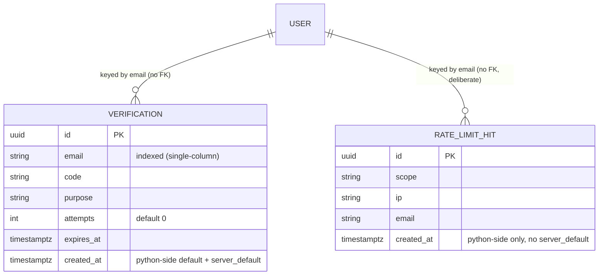

# api-fa-backend (PRJ-003) — Objective Dependency Graph

Project: PRJ-003 (`projects/api-fa-backend`). Execution mode: **Semi-Auto** (3 gates per objective,
per CLAUDE.md). Type: backend-only reusable auth service — no `uiux-designer`/Pencil deliverable
in any objective's Phase 1 gate (no UI of its own).

**Goal:** turn the cloned FastAPI auth starter into a hardened, fully-tested reference block that
other projects can fork with confidence ("bloque hiperseguro").

**Tech stack (inherited from existing code, not re-litigated):** FastAPI, SQLAlchemy 2.0 async +
PostgreSQL/asyncpg, JWT via python-jose, passlib[bcrypt], Pydantic v2.

## Phase 0 — Retroactive discovery: Done (2026-08-21)

Before this graph existed, the repo was audited as-is (it predates this workflow — cloned with
code already in place, not built objective-by-objective). Artifacts, reusable as Phase 1 inputs
for the objectives below instead of being re-derived:
- `docs/security/audit-report.md` — full SAST/threat-model-equivalent audit (14 findings: 2
  Critical, 2 High, 6 Medium, 4 Low) by `security-specialist`.
- `docs/test-gap-analysis.md` — test coverage gap analysis (current coverage: 0%) by `qa-engineer`.

Every objective below traces back to specific findings in those two files instead of restating
them — read the finding number cited, don't take the one-line summary here as the full spec.

## Graph

```
[OBJ-000] Test Infrastructure Bootstrap
   ├── [OBJ-001] Critical Auth Hardening (CRITICAL)
   │      ├── [OBJ-002] Session & Token Lifecycle (HIGH)
   │      └── [OBJ-003] Data & Transport Hardening (MEDIUM)
   ├── [OBJ-004] HTTP Security Baseline (MEDIUM)
   ├── [OBJ-005] Email Verification Flow (MEDIUM)
   └── [OBJ-006] Migrations & Supply Chain Hardening (LOW)

[OBJ-007] Registration Enumeration Policy Decision (LOW) — blocked on a product decision from
the user, not on any other objective's code. See its row below.
```

## Active Objectives Status

| ID | Description | Assigned Agent(s) | Status | Dependencies | Traces to |
|---|---|---|---|---|---|
| OBJ-000 | pytest + pytest-asyncio + httpx AsyncClient + test-DB override of `get_db` + user factory | qa-engineer | **Done (2026-08-21)** | None | test-gap-analysis.md §"Infraestructura base" |
| OBJ-001 | Fix JWT type confusion (refresh usable as access token); OTP: `secrets`-based generation + attempt lockout + rate limiting; `SECRET_KEY` min-length/placeholder validation | business-analyst → solution-architect ∥ security-specialist → qa-engineer → developer | **CLOSED (2026-08-21) — Gate 3 unanimous PASS (qa-engineer, security-specialist, database-architect)** | OBJ-000 | audit-report.md #1, #2, #4 |
| OBJ-002 | `/logout` + revocation store; refresh-token rotation + reuse detection; `token_version` invalidation on password reset | business-analyst → solution-architect → qa-engineer → developer | Not Started — **next in line** | OBJ-001 (done) | audit-report.md #3 |
| OBJ-003 | Hash OTP at rest (HMAC); enforce TLS to PostgreSQL; constant-time login/forgot-password (timing side-channel) | solution-architect → database-architect ∥ qa-engineer → developer | Not Started | OBJ-001 (done) | audit-report.md #5, #7, #8 |
| OBJ-004 | CORS middleware; security headers (HSTS/X-Frame-Options/CSP/nosniff); gate `/docs`+`/redoc`+`/openapi.json` by `ENVIRONMENT`; structured auth-event logging; remove OTP debug `print`; **+backlog: rate limiter's `client_ip()` needs `X-Forwarded-For`/proxy support (MEDIUM, from OBJ-001 Gate 3)** | solution-architect → qa-engineer → developer | Not Started | OBJ-000 | audit-report.md #9, #10, #13 |
| OBJ-005 | Real `/verify-email` flow; enforce `is_verified` at login (policy: block or warn — confirm with user at this objective's gate 1); pluggable email-sender abstraction replacing the `print` mock | business-analyst → solution-architect → qa-engineer → developer | Not Started | OBJ-000 | audit-report.md #11 |
| OBJ-006 | Replace `Base.metadata.create_all` with real Alembic migrations; pin `requirements.txt` + lockfile; `pip-audit`/`safety` in CI; separate DB roles (DDL vs. DML); **+backlog from OBJ-001 Gate 3: scheduled cleanup job for `rate_limit_hits` (unbounded growth, LOW), composite index `(email, purpose, expires_at)` on `verifications`, row-locking/atomic-UPDATE hardening for the OTP-lockout and rate-limit TOCTOU gaps (LOW, bounded overshoot only)** | database-architect → devops-engineer | Not Started | OBJ-000 | audit-report.md #12, #14 |
| OBJ-007 | Decide `/register` enumeration behavior: keep explicit "email exists" (documented accepted risk) vs. generic response matching `/forgot-password`'s pattern | **user decision required**, then developer | Not Started | None (blocked on product decision, not code) | audit-report.md #6 |

## OBJ-001 — Phase 1 deliverables (2026-08-21)

- `docs/requirements/obj-001-critical-auth-hardening.md` (business-analyst) — 3 user stories, 21
  Gherkin scenarios covering findings #1, #2, #4.
- `docs/api/openapi.yaml` (solution-architect) — full spec (all 6 existing endpoints + proposed
  new `GET /auth/me`), validated against OpenAPI 3.1. `Token` schema now documents an explicit
  `type: access|refresh` claim (closes #1); `/auth/refresh` returns 401 (was 400) on invalid
  type/signature; `forgot-password`/`verify-otp`/`reset-password` gain a `429` rate-limit
  response; OTP attempt-lockout reuses the existing generic `400` (no new oracle).
- `docs/api/obj-001-design-notes.md` (solution-architect) — JWT claim schema, rate-limit (IP,
  infra concern) vs. OTP lockout (shared `attempts` counter on the `Verification` row, business
  concern) split, `SECRET_KEY` startup-validation contract (non-HTTP).
- **Schema change surfaced**: the lockout design adds an `attempts` counter column to
  `Verification` — a DB model change that Gate 1 nominally wants a `database-architect` pass on,
  but OBJ-006 (real Alembic migrations) hasn't landed yet, so today this still lands via
  `Base.metadata.create_all` like every other column. Not a blocker, just flagging the ordering
  wrinkle: OBJ-001's migration today is informal; it becomes a real Alembic migration once OBJ-006
  exists (retrofit, not urgent — the column is additive and harmless to backfill).
- **Gate 1: APPROVED (2026-08-21).** Decisions locked in:
  - `GET /auth/me` is in scope for OBJ-001 (used to contract-test the #1 fix end-to-end).
  - OTP lockout: 5 failed attempts invalidates the code. Rate limit: 5 req/min per IP+email on
    `/forgot-password`, 10 req/min on `/verify-otp` and `/reset-password`. OTP resend cooldown:
    60s.
  - OTP format unchanged: 6 digits, 10 min TTL (the lockout+rate-limit above is what makes this
    safe now, not the code space).
  - Rate-limit/lockout state lives in a Postgres table (no Redis dependency added to the
    template).
  - JWT claim: explicit `type: "access"|"refresh"` (already settled by solution-architect,
    matched business-analyst's recommendation).
  - OBJ-001 is cleared to start Phase 2. Phase 2 needs OBJ-000 (test infra) first — dispatched
    together, same qa-engineer pass, since it's the same agent role and avoids a redundant
    context reload.

## OBJ-000 — Test Infrastructure Bootstrap: Done (2026-08-21)

Delivered by qa-engineer, same pass as OBJ-001 Phase 2 (dispatched together
per the Gate 1 note above):

- `requirements-dev.txt` (`-r requirements.txt` + `pytest==9.1.1`,
  `pytest-asyncio==1.4.0`, `httpx==0.28.1`, `freezegun==1.5.5`) — kept
  separate from `requirements.txt` per test-gap-analysis.md's own
  recommendation.
- `pytest.ini` — `asyncio_mode = auto`, `asyncio_default_fixture_loop_scope
  = session`, `asyncio_default_test_loop_scope = session` (the latter two
  are required together, not just the fixture one — a session-scoped async
  `db_engine` fixture combined with per-function test loops throws
  `RuntimeError: Future attached to a different loop` under
  pytest-asyncio 1.4; found and fixed during this pass, not theoretical).
- `docker-compose.test.yml` — disposable Postgres 16 on port 5433 (not
  5432, to avoid colliding with a developer's own local Postgres).
- `tests/conftest.py` — env-var bootstrap ordering (Settings is a
  module-level singleton depending on required, default-less env vars),
  `db_engine`/`db_session`/`client`/`api_prefix`/`user_factory`/
  `verification_factory` fixtures. `db_session` uses SQLAlchemy 2.0's
  `join_transaction_mode="create_savepoint"` for rollback-per-test
  isolation.
- `tests/factories.py` — `create_user` (real bcrypt hash via
  `security.get_password_hash`, `is_active`/`is_verified` overridable),
  `create_verification` (seeds a known OTP code directly — necessary since
  no endpoint ever returns the generated OTP in an HTTP response).
- `tests/README.md` — run instructions, verification status, scope
  boundaries, risk notes for `developer`.

**Postgres note (relevant to any future "why is Postgres access blocked"
question):** this sandbox has no Docker and no credentials for the local
Postgres 16 Windows service already running on port 5432 (two attempts to
obtain them were correctly blocked by the harness's safety classifier as
credential-discovery behavior, and were not worked around). The full test
suite was still verified end-to-end using a throwaway, self-provisioned
Postgres instance (`initdb`/`pg_ctl` from the same installed binaries, own
data dir, port 5433, torn down after use) — functionally what
`docker-compose.test.yml` automates for anyone else. See
`tests/README.md` for the full note and verification results.

## OBJ-001 — Phase 2 (red phase): Done (2026-08-21)

- 39 tests across `tests/unit/` (`test_security.py`,
  `test_secret_key_startup.py`, `test_otp_generation.py`) and `tests/api/`
  (`test_token_type_enforcement.py`, `test_me_endpoint.py`,
  `test_otp_lockout.py`, `test_rate_limit.py`,
  `test_otp_resend_cooldown.py`) translate all 21 Gherkin scenarios from
  `docs/requirements/obj-001-critical-auth-hardening.md` into executable
  tests, traced to `docs/api/openapi.yaml` and
  `docs/api/obj-001-design-notes.md`.
- Verified end-to-end against a real Postgres (see OBJ-000 note above):
  **39 failed, 10 passed.** Every failure traces to a specific missing
  piece of OBJ-001 (no `type` JWT claim, wrong status codes on
  `/auth/refresh`/`verify_refresh_token`, `/auth/me` missing entirely ->
  404, no OTP attempt lockout, no rate limiting, OTP generation still
  `random`-based, no `SECRET_KEY` startup validation). Every pass documents
  already-correct current behavior that must not regress (OTP TTL expiry,
  refresh-token-on-`/auth/refresh`, no-OTP-reuse-after-successful-reset).
  None failed for a broken-test reason (import errors, bad fixtures,
  wrong assumptions about the current contract).
- **Explicitly out of scope, documented in tests/README.md:** Scenario 2.6
  (timing side-channel — BA's own AC calls it best-effort, not strictly
  testable); Scenario 3.8 (SECRET_KEY rotation — marked TBD in the AC,
  mechanism undecided); true concurrent/TOCTOU testing for Scenario 2.7
  (exercised sequentially instead, consistent with test-gap-analysis.md's
  own flakiness note); the broader non-OBJ-001 endpoint backlog from
  test-gap-analysis.md (spans OBJ-002–OBJ-005, not re-scoped here).
- **Risk flagged to developer:** `tests/api/test_rate_limit.py` assumes
  the rate limiter persists through the same overridable `deps.get_db`
  session as the rest of the app. If implemented as a fully separate
  module-level engine/session instead, those tests will fail with a raw
  DB connection error rather than a clean assertion once the code lands —
  treat that as a testability signal, not a broken test. Full detail in
  `tests/README.md`.
- **Gate 2: APPROVED (2026-08-21).** `developer` cleared to start Phase 3
  implementation against the 39 red tests.

## OBJ-001 — Phase 3 (green phase): Done (2026-08-21, developer)

Baseline confirmed before any change: full suite run against a throwaway
self-provisioned Postgres 16 instance (same `initdb`/`pg_ctl` approach
qa-engineer used — no Docker in this sandbox either; port 5433, `trust`
auth, own data dir, torn down after use) reproduced qa-engineer's exact
**39 failed, 10 passed**. Final suite after implementation: **49 passed,
0 failed** (two consecutive full runs, no flakiness observed).

**Files touched:**
- `app/core/security.py` — `create_access_token`/`create_refresh_token` now
  set an explicit `type: "access"|"refresh"` claim (+ `iat`); legacy
  `refresh: true` claim retired. `verify_refresh_token` checks `type ==
  "refresh"` and now raises 401 (was 400) for every validity failure
  (wrong type, bad signature, expired, malformed).
- `app/api/deps.py` — `get_current_user` rejects (401) any token whose
  `type` claim isn't `"access"`, including tokens with no `type` claim at
  all (fail-closed, no legacy-token special case, per design notes).
- `app/api/v1/endpoints/auth.py` — new `GET /me` (via
  `deps.get_current_active_user`); OTP generation switched from
  `random.choices` to `secrets.choice` (CSPRNG); new
  `_check_and_consume_otp` helper shared by `/verify-otp` and
  `/reset-password` implementing the shared 5-attempt lockout budget
  (audit finding #2); `/forgot-password` gained a 60s resend cooldown
  (checked against ANY existing row for the email+purpose, live or
  locked/expired — deliberate, closes the "immediately re-request after
  lockout to reset budget" gap the design notes called out); all three
  OTP-adjacent endpoints call the new rate limiter first.
- `app/core/rate_limit.py` (new) — sliding-window rate limiter
  (`enforce_rate_limit`), Postgres-table backed, takes the caller's
  `AsyncSession` (the one injected via `deps.get_db`) rather than opening
  its own engine — this was a deliberate testability requirement flagged
  by qa-engineer (a separate engine would bypass the tests' DB override
  and fail with a connection error instead of a clean assertion). Confirmed
  in practice: `tests/api/test_rate_limit.py` passes cleanly.
- `app/models/rate_limit.py` (new) — `RateLimitHit` model backing the
  limiter (`scope`, `ip`, `email`, `created_at`, composite index).
  Registered in `app/models/__init__.py` so both `app/main.py`'s
  `Base.metadata.create_all` and the test suite's `db_engine` fixture
  (which imports `app.models.user`/`verification`, triggering the package
  `__init__` and therefore this model too) pick it up without needing to
  touch `tests/conftest.py`.
- `app/models/verification.py` — added `attempts` (int, default 0) for the
  shared lockout counter. Also gave `created_at` a **Python-side** default
  (`datetime.now(timezone.utc)`) alongside the existing `server_default`:
  the OTP-resend-cooldown logic needs `created_at` to respect freezegun's
  frozen time in `tests/api/test_otp_resend_cooldown.py`, and a
  Postgres-side `func.now()` would always resolve to real wall-clock time
  regardless of the test's frozen clock — this was caught and fixed during
  implementation, not a hypothetical.
- `app/core/config.py` — `SECRET_KEY` field validator rejects (raises,
  blocking import/startup) any value under 32 chars or matching a
  case-insensitive placeholder blocklist.
- `app/main.py` — imports `app.models.rate_limit` alongside
  `user`/`verification` so its table is included in `create_all` (belt and
  suspenders with the `__init__.py` registration above).
- `.env.example` — `SECRET_KEY` comment now recommends
  `secrets.token_urlsafe(64)` and documents the 32-char/placeholder
  startup gate.
- No new entries in `requirements.txt` — `secrets` is stdlib; no new
  runtime dependency was needed for the Postgres-table rate limiter/lockout
  approach.

**Design deviations from `obj-001-design-notes.md`, decided independently
(design doc explicitly left these as open implementation choices, not
architecture):**
- **OTP lockout invalidation mechanism**: chose "set `expires_at` to now"
  over "delete the row" (both were offered as equally valid in the design
  notes). Deleting would have broken the resend-cooldown's stated purpose
  ("stops an attacker who just got locked out from immediately requesting
  a fresh row to reset their budget") — with delete, no row would remain
  for the cooldown check to find. Keeping the row (marked expired) lets one
  `created_at`-based cooldown check serve both the "still live" and
  "already locked/expired" cases uniformly.
- **Rate limiter storage shape**: a single `rate_limit_hits` table with one
  row per accepted request (sliding window via `COUNT(...) WHERE created_at
  > now - window`), rather than a per-key counter+window-start row. Simpler
  to reason about and to keep consistent with the freezegun-safety
  requirement (explicit Python-side timestamps throughout, no server-side
  `now()` reliance anywhere in the rate-limit path); accepted the modest
  extra row growth since the design notes flagged this as a "developer
  finds simpler" choice, not a fixed contract.
- **Rate-limit/lockout thresholds**: wired as module-level constants in
  `auth.py` (`MAX_OTP_ATTEMPTS = 5`, `OTP_RESEND_COOLDOWN_SECONDS = 60`,
  `FORGOT_PASSWORD_RATE_LIMIT_PER_MINUTE = 5`,
  `VERIFY_OTP_RATE_LIMIT_PER_MINUTE = 10`,
  `RESET_PASSWORD_RATE_LIMIT_PER_MINUTE = 10`), not `Settings` fields — kept
  scope minimal and matches the exact constants qa-engineer hardcoded in
  the test files (`tests/README.md` explicitly anticipated this: "if
  developer wires these to settings with different defaults, update the
  constants..." — values are unchanged from Gate 1, so no test-file update
  was needed).

**What's left for Gate 3:**
- `qa-engineer` — **DONE (2026-08-21), verdict: PASS with two flagged gaps
  (non-blocking for Gate 3, should be tracked before OBJ-002/OBJ-006
  close).** Full detail below.
- `security-specialist` — SAST/DAST pass confirming findings #1, #2, #4 are
  actually closed (not just tests passing), and a fresh look at the two
  design deviations above (particularly the "mark expired, don't delete"
  lockout choice, since it means locked-out `Verification` rows persist
  until the next successful `/forgot-password` call past the cooldown —
  worth confirming this isn't itself an unbounded-storage or info-leak
  concern).
- `database-architect` — informal review of the `attempts` column and the
  new `rate_limit_hits` table (both still land via `Base.metadata.create_all`,
  per the ordering wrinkle already flagged in this file for OBJ-006).
  **Done (2026-08-21) — see "database-architect informal schema review" below.**
- Test DB teardown note: this pass's throwaway Postgres 16 instance
  (`initdb`/`pg_ctl`, port 5433, own data dir) was stopped after the final
  verification run, same as qa-engineer's OBJ-000/Phase 2 pass.

## OBJ-001 — qa-engineer independent Gate 3 verification (2026-08-21)

**Verdict: PASS.** Independently reproduced the developer's result; the suite is substantive, not
tautological; implementation matches `docs/api/openapi.yaml`; no regressions. Two non-blocking
edge-case gaps found in the two Phase 3 design deviations (below) — recommend tracking, not
reopening Gate 3.

**1. Own suite execution (not trusting developer's report).**
Same environment constraint as prior passes (no Docker in this sandbox) — self-provisioned a
throwaway Postgres 16 via `initdb`/`pg_ctl`, port 5433, `trust` auth, own data dir outside the
repo, torn down after the run (`pg_ctl stop -m fast`, confirmed stopped). Ran the full suite
**twice, foreground, back to back**: both runs **49 passed, 0 failed**, ~35s each, no flakiness.
Matches developer's reported 49/49 exactly.

**2. Substantive vs. trivial — checked every one of the 39 red-phase tests, not just that they're
green.** Traced each to its Gherkin scenario and read the actual assertions (not just pass/fail):
- `test_otp_lockout.py` / `test_rate_limit.py`: assert real status-code transitions across a
  request-count threshold (e.g. requests 1-5 return 200, request 6 returns 429; a *correct* OTP
  is asserted to still fail 400 after 5 wrong guesses — this is the actual lockout behavior, not
  a weak "some 4xx" check), assert the exact generic error message is reused for
  wrong-code/expired/locked-out (no new oracle), assert a shared attempts budget across two
  different endpoints (`verify-otp` + `reset-password`), assert the rate limit isn't foolable by
  varying the guessed OTP.
- `test_token_type_enforcement.py`: constructs real JWTs with `python-jose` directly (including
  one signed with a wrong/guessed secret, and one with the `type` claim omitted entirely) rather
  than only exercising tokens minted by the app's own helpers — this genuinely exercises the
  fail-closed signature/claim path, not a mocked shortcut.
  `test_forged_token_with_correct_secret_but_no_type_claim_rejected` in particular is exactly
  the "no legacy-token special case" fail-closed rule from the design notes, and it passes for
  the right reason (verified `app/api/deps.py:28` rejects on `payload.get("type") !=
  TOKEN_TYPE_ACCESS`, which is `None != "access"` → True → reject).
- `test_secret_key_startup.py`: genuinely spawns a **subprocess** per case (`sys.executable -c
  "import app.core.config"`) with a controlled env and asserts the process's exit code — this is
  not mockable/tautological, it's the only way to prove a module-level Pydantic singleton
  actually raises at import time for a given `SECRET_KEY`. Confirmed the validator in
  `app/core/config.py:37-50` runs before `get_settings()`/`settings =` executes at module scope,
  so a bad `SECRET_KEY` really does prevent `app.*` from importing at all, not just some
  in-process object being unusable.
- `test_otp_generation.py`: static source-introspection (`inspect.getsource`), explicitly
  documented as deliberate (a statistical distribution test over ~100-1000 draws can't
  distinguish `random` from `secrets` at that sample size) rather than an oversight. Confirmed
  `app/api/v1/endpoints/auth.py:36` uses `secrets.choice`, and confirmed no `random.choices`/
  `random.choice(` string appears anywhere in that module.
- None of the 39 rely on mocking out the code path under test (e.g. no mocked DB session hiding
  the real query, no monkeypatched `enforce_rate_limit`/`_check_and_consume_otp`) — all go
  through the real FastAPI app via `httpx.ASGITransport` end-to-end, or (for Story 3) a real
  subprocess.

**3. Implementation vs. `docs/api/openapi.yaml` — read the diff (`app/core/security.py`,
`app/api/deps.py`, `app/api/v1/endpoints/auth.py`, `app/core/rate_limit.py`,
`app/models/rate_limit.py`, `app/models/verification.py`, `app/core/config.py`) against the spec
line by line:**
- `/auth/refresh` and `/auth/me` both 401 on any token-validity failure (bad signature, expired,
  malformed, wrong `type`) per spec; `/auth/refresh`'s "valid token, inactive user" branch stays
  400 as spec'd (business-state error, distinct from credential validation) — confirmed in
  `auth.py:258-259`.
- `/auth/refresh` correctly does **not** rotate the refresh token (`auth.py:266` echoes the
  submitted token back) — this matches the spec's explicit note that rotation is OBJ-002 scope,
  not a bug or missed requirement in this pass.
- `RateLimited` (429) responses carry `Retry-After` on all three OTP-adjacent endpoints
  (`rate_limit.py:58`), matching the spec's header contract.
- OTP lockout and rate limiting are correctly layered in the right order in each endpoint
  (`auth.py:207-213`, `226-232`): rate limit is checked *before* `_check_and_consume_otp`, so a
  rate-limited request never increments the OTP attempt counter — no double-penalty / no way to
  burn a victim's OTP budget via a flood that's supposed to be rejected at the rate-limit layer
  first.
- `forgot_password` enforces the rate limit before the user-existence check (`auth.py:142-152`),
  so rate-limiting behavior itself doesn't become a new user-enumeration side channel (existing
  vs. non-existent email get identical 429 experiences).

**4. Design-deviation edge cases (the two independent developer decisions) — evaluated for gaps
not covered by the current tests:**

- **(a) OTP lockout via `expires_at = now()` instead of row delete.** No test gap found in the
  *window-boundary* sense the task asked about — this isn't a fixed-window counter, so there's no
  "reset at minute boundary" burst-doubling risk. The real gap is storage, and it's already
  identified independently by `database-architect`'s review below (dead `Verification` rows
  persist per email across `reset_password`/`verify_email` purposes) — folding into that finding
  rather than duplicating it. One additional angle database-architect's pass didn't cover: this
  is **also a synchronization primitive**, and the current code has no row lock. `_check_and_consume_otp`
  does a plain `SELECT` then `UPDATE` (`auth.py:58-77`) with no `SELECT ... FOR UPDATE` — two
  concurrent requests (the 5th failed guess and a correct-code guess arriving in the same
  window) could both read `attempts == 4` before either commits, and the correct-code request
  could succeed based on a stale pre-lockout read. This is the same class of gap already flagged
  as out-of-scope for Scenario 2.7 (tests exercise this sequentially, not concurrently, per
  `test-gap-analysis.md`'s own flakiness note) — not a new defect, but worth being explicit that
  it also applies to the *lockout* path, not just the rate limiter. Recommend a follow-up
  concurrency-hardening pass (row locking or an atomic `UPDATE ... RETURNING`) before treating the
  lockout as airtight under real concurrent load; not a Gate 3 blocker given the documented scope
  boundary.
- **(b) Rate limiter: one row per accepted request + `COUNT(...)` sliding window, no counter+bucket.**
  On the specific question asked ("attacker hits exactly the window boundary") — this design is
  actually **more correct** than a naive fixed-window counter: because it's a true sliding window
  (`created_at > now - window_seconds`, continuously re-evaluated), there's no reset instant an
  attacker can straddle to get 2x the allowed rate (the classic fixed-window edge case). No test
  gap there. The real edge case is the same TOCTOU shape as 4(a): `enforce_rate_limit`
  (`rate_limit.py:42-62`) does `SELECT COUNT(...)` then, if under the limit, `INSERT` — not
  atomic. Concurrent requests arriving at the limit boundary could each observe
  `hits_in_window == limit - 1`, both pass, and both insert, producing a transient one-request
  overshoot per burst. Low severity (bounded overshoot, not unbounded bypass) and consistent with
  the project's already-documented stance that true concurrency/TOCTOU is out of scope for this
  pass — flagging for awareness, not blocking. **Unbounded table growth** (no cleanup of
  `rate_limit_hits`) is the other gap on this path — confirmed no `DELETE`/cleanup/TTL code
  exists anywhere in `app/` (`grep` came back empty); `database-architect`'s review below reaches
  the same conclusion independently and proposes a scheduled-cleanup remediation tracked into
  OBJ-006. Concur with that recommendation.

**5. Regression check.** Full 49/49 (not just the 39 that were red) confirms the 10
previously-passing tests (OTP TTL expiry, refresh-token-on-`/auth/refresh`, no-OTP-reuse-after-
successful-reset, etc.) still pass unchanged — no regression. Spot-checked `register`/`login`
(untouched by this diff) — no behavior changes visible in the diff or by re-reading
`auth.py:87-133`.

**Conclusion:** Gate 3 qa-engineer sign-off: **PASS**. The two flagged concurrency edge cases
(4a, 4b) and the unbounded `rate_limit_hits` growth are real but non-blocking — recommend
tracking the concurrency-hardening follow-up alongside the already-tracked cleanup-job item
(OBJ-006), not reopening this gate. Awaiting `security-specialist`'s SAST/DAST pass before OBJ-001
closes fully.

## OBJ-001 — database-architect informal schema review (Gate 3, 2026-08-21)

Informal review only (OBJ-006 real Alembic migrations not started — schema still lands via
`Base.metadata.create_all`). No files changed by this pass; findings for `developer` to pick up
in a follow-up, and for `OBJ-006` to formalize once real migrations exist.

**ER diagram (current state, both tables):**



No FK from either table to `users.email` — correct as-is: rate limiting and OTP lockout must
apply to unauthenticated/non-existent emails too (otherwise `/forgot-password` on an unregistered
address would be unprotected, reopening an enumeration oracle). Do not add a FK here later without
re-checking that.

### 1. `verifications.attempts`
Type/default are right: `Integer, nullable=False, default=0`. No concerns there.

Actual query pattern in `auth.py` (`_check_and_consume_otp`, lines ~58-65) is
`email == X AND purpose == Y AND expires_at > now()` — `code` is **not** in the SQL filter, it's
compared in Python after fetch. So the index question is about `(email, purpose, expires_at)`,
not `(email, code, purpose, expires_at)`.

Today there's only a single-column index on `email`. That's not currently a real hazard because
`/forgot-password` deletes-then-inserts (lines 176-180: `DELETE ... WHERE email = X AND purpose =
Y` before creating the fresh row), so live-row count per `(email, purpose)` stays effectively at 1
— Postgres will filter the small email-matched set in memory almost for free regardless of index
shape. But two things make a composite index the right move anyway, not just a nice-to-have:
- Locked-out/expired rows are **kept, not deleted** (deliberate design choice, see Phase 3 notes
  above — `expires_at` pulled to now instead of a `DELETE`). Over time, a single email can
  accumulate many dead rows across `reset_password` and `verify_email` purposes, so the "index on
  email, filter purpose+expires_at in memory" shortcut degrades as that backlog grows per address.
- It's cheap and has no downside: add a composite `Index("ix_verifications_email_purpose_expires_at", "email", "purpose", "expires_at")` and drop the redundant standalone `email` index (the composite serves any query that only filters on `email` too, leftmost-prefix).

Illustrative DDL (not applied — for `developer`/`OBJ-006` to land):
```sql
DROP INDEX IF EXISTS ix_verifications_email;
CREATE INDEX ix_verifications_email_purpose_expires_at
    ON verifications (email, purpose, expires_at);
```

Minor, unrelated to this objective's scope: `expires_at`/`created_at` are typed
`Mapped[float]` in the model but the column is `DateTime(timezone=True)` — a stale type
annotation (should be `Mapped[datetime]`), pre-existing on `expires_at`, and now copied onto the
new pattern in `RateLimitHit.created_at` too. Cosmetic (no runtime effect), but worth a cleanup
pass since it'll otherwise keep getting copy-pasted into future models.

### 2. `rate_limit_hits`
Index is correct and well-designed: `Index(..., "scope", "ip", "email", "created_at")` matches
the query shape in `enforce_rate_limit` exactly — three equality predicates followed by the one
range predicate (`created_at > window_start`), in the right left-to-right order for a B-tree to
use all four columns as a single index range scan. No table-scan risk from the query pattern
itself. Good work by `developer` here, nothing to change.

### 3. Unbounded growth risk — real, and worth acting on before production traffic
This is the one finding that actually matters. `rate_limit_hits` gets one row per **accepted**
request on three endpoints (5-10 req/min ceilings), with no delete, no TTL, and no partitioning
anywhere in the code. Every row older than the 60s window is permanently dead weight — the query
never reads it again (`created_at > window_start` excludes it forever) — but nothing removes it.
At even modest sustained traffic this is thousands of rows/day per busy deployment, growing
without bound, forever. It won't break anything functionally (the covering index keeps the hot
query fast regardless of table size for a while), but it's an unmonitored disk-growth leak and
will eventually show up as bloated autovacuum/table-scan-adjacent maintenance costs.

This was a deliberate, reasonable scope call by `developer` for OBJ-001 (design notes explicitly
left storage shape open, and the one-row-per-request approach was chosen for
freezegun/testability simplicity) — not a defect in this pass. But it needs a follow-up before
this goes to real production load. Recommendation, in order of preference for this project's
size:
1. **Scheduled cleanup job** (simplest, fits this stack): a periodic `DELETE FROM rate_limit_hits
   WHERE created_at < now() - interval '1 hour'` (window is 60s, so even 1 hour of retention is
   generous slack for clock skew/debugging) run via `pg_cron` or an app-level scheduled task
   (`devops-engineer` territory — cron/Celery-beat/APScheduler, whatever this template already
   has access to). Do **not** run this inline in the request path (`enforce_rate_limit` is on the
   hot auth path — adding a `DELETE` there adds latency and lock contention to every login-adjacent
   request for no benefit the request itself gets).
2. If traffic is expected to be high-volume in whatever downstream project forks this template:
   time-based partitioning (daily partitions, drop partitions older than a day) scales better than
   per-row deletes, but is real infra complexity — overkill for this auth-service template today,
   worth flagging as an option in `OBJ-006`'s scope rather than building now.
3. Not recommending a rewrite to a per-key counter+window-start row (bounded row count) — that was
   already considered and declined in Phase 3 for good reasons (freezegun-safety, simplicity); the
   scheduled-delete approach gets the unbounded-growth problem solved without touching the schema
   or the tested request-path code.

**Suggested tracking**: fold "add scheduled `rate_limit_hits` cleanup job" into `OBJ-006`'s scope
(`devops-engineer` + `database-architect`) rather than opening a new objective — it's
infra/maintenance, not a security-blocking issue for OBJ-001's Gate 3.

### Minor/secondary observations
- `RateLimitHit.ip` is `String`; consider Postgres native `INET` for correctness (validates
  IPv4/IPv6 shape) and slightly more compact storage. Not blocking — `String` works fine and is
  simpler if this template ever needs to store non-IP client identifiers.
- Both tables generate `id` client-side (`default=uuid.uuid4`) rather than via
  `server_default=gen_random_uuid()` — consistent with the existing `User`/`Verification`
  pattern, no objection.
- No modeling issue with `verifications.attempts` not resetting on successful `/verify-otp` (row
  isn't deleted there, only on `/reset-password`) — that's request-flow/business logic, not a
  data-model concern, and out of scope for this review.

**Gate 3 status for database-architect's piece: cleared.** No blocking data-model issues in
`attempts` or `rate_limit_hits`. One index recommendation (verifications composite index, cheap,
non-blocking) and one real but non-blocking growth-management gap (rate_limit_hits cleanup job,
tracked into OBJ-006) — neither should hold up OBJ-001's Gate 3 sign-off.

## OBJ-001 — security-specialist Gate 3 SAST verification (2026-08-21)

Full detail in `docs/security/audit-report.md` §"Gate 3 — Verificación OBJ-001". Summary:

- **#1 (refresh-as-access-token) — CERRADO.** `app/api/deps.py:28` fail-closed on `type != "access"`, including tokens with no `type` claim at all (also correctly invalidates every pre-fix legacy token).
- **#2 (OTP brute force) — CERRADO**, one documented residual: `secrets.choice` confirmed, 5-attempt lockout confirmed, lockout-vs-natural-expiry oracle confirmed indistinguishable (same 400 branch). Attempts only reset via `/forgot-password`, itself rate-limited + 60s cooldown — bounds guessing to ~50/10min, not unlimited (accepted Gate 1 tradeoff). Low-severity theoretical concurrency race noted (same TOCTOU shape qa-engineer flagged independently) — residual, not reopened.
- **#4 (SECRET_KEY unvalidated) — CERRADO.** Real `ValueError` at eager `Settings()` construction, blocks import/startup for real.
- **New MEDIUM**: `client_ip()` has no `X-Forwarded-For` support — behind any reverse proxy/LB (this template's actual target deployment shape), the IP dimension of rate limiting collapses to a constant. Tracked into OBJ-004.
- **New LOW**: `rate_limit_hits` has no TTL/purge — confirmed via grep, matches database-architect's independent finding. Tracked into OBJ-006.
- Neither new finding reopens the account-takeover chain audit-report.md originally described.

**OBJ-001 Gate 3 final verdict: PASS, unanimous across qa-engineer, security-specialist, and database-architect. Objective CLOSED.**

## Notes

- OBJ-001 is the priority tranche: findings #1 and #2 chain into an unauthenticated full
  account-takeover (enumerate email → brute-force OTP → reset password → stolen refresh token
  from before the reset still works because nothing was revoked). OBJ-002 closes the last link
  of that chain (revocation) and is next in line once OBJ-001 lands.
- OBJ-001's Phase 1 reuses `docs/security/audit-report.md` directly as its threat-model input —
  `security-specialist` is looped in to confirm the remediation design closes the findings it
  raised, not to re-run discovery from scratch.
- OBJ-004 and OBJ-005 and OBJ-006 have no code overlap with OBJ-001/002/003 (different files:
  middleware/config vs. `auth.py`/`security.py`/`deps.py` vs. migrations) — safe to run their
  Phase 1s in parallel with the OBJ-001 branch once OBJ-000 clears, rather than waiting in a
  single queue.
