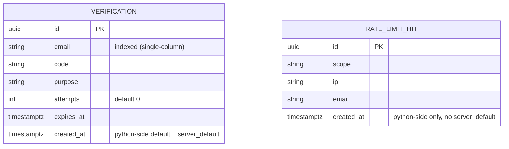

# OBJ-001 — Schema Review (database-architect)

**Summary:** Gate 3 informal review (OBJ-006's real Alembic migrations not started yet — schema
still lands via `Base.metadata.create_all`). Covers `verifications.attempts` and the new
`rate_limit_hits` table. Verdict: **cleared**, no blocking issues; one cheap index recommendation
and one real-but-non-blocking growth gap.

## Gate 3 informal review — 2026-08-21

ER state (both tables, no FK to `users` on either — deliberate: rate limiting/OTP lockout must
also apply to unregistered emails, or `/forgot-password` on a non-existent address would be
unprotected, reopening an enumeration oracle):



**`verifications.attempts`**: type/default correct (`Integer, NOT NULL, default=0`). Query pattern
is `email == X AND purpose == Y AND expires_at > now()` (`code` compared in Python after fetch, not
in SQL). Only a single-column `email` index exists today — not an acute hazard since
`/forgot-password` deletes-then-inserts, but locked-out/expired rows are kept (not deleted), so a
single email accumulates dead rows across purposes over time. **Recommendation:** composite index
`(email, purpose, expires_at)`, dropping the redundant standalone `email` index:
```sql
DROP INDEX IF EXISTS ix_verifications_email;
CREATE INDEX ix_verifications_email_purpose_expires_at ON verifications (email, purpose, expires_at);
```
Minor unrelated note: `expires_at`/`created_at` are typed `Mapped[float]` but the column is
`DateTime(timezone=True)` — stale annotation, cosmetic, worth fixing whenever this file is next
touched.

**`rate_limit_hits`**: index `(scope, ip, email, created_at)` is a correct match for
`enforce_rate_limit`'s query shape — no table-scan risk.

**Unbounded growth (the one finding that matters):** one row per accepted request on three
endpoints (5-10 req/min ceilings), no delete/TTL/partitioning anywhere. Every row past the 60s
window is permanently dead weight the query never reads again. Won't break correctness, but is an
unmonitored disk-growth leak. **Recommendation (in order of preference for this project's size):**
1. Scheduled cleanup job (`devops-engineer`/`database-architect`, `pg_cron` or app-level scheduler,
   outside the hot request path): `DELETE FROM rate_limit_hits WHERE created_at < now() - interval
   '1 hour'` (window is 60s; 1hr retention is generous slack). **Do not** run inline in the request
   path.
2. Time-based partitioning if a downstream fork expects high volume — flag as an OBJ-006 option,
   not building now.
3. Not recommending a per-key counter+window row rewrite — already considered and declined in
   Phase 3 for freezegun-safety/simplicity reasons.

Tracked into OBJ-006's scope (cleanup job), not a new objective.

**Minor/secondary:** `RateLimitHit.ip` is `String`; `INET` would validate shape + compact storage
(not blocking). Both tables generate `id` client-side (`default=uuid.uuid4`), consistent with the
rest of the project. `verifications.attempts` not resetting on successful `/verify-otp` (only on
`/reset-password`) is business logic, not a data-model concern.

**Gate 3 status: cleared.** No blocking data-model issues.
