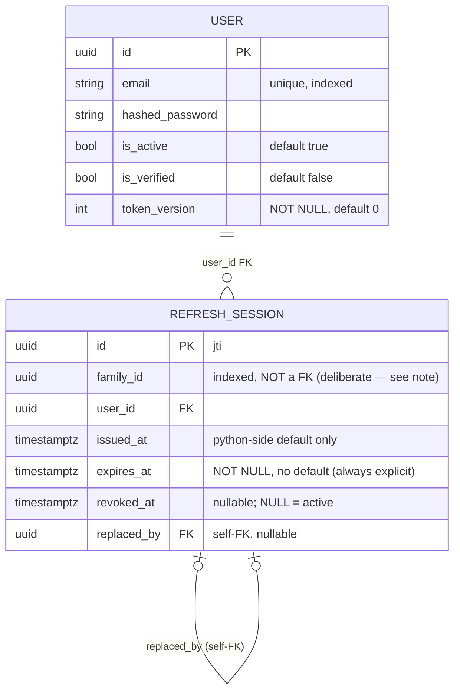

# OBJ-002 — Schema Review (database-architect)

**Summary:** Gate 3 informal review (still pre-OBJ-006, schema via `create_all`). Covers the new
`refresh_sessions` table and `users.token_version`. Verdict: **cleared**, no blocking issues; one
composite-index and one FK `ON DELETE` recommendation, plus an important growth-management nuance
(this table's dead rows are load-bearing evidence, unlike `rate_limit_hits`'/`verifications`').

## Gate 3 informal review — 2026-08-23

ER state (full 4-table schema, extends OBJ-001's diagram):



**`RefreshSession` model:** types/nullability all correct. `family_id` is deliberately **not** a
real FK (the root row references its own not-yet-committed `id` — a grouping key, not a
referential-integrity relationship) — leave as a plain indexed column. `issued_at`'s Python-side
default matches the OBJ-001 freezegun-safety pattern, though note it's a third slightly different
timestamp-default variant across the three models (`Verification`: default+server_default;
`RateLimitHit`: neither; `RefreshSession.issued_at`: default only) — cosmetic today, worth
unifying when OBJ-006 writes real migrations. `expires_at` deliberately has **no** default
(depends on `settings.REFRESH_TOKEN_EXPIRE_DAYS`, only known at mint time — an implicit default
here would be actively dangerous).

`users.token_version`: `Integer, NOT NULL, default=0` — correct, safe default for backfilled rows.

**Index review against actual query shapes in `auth.py`:** PK lookup (jti) — fine as-is. Family
bulk-revoke (`family_id = X AND revoked_at IS NULL`) — existing single-column `(family_id)` index
is a non-issue at current chain lengths (~336 rows/family at the 7-day ceiling) but same shape as
the OBJ-001 `verifications` finding; recommend widening to `(family_id, revoked_at)`, lower
priority than OBJ-001's was:
```sql
DROP INDEX IF EXISTS ix_refresh_sessions_family_id;
CREATE INDEX ix_refresh_sessions_family_id_revoked_at ON refresh_sessions (family_id, revoked_at);
```
User bulk-revoke (`user_id = X AND revoked_at IS NULL`) — existing composite `(user_id,
revoked_at)` is an exact match, no change needed.

**`replaced_by` self-FK:** correct as declared; the FK-ordering flush() fix in the rotation
handler (see `obj-002-design-notes.md`'s Phase 3 addendum) is the right fix, not a workaround.
**Gap:** no `ON DELETE` behavior declared on either FK (defaults to `NO ACTION`) — not a problem
today (nothing deletes these rows), but will matter the moment OBJ-006 adds a cleanup job.
Recommend explicit `ON DELETE CASCADE` (`user_id`) and `ON DELETE SET NULL` (`replaced_by`) in that
migration.

**Growth/lifecycle — real, with an important nuance this table has that `rate_limit_hits`/
`verifications` don't:** revoked/expired rows are not merely inert — they are the *evidence* the
reuse-detection mechanism depends on (a replayed, already-rotated token is only recognized as
reuse if its now-revoked row still exists). Deleting them too early doesn't break the individual
replay check but silently downgrades "revoke the entire compromised family" to "reject just this
one token, leave the rest of the family valid" — a real security regression if the retention
window is too short. **Recommendation for OBJ-006:** scheduled cleanup job with a retention floor
of **at least `REFRESH_TOKEN_EXPIRE_DAYS`** (currently 7 days) past `expires_at`/`revoked_at`, not
a short window like `rate_limit_hits`'s — and this must land together with (or after) the `ON
DELETE SET NULL` fix on `replaced_by`, or the job will intermittently hit FK violations on chains
where an old-but-not-yet-purge-eligible row still points at one that just became eligible. Not
recommending partitioning at this project's current size.

**Gate 3 status: cleared.** No blocking data-model issues.
