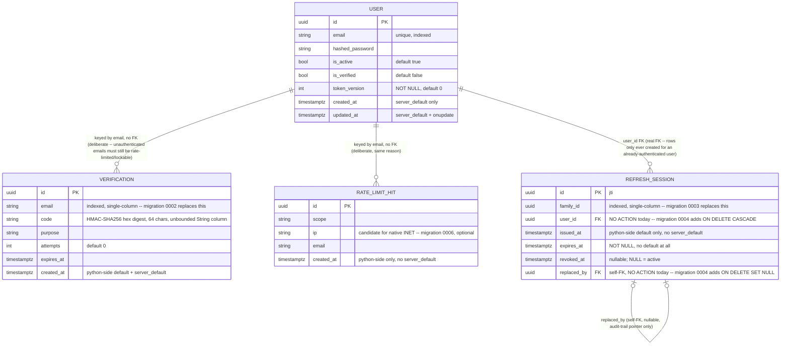

# OBJ-006 — Migrations & Supply Chain Hardening: database-architect Phase 1 plan

**Status:** Phase 1 design only. No Alembic files written, no running code touched, no migration
applied. This document is the design/sequencing deliverable for `developer`'s later Phase 3
authorship pass and for `devops-engineer`'s CI/pip-audit/lockfile piece (a separate future
dispatch — see "Handoff to devops-engineer" below).

**Scope of this pass:** the migration plan and schema-formalization design (item 1 of OBJ-006's
row in `dependency_graph.md`: "replace `Base.metadata.create_all` with real Alembic migrations"),
the DDL/DML role-separation design (part of item 1: "separate DB roles"), and the two
scheduled-cleanup jobs' SQL (backlog items from OBJ-001/OBJ-002 Gate 3). `pip-audit`/`safety`/CI
wiring and the `requirements.txt` lockfile are explicitly **not** this pass's job — see the
handoff section.

**Quick index:** current schema frozen into migration 0001 (§1) · 8-migration Alembic sequence,
0001-0007 planned + 0008 added during authorship (§2) · DDL/DML role separation, `fa_migrator`
vs. `fa_app`, conditional grants that no-op if roles don't exist (§3) · two scheduled cleanup jobs,
`rate_limit_hits` (1hr) and `refresh_sessions` (7-day floor) (§4) · row-locking/TOCTOU hardening
explicitly deferred, not a migration (§5) · 7 Gate-1 tradeoffs, all APPROVED 2026-08-23 (§7, see
"Gate 1 — APPROVED" below) · devops-engineer handoff list (§8, superseded/extended by the second
"Handoff" section near the bottom, post-migration-authorship). **Read this if you only have time
for one thing:** "CRITICAL finding: migration 0008 breaks the current `/auth/refresh` handler" —
migration 0008 is written but NOT SAFE TO DEPLOY past 0007 until `developer` reorders that
handler. Jump to: "1. Current schema state", "2. Alembic migration sequence", "3. DDL vs. DML role
separation", "4. Scheduled cleanup jobs", "5. Row-locking / TOCTOU hardening", "6. Cosmetic item",
"7. Gate-1 open questions", "8. Handoff to devops-engineer", "Gate 1 — APPROVED", "Migration
authorship", "CRITICAL finding", "Environment blocker: greenlet", "devops-engineer pass
(2026-08-25)", "database-architect pass — OBJ-011 greenfield role provisioning fix (2026-08-25)".

**Backlog items covered, traced to their source** (all read directly from
`.ai-context/dependency_graph.md`'s OBJ-006 row and the OBJ-001/002/003 database-architect review
sections cited there, not re-derived):

| # | Item | Source |
|---|---|---|
| 1 | Composite index `(email, purpose, expires_at)` on `verifications`, drop redundant single-column `email` index | OBJ-001 database-architect review |
| 2 | Row-locking/atomic-UPDATE hardening for OTP-lockout + rate-limit TOCTOU | OBJ-001 qa-engineer + database-architect + security-specialist (independently) |
| 3 | Scheduled cleanup job, `rate_limit_hits`, short (~1hr) retention | OBJ-001 database-architect review |
| 4 | Composite index `(family_id, revoked_at)` on `refresh_sessions` (was single-column `family_id`) | OBJ-002 database-architect review |
| 5 | `ON DELETE SET NULL`/`CASCADE` on `refresh_sessions.user_id`/`replaced_by` FKs (currently `NO ACTION`) | OBJ-002 database-architect review |
| 6 | Scheduled cleanup job, `refresh_sessions`, retention floor ≥ `REFRESH_TOKEN_EXPIRE_DAYS` (7d) | OBJ-002 database-architect review |
| 7 (optional) | Converge three timestamp-default conventions (`Verification`/`RateLimitHit`/`RefreshSession`) | OBJ-002 database-architect review |
| 8 (optional) | `RateLimitHit.ip` → native `INET` | OBJ-001 database-architect review |
| 9 (cosmetic) | Fix stale `Mapped[float]` annotations on timestamp columns | OBJ-001 database-architect review |
| — | Supply chain: `pip-audit`/safety in CI + lockfile | audit-report.md #12 — **devops-engineer**, not this pass |
| — | DDL/DML role separation | audit-report.md #14 — this pass (design), devops-engineer (CI/deploy wiring) |

Findings #12/#14 cross-checked directly against `docs/security/audit-report.md` (not trusted from
the graph's summary alone, per this dispatch's instruction — OBJ-003's Phase 1 pass found a
transposed citation elsewhere in this file, so citations get verified, not assumed). Confirmed:
**#12 = dependency pinning/supply-chain (lines 110-118)**, **#14 = DB DDL/DML privilege separation
(lines 130-134)** — both genuinely migrations/supply-chain-shaped, no transposition here. Also
re-confirmed in the Gate 3 — Verificación OBJ-003 verdict table (line 356): "#12/#14 (supply
chain/migraciones/roles DB — OBJ-006)".

---

## 1. Current schema state (verified by reading the actual model files, not the graph's prior
   informal-review diagrams — those are accurate as of when they were written, but this pass
   re-confirms directly since it's the one that has to freeze this state into migration 0001)

Read directly: `app/models/user.py`, `app/models/verification.py`, `app/models/rate_limit.py`,
`app/models/refresh_session.py`. Confirms the schema is exactly what OBJ-003's Gate 3 left it —
`Verification.code` was **not** renamed to `code_hash` (developer's Phase 3 decision, kept `code`
per the design notes' own stated default) — and no changes have landed since.



Existing indexes today (all four tables, confirmed by reading the model `__table_args__`/
`index=True` declarations):
- `users`: unique index on `email` (unchanged by this objective).
- `verifications`: single-column index on `email`.
- `rate_limit_hits`: composite `(scope, ip, email, created_at)` — already correct, praised in the
  OBJ-001 review, **not** touched by this plan.
- `refresh_sessions`: `(family_id)` single-column, `(user_id, revoked_at)` composite (already
  correct, matches its query pattern exactly — **not** touched by this plan).

---

## 2. Alembic migration sequence

Not one giant migration — one baseline capture, then one migration per hardening item so history
stays legible and each is independently revertible (`alembic downgrade -1` undoes exactly one
concern). Numbering below is a logical/legibility convention for this doc; `developer`'s Phase 3
pass will generate real Alembic revision IDs via `alembic revision -m "..."` (hash-based, not
these sequential numbers) — the **order** and **content** are the deliverable here, not the IDs.

| # | Migration | Backlog item | Risk | Reversible |
|---|---|---|---|---|
| 0001 | `baseline_current_schema` | — (freezes current state) | None (no DDL change vs. today) | N/A — this *is* the baseline |
| 0002 | `verifications_composite_index` | #1 | Low | Yes, trivially |
| 0003 | `refresh_sessions_composite_index` | #4 | Low | Yes, trivially |
| 0004 | `refresh_sessions_fk_on_delete` | #5 | Low-Medium (constraint semantics change) | Yes |
| 0005 | `timestamp_default_convergence` (optional) | #7 | Low (additive) | Yes |
| 0006 | `rate_limit_hit_ip_to_inet` (optional) | #8 | Medium (type cast) | Yes, with care |
| 0007 | `grant_dml_role_privileges` | #14 (part) | Low (grants only, no schema change) | Yes |

Items #2 (row-locking/TOCTOU) and #9 (stale `Mapped[float]` annotations) are **not** migrations —
see §5 and §6 below for why, and where they land instead.

### 0001 — `baseline_current_schema`

Captures the schema exactly as it exists today (§1's diagram) — all 4 tables, all current columns/
types/nullability/defaults, all current indexes and FKs, **before** any of the hardening items
below are applied. This is what `alembic revision --autogenerate` should produce once
`env.py`'s `target_metadata` is pointed at `Base.metadata` with all 4 model modules imported (same
import list already established in `app/models/__init__.py` and `app/main.py`:
`user, verification, rate_limit, refresh_session`).

**Operational cutover nuance (important, flagging explicitly for `developer`/`devops-engineer`):**
this project already has live schema state in every environment that's run `Base.metadata.
create_all` before now (every dev/test Postgres instance spun up across OBJ-000 through OBJ-003).
Migration 0001 must not try to re-`CREATE TABLE` against a database that already has these tables
— two distinct cutover paths:
- **Fresh database, nothing created yet:** `alembic upgrade head` runs 0001's real `CREATE TABLE`
  statements normally.
- **Existing dev/test database, tables already created via `create_all`:** run
  `alembic stamp 0001` (marks 0001 as applied without executing its DDL), then
  `alembic upgrade head` applies 0002 onward normally. `developer`/`devops-engineer` need to
  document this distinction in the project's dev-setup instructions — it's easy to get wrong once
  (`alembic upgrade head` against an already-created DB would fail on `CREATE TABLE ... already
  exists`).

**`env.py` design note (for whoever authors it):** do **not** import `app.core.config.settings` for
the migration DB connection string. `Settings()` eagerly validates `SECRET_KEY`/
`POSTGRES_SSL_MODE`/etc. at import time (same singleton pattern documented throughout this
project's test-infra notes) — a pure schema migration has no business requiring a valid
`SECRET_KEY` to run. Use a dedicated `MIGRATOR_DATABASE_URL` env var instead (see §3 for the role
this connects as), read directly by `alembic/env.py`, decoupled from the app's `Settings` class
entirely.

### 0002 — `verifications_composite_index`

Backlog item #1 (OBJ-001 database-architect review — already fully specified there; reproduced
here for the migration sequence, not re-derived):

```sql
DROP INDEX IF EXISTS ix_verifications_email;
CREATE INDEX ix_verifications_email_purpose_expires_at
    ON verifications (email, purpose, expires_at);
```

Matches the actual query shape in `_check_and_consume_otp` (`email == X AND purpose == Y AND
expires_at > now()`) exactly — leftmost-prefix also serves any query that only filters on `email`,
so nothing that used the old single-column index loses coverage.

### 0003 — `refresh_sessions_composite_index`

Backlog item #4 (OBJ-002 database-architect review):

```sql
DROP INDEX IF EXISTS ix_refresh_sessions_family_id;
CREATE INDEX ix_refresh_sessions_family_id_revoked_at
    ON refresh_sessions (family_id, revoked_at);
```

Matches the family-wide bulk-revoke query (`UPDATE ... WHERE revoked_at IS NULL AND family_id =
:fid`). Lower priority than 0002 (today's rotation chains are short enough that the single-column
index is a non-issue in practice), but cheap and correct to land while touching this table anyway
for 0004.

### 0004 — `refresh_sessions_fk_on_delete`

Backlog item #5 (OBJ-002 database-architect review) — **hard prerequisite for the
`refresh_sessions` cleanup job (§4 below)**; do not schedule that job before this lands, or it will
intermittently fail with FK violations once a chain is long enough that a purge-eligible row is
still pointed at by a newer row's `replaced_by`.

```sql
ALTER TABLE refresh_sessions
    DROP CONSTRAINT refresh_sessions_user_id_fkey,
    ADD CONSTRAINT refresh_sessions_user_id_fkey
        FOREIGN KEY (user_id) REFERENCES users(id) ON DELETE CASCADE;

ALTER TABLE refresh_sessions
    DROP CONSTRAINT refresh_sessions_replaced_by_fkey,
    ADD CONSTRAINT refresh_sessions_replaced_by_fkey
        FOREIGN KEY (replaced_by) REFERENCES refresh_sessions(id) ON DELETE SET NULL;
```

`user_id` → `CASCADE`: if a future "delete account" endpoint is ever added, session rows for a
deleted user should go with it (no orphaned rows referencing a nonexistent user). `replaced_by` →
`SET NULL`: a purge job must be able to delete an old row even if a newer row still points back at
it — the design notes and the model's own docstring already establish `replaced_by` as
audit-trail-only, not required for correctness (the reuse-detection state machine only needs
`family_id`/`revoked_at`).

Actual constraint names must be confirmed against what SQLAlchemy/Alembic actually generated
(`refresh_sessions_user_id_fkey`/`refresh_sessions_replaced_by_fkey` follow Postgres's default
naming convention for unnamed FKs, but `developer`'s Phase 3 pass should verify via
`\d refresh_sessions` or Alembic's own naming-convention config rather than assume).

### 0005 — `timestamp_default_convergence` (optional, Gate-1 flagged — see §7)

Backlog item #7. Three different precedents currently exist for how a table gets its `created_at`/
`issued_at`:
- `Verification.created_at`: Python-side default **and** `server_default=func.now()` (belt and
  suspenders).
- `RateLimitHit.created_at`: neither — always caller-supplied, no default at all.
- `RefreshSession.issued_at`: Python-side default only, no `server_default`.

**Recommendation:** converge on `Verification`'s pattern (Python default + `server_default`) —
it's the most defensive of the three (protects against both ORM-bypassing direct-SQL inserts *and*
freezegun-frozen-clock test consistency) and every real construction site already goes through the
ORM, so adding a `server_default` is purely a safety net, never actually exercised by current code
paths (confirmed: no direct-SQL insert exists anywhere in `app/`).

```sql
ALTER TABLE rate_limit_hits ALTER COLUMN created_at SET DEFAULT now();
ALTER TABLE refresh_sessions ALTER COLUMN issued_at SET DEFAULT now();
```

Purely additive — does not change any existing row, does not change any Python-side behavior
(explicit values passed by the ORM always take precedence over a column default). Low risk,
reversible (`SET DEFAULT NULL` / drop the default).

### 0006 — `rate_limit_hit_ip_to_inet` (optional, Gate-1 flagged — see §7)

Backlog item #8.

```sql
ALTER TABLE rate_limit_hits
    ALTER COLUMN ip TYPE inet USING ip::inet;
```

Risk: `USING ip::inet` will fail the whole migration if any existing row's `ip` value doesn't parse
as a valid IPv4/IPv6 address. In practice `ip` is always populated from `request.client.host`
(`app/core/rate_limit.py`), so this should hold — but **recommend running a validation query in any
environment with real accumulated data before applying this migration**, not just trusting the
invariant:

```sql
SELECT id, ip FROM rate_limit_hits WHERE ip !~ '^[0-9a-fA-F:.]+$';
```

Genuine correctness benefit (validates shape at write time, more compact storage) but real
migration risk on a populated table, unlike every other item in this sequence — this is why it's
flagged Gate-1-optional rather than bundled unconditionally.

### 0007 — `grant_dml_role_privileges`

Part of finding #14 (role separation). Depends on `fa_migrator`/`fa_app` roles already existing in
the target environment (provisioned by `docs/database/sql/provision_db_roles.sql`, run once,
**outside** Alembic — see §3 for why role *creation* is deliberately kept out of the migration
history). This migration only issues grants, assuming the roles exist:

```sql
GRANT SELECT, INSERT, UPDATE, DELETE
    ON users, verifications, rate_limit_hits, refresh_sessions
    TO fa_app;

ALTER DEFAULT PRIVILEGES FOR ROLE fa_migrator IN SCHEMA public
    GRANT SELECT, INSERT, UPDATE, DELETE ON TABLES TO fa_app;
```

Keeping this as a real migration (rather than only in the standalone provisioning script) means
the grant state is versioned/auditable alongside the schema itself, and automatically re-applies if
an environment's database is ever rebuilt from migration history. Must run under `fa_migrator` (or
another role with `GRANT` rights on these tables) — will fail if run under `fa_app` itself, which
is the intended fail-safe (the DML role can never grant itself more than it already has).

---

## 3. DDL vs. DML role separation (finding #14)

**Roles:**
- `fa_migrator` — owns/creates the schema. `CREATE` on the target database + `public` schema.
  Used **only** by Alembic (`alembic upgrade head`), never by the running app.
- `fa_app` — `CONNECT` + `SELECT`/`INSERT`/`UPDATE`/`DELETE` on the 4 tables (and, via
  `ALTER DEFAULT PRIVILEGES`, automatically on any future table `fa_migrator` creates). No
  `CREATE`/`ALTER`/`DROP` anywhere. Used by the running app's actual DB connection
  (`Settings.POSTGRES_USER`/`POSTGRES_PASSWORD`) in every non-local environment.

Full provisioning SQL: `docs/database/sql/provision_db_roles.sql` (illustrative, uses psql
variables for passwords — never a literal password in a file tracked in git). Grants for the 4
existing tables are also captured as Alembic migration 0007 above, for the versioning reason
explained there; role *creation* stays outside Alembic on purpose — it's cluster-level, typically
needs superuser, and would otherwise force secrets into migration files.

### Local dev/test — keep the existing pattern, don't force separation

This project's established pattern (every OBJ-000 through OBJ-003 pass) is a throwaway,
self-provisioned Postgres instance (`initdb`/`pg_ctl`, own data dir, `trust` auth, torn down after
use) or `docker-compose.test.yml`'s disposable Postgres 16. **Recommendation: do not require role
separation here.** The threat model role separation defends against (an attacker/bug with only DML
access escalating to schema-modifying damage) doesn't meaningfully apply to a single-developer,
ephemeral, destroyed-after-each-run database — and forcing two-role setup onto every
qa-engineer/developer Gate 3 pass would add real friction to a fast dev loop that currently works
well, for no real security benefit in that context.

Concretely: local/test continues to use a single Postgres role (today's default superuser or
`trust`-auth user) for both `alembic upgrade head` and the running app/test suite — i.e. no local
`.env`/`docker-compose.test.yml` changes required by this migration. `provision_db_roles.sql` is
available and usable if a developer specifically wants to exercise the grant behavior locally, but
it's opt-in, not required for the existing test suite to keep passing.

**Confirmed safe against the existing test suite** — read `tests/conftest.py` directly: the
`db_engine` fixture builds its own independent engine against `TEST_DATABASE_URL` and calls
`Base.metadata.drop_all`/`create_all` itself; it explicitly never touches `app.core.database.engine`
or `app.main`'s lifespan (`app.main`'s lifespan "intentionally never runs in these tests", per the
fixture's own docstring, confirmed — `httpx.ASGITransport` doesn't send ASGI lifespan events
unless wrapped with an explicit lifespan manager, which this fixture doesn't do). So none of this
migration/role work changes what the test suite does today, and removing `create_all` from
`app/main.py`'s lifespan (see below) cannot break it either.

### CI — recommendation for devops-engineer, not designed here

Recommend CI exercise the real two-role separation (closer approximation of prod than local/test,
catches a forgotten grant or an accidental DDL-shaped app query before staging). This is
`devops-engineer`'s call and a separate future dispatch — flagging the recommendation here so it
isn't rediscovered from scratch, not designing the CI wiring itself.

### Staging/production — mandatory separation

- The app's actual runtime connection (`Settings.POSTGRES_USER`/`POSTGRES_PASSWORD`, whatever
  secret-injection mechanism the real deployment uses) **must** point at `fa_app`.
- A separate `MIGRATOR_DATABASE_URL` (or equivalent secret, scoped to the deploy pipeline only,
  never present in the running app's environment) is used **only** by the one-time
  `alembic upgrade head` step at deploy time, then never touched again until the next deploy.
- **`app/main.py`'s lifespan must drop its `Base.metadata.create_all` call once real migrations +
  role separation land** (`app/main.py:13-14` today). Two independent reasons, not just style:
  1. Alembic is now the source of truth for schema state; running `create_all` afterward is
     redundant and risks silent drift if a model changes without a matching migration.
  2. Under the new DML-only `fa_app` role, `create_all` would raise a permissions error on
     startup — the app literally cannot run it anymore, so leaving the call in isn't just
     redundant, it's a startup-breaking bug waiting to happen the moment role separation is
     enforced in a real environment.

  Flagging this explicitly as a required `developer` follow-up for whichever pass wires role
  separation into a real deployment — not applied here (Phase 1 design only, no running code
  touched).

---

## 4. Scheduled cleanup jobs

Both designed as migration-adjacent SQL artifacts, not Alembic migrations themselves (they're
recurring DML operations, not one-time schema changes) — actual scheduling mechanism is
`devops-engineer`'s call, but a recommendation is proposed below since this pass is touching the
territory first.

- `docs/database/sql/cleanup_rate_limit_hits.sql` — `DELETE FROM rate_limit_hits WHERE created_at <
  now() - interval '1 hour'`. Retention: 1 hour (generous slack over the widest 60s rate-limit
  window in use today). Runs as DML — `fa_app` has sufficient privileges, no `fa_migrator` needed.
- `docs/database/sql/cleanup_refresh_sessions.sql` — retention floor **≥
  `REFRESH_TOKEN_EXPIRE_DAYS`** (currently 7 days), keyed off `revoked_at` for explicitly-revoked
  rows and `expires_at` for rows that died of ordinary expiry. **Hard dependency on migration 0004**
  (FK `ON DELETE SET NULL`) — do not schedule before 0004 lands, see the file's own header comment.

### Cleanup job scheduling mechanism — recommendation

**Recommend app-level scheduling (e.g. APScheduler embedded in the FastAPI process, similar shape
to the existing `lifespan` pattern in `app/main.py`) over `pg_cron`.** Rationale:
- `pg_cron` requires installing a Postgres extension (superuser-only) — adds an operational
  dependency this "fork me into any project" template can't assume every downstream Postgres
  provider supports (managed Postgres offerings vary widely on extension allowlists).
- More importantly: the `refresh_sessions` job's retention floor **must** track
  `Settings.REFRESH_TOKEN_EXPIRE_DAYS`. An app-level scheduler can read that setting directly and
  never drift out of sync. A `pg_cron` job is pure SQL with no visibility into the app's config —
  the interval literal would need to be manually kept in sync by whoever edits `.env`, a real and
  easy-to-miss operational footgun (flagged explicitly in `cleanup_refresh_sessions.sql`'s own
  header comment).
- Matches this project's own established precedent of avoiding new infra dependencies when an
  in-process option exists (same reasoning OBJ-001 Gate 1 used to reject a Redis dependency for
  the rate limiter in favor of a Postgres-table approach).

This is a recommendation, not a decision — `devops-engineer` owns the actual CI/scheduling
infrastructure call and may have constraints (e.g. an existing Celery-beat setup elsewhere in a
downstream fork) that favor a different mechanism. Both cleanup SQL files are mechanism-agnostic
(plain `DELETE` statements) so either choice can consume them unchanged.

---

## 5. Row-locking / TOCTOU hardening — explicitly NOT a migration

Backlog item #2 (OTP-lockout + rate-limit TOCTOU gaps, flagged independently by qa-engineer,
database-architect, and security-specialist across OBJ-001/OBJ-002 Gate 3 passes, plus the
`/auth/refresh` rotation double-child gap security-specialist found at OBJ-002 Gate 3) is an
**application-code** fix, not a schema change:
- `_check_and_consume_otp` needs `SELECT ... FOR UPDATE` (or an atomic `UPDATE ... WHERE attempts <
  :max RETURNING ...`) instead of today's plain `SELECT` then `UPDATE`.
- `enforce_rate_limit` has the same `SELECT COUNT(...)` then `INSERT` shape.
- `/auth/refresh`'s rotation `UPDATE` on the old `session_row` doesn't repeat the `WHERE revoked_at
  IS NULL` predicate — the fix there is adding that predicate back (an atomic
  `UPDATE ... WHERE id = :jti AND revoked_at IS NULL RETURNING ...`, checking the row count),
  which is a query-shape change, not a schema change either.

None of these require a DDL migration — no column, index, or constraint change is involved. This
is `developer`'s Phase 3 territory for whichever OBJ-006 implementation pass lands it, not a
database-architect migration deliverable. Noting one **optional, not-in-the-original-backlog**
DB-level defense-in-depth idea surfaced while designing this plan, for Gate-1 discussion only (see
§7): a partial unique index on `refresh_sessions (family_id) WHERE revoked_at IS NULL` would make
the rotation TOCTOU gap fail loudly (constraint violation) instead of silently producing two valid
children — not recommending it be adopted unilaterally since it changes failure-mode behavior
(an error instead of a silent extra token), just flagging it exists as an option.

---

## 6. Cosmetic item — not a migration either

Backlog item #9 (`Mapped[float]` annotations on `expires_at`/`created_at`/`issued_at` columns that
are actually `DateTime(timezone=True)`, should be `Mapped[datetime]`) is a pure Python type-hint
fix — zero DDL, zero runtime behavior change. No migration needed, no ordering dependency on
anything else in this plan. Left for `developer` to fix opportunistically whenever touching these
model files next (e.g. alongside migration 0004's FK work, since that pass is already in
`refresh_session.py`/`verification.py`).

---

## 7. Gate-1 open questions (flagging, not deciding — genuine tradeoffs a user might want input on)

1. **`rate_limit_hits` retention window (1 hour)** — an arbitrary-but-reasonable default (60x the
   widest 60s rate-limit window). Adjustable; no correctness reason it couldn't be shorter (30 min)
   or longer (6 hours) — purely a "how much debugging/clock-skew slack do we want" call.
2. **`refresh_sessions` retention floor (7 days = `REFRESH_TOKEN_EXPIRE_DAYS`)** — this is a
   **hard floor**, not adjustable downward without weakening reuse-detection (see §4/the SQL
   file's own header). It *could* go higher (e.g. `REFRESH_TOKEN_EXPIRE_DAYS + 1` as an explicit
   safety margin against clock skew between when a token's `exp` claim and its DB row's
   `expires_at` are compared) — worth a user decision on whether the extra margin is worth the
   slightly larger table.
3. **Cleanup job scheduling mechanism (APScheduler recommended vs. `pg_cron`)** — recommendation
   given above, but this is ultimately `devops-engineer`'s infrastructure call, and a user with a
   strong `pg_cron` preference (e.g. already using it elsewhere) should say so before
   `devops-engineer`'s dispatch commits to a mechanism.
4. **Migration 0005 (timestamp default convergence)** — purely cosmetic/defense-in-depth, zero
   behavior change today. Optional: could be dropped from the sequence entirely with no loss, or
   kept as proposed. Low-stakes either way.
5. **Migration 0006 (`RateLimitHit.ip` → `INET`)** — genuine correctness/storage benefit, but the
   only migration in this sequence with real (if low-probability) data-cast failure risk on a
   populated table. Worth an explicit go/no-go given that risk profile, rather than bundling it
   unconditionally with the others.
6. **CI role-separation enforcement** — recommended above (§3) but not designed by this pass;
   flagging so the user can weigh in before `devops-engineer` picks it up, since it affects that
   pass's scope.
7. **Optional partial-unique-index defense on `refresh_sessions`** (§5) — not in the original
   backlog, surfaced during this design pass. Purely optional; changes the TOCTOU gap's failure
   mode rather than closing it via locking. No recommendation either way beyond "worth knowing it's
   an option."

---

## 8. Handoff to devops-engineer (explicit, so the next dispatch isn't rediscovery)

What `devops-engineer`'s future OBJ-006 dispatch needs from this pass, so it doesn't have to
re-derive any of it:

- **Final schema state**: this document's §1 ER diagram + §2's migration sequence describe exactly
  what the database looks like once all migrations land (4 tables, indexes as listed, FKs with
  explicit `ON DELETE` behavior).
- **Role names + env vars**: `fa_migrator` (DDL, used only by `alembic upgrade head` at deploy
  time, via a `MIGRATOR_DATABASE_URL` secret scoped to the deploy pipeline) and `fa_app` (DML only,
  what `Settings.POSTGRES_USER`/`POSTGRES_PASSWORD` should resolve to in every non-local
  environment). Provisioning script: `docs/database/sql/provision_db_roles.sql`.
- **Two cleanup-job SQL files**, mechanism-agnostic, ready to wire into whatever scheduler
  `devops-engineer` picks: `docs/database/sql/cleanup_rate_limit_hits.sql` and
  `docs/database/sql/cleanup_refresh_sessions.sql`. The latter has a **hard dependency on migration
  0004** being applied first.
- **Recommendation** (not a mandate): APScheduler/app-level over `pg_cron`, rationale in §4.
- **Explicitly not this pass's job, still open for devops-engineer**: `requirements.txt`
  pinning + lockfile, `pip-audit`/`safety` in CI (audit-report.md finding #12) — no design work
  done here, this document doesn't touch dependency management at all.
- **`app/main.py`'s `create_all` removal** (§3) is a `developer` code change gated on role
  separation actually being deployed somewhere — flag to `developer` when that lands, don't do it
  prematurely (removing it before Alembic/role separation exist in an environment would break that
  environment's schema bootstrap entirely).

---

## Gate 1 — APPROVED (2026-08-23)

Resolution of the 7 flagged open questions: (1) `rate_limit_hits` retention 1hr, as recommended.
(2) `refresh_sessions` retention floor 7 days (`REFRESH_TOKEN_EXPIRE_DAYS`), the hard floor, no
extra margin. (3) Cleanup scheduling: APScheduler, as recommended. (4) Migration 0005 (timestamp
convergence): keep in the sequence. (5) **Migration 0006 (`RateLimitHit.ip` → `INET`): INCLUDE** —
user explicitly chose to accept the data-cast risk now rather than defer (the one item genuinely
asked, since this pass itself flagged it as the sequence's only real risk). (6) CI role-separation
enforcement: adopted. (7) Optional partial-unique-index defense on `refresh_sessions`: adopted.

Cleared to author the actual Alembic migration files next.

## Migration authorship (database-architect, 2026-08-24)

Resumed from a partial scaffold (`alembic.ini`/`env.py`/etc. from `alembic init`, left by a prior
session interrupted by an infrastructure error) — `env.py`'s `MIGRATOR_DATABASE_URL` design
verified correct, not assumed.

**8 migrations authored** (one more than planned — see below), hand-authored against the model
files directly, not autogenerated:

| Revision | Content |
|---|---|
| `0001_baseline_current_schema` | Captures all 4 tables exactly as `create_all` produces them; documents the `stamp`+`upgrade` cutover path for already-`create_all`'d DBs. |
| `0002_verif_composite_idx` | `verifications (email, purpose, expires_at)`, drops the redundant single-column index (backlog #1). |
| `0003_refresh_sess_composite_idx` | `refresh_sessions (family_id)` → `(family_id, revoked_at)` (backlog #4). |
| `0004_refresh_sess_fk_ondelete` | `user_id` → `ON DELETE CASCADE`, `replaced_by` → `ON DELETE SET NULL` (backlog #5). |
| `0005_timestamp_default_conv` | `server_default=now()` convergence (backlog #7, optional, kept). |
| `0006_rate_limit_hit_ip_inet` | `rate_limit_hits.ip` `String`→`INET` (backlog #8, data-cast risk accepted). |
| `0007_grant_dml_role_privileges` | DML grants to `fa_app` (finding #14) — conditional on `fa_app`/`fa_migrator` actually existing (no-ops with a printed notice otherwise, so a fresh throwaway/CI DB with no roles still upgrades cleanly). |
| `0008_refresh_sess_partial_uniq` | Partial unique index `refresh_sessions (family_id) WHERE revoked_at IS NULL` (Gate-1 item 7). **See CRITICAL finding below — do not deploy past 0007 yet.** |

Also added: `TEST_DB_SCHEMA_SOURCE` env var on `tests/conftest.py`'s `db_engine` fixture (default
`create_all` unchanged; `alembic` mode skips `drop_all`/`create_all`, assumes the schema was
already provisioned by a real `alembic upgrade` — commands in `tests/README.md`).

**Verification** (throwaway Postgres 16, no Docker in this sandbox): full upgrade (all 8, clean),
full downgrade (clean, only `alembic_version` left), re-upgrade (clean); byte-for-byte `psql \d`
diff proving migration 0001 == `create_all`'s output exactly; the `stamp`-then-`upgrade` cutover
path confirmed against a simulated pre-existing `create_all` database; migration 0006's
validation-failure path (bad `ip` row aborts with no partial state) and success path both
confirmed; migration 0007's grant/revoke confirmed against real `fa_app`/`fa_migrator` roles
(`fa_app` genuinely can't `ALTER`/self-escalate).

## CRITICAL finding: migration 0008 breaks the current `/auth/refresh` handler

Empirically confirmed **deterministic** (not just under concurrency): the rotation handler's
current order — INSERT the new `refresh_sessions` row (same `family_id`, `revoked_at` NULL) and
flush, *then* set the OLD row's `revoked_at`/`replaced_by` — briefly has two rows sharing
`family_id` with `revoked_at IS NULL`, which migration 0008's unique index forbids. Every
single-threaded rotation raises `duplicate key value violates unique constraint` once migrated to
head. Reproduced via raw SQL mirroring the app's exact operation sequence.

**Validated fix**: reorder to revoke→insert→link (UPDATE old row's `revoked_at` first and flush,
then INSERT the new row, then UPDATE the old row's `replaced_by` — 3 statements since `replaced_by`
needs the new row to exist first). Confirmed working against the same 0008-migrated schema.

**Action required before 0008 is safe to deploy anywhere real**: `developer` must reorder
`/auth/refresh`'s rotation handler (ideally combined with the TOCTOU locking fix already flagged in
this plan's §5, since both touch the same code). **Until that lands: stop at
`0007_grant_dml_role_privileges`, do not run `alembic upgrade head`.** Migration 0008's own
docstring carries this warning. `devops-engineer`: do not wire 0008 into any automated deploy step
until a `developer` pass clears this.

## Environment blocker: `greenlet` blocked by Windows Application Control (2026-08-24)

`import greenlet` fails with `ImportError: DLL load failed... An Application Control policy has
blocked this file` — reproducible, not intermittent. `greenlet` is a hard SQLAlchemy
`AsyncEngine`/`AsyncSession` dependency for *every* operation, so this blocks the entire
`tests/api/**` suite and any async-DB code path project-wide — not caused by these migrations.
Plain sync SQLAlchemy (`create_engine`/`psycopg2`, what Alembic itself uses) is unaffected.
`initdb.exe` specifically (not `pg_ctl`/`postgres`/`psql`) is blocked by the same policy class —
worked around by copying an already-initialized cluster directory instead of running `initdb`
fresh. Item 8 (full pytest suite against a migrated schema) is **not yet directly verified** —
flagged for `qa-engineer`/`devops-engineer` once this policy is resolved through a sanctioned
channel. `tests/README.md` has the exact re-run commands (`TEST_DB_SCHEMA_SOURCE=alembic`, stopping
at 0007).

## Handoff to devops-engineer (unstarted as of this writing)

Everything in this document's own "Handoff" section above still applies (role names/env vars, the
two cleanup SQL files with 0004's dependency, APScheduler recommendation, `requirements.txt`
pinning/lockfile/`pip-audit` per finding #12 — fully untouched by this pass). Additions:
- Do not include migration 0008 in any automated deploy/CI step yet (see CRITICAL finding above);
  `0007` is the current safe ceiling.
- Role *creation* (`docs/database/sql/provision_db_roles.sql`) is a one-time superuser operator
  step, intentionally outside Alembic's history — migration 0007 only grants, safely no-ops if
  roles don't exist.
- CI wiring: decide `create_all` mode vs. `TEST_DB_SCHEMA_SOURCE=alembic` mode (stopping at 0007)
  vs. both — the latter is the only real regression check against ORM/migration schema drift.
- The `greenlet` Application Control block will likely affect CI too if the runner shares this
  environment's policy — verify before assuming otherwise.

## devops-engineer pass (2026-08-25) — CI/lockfile/scheduler delivered, two findings for you

Full detail lives in `.github/workflows/ci.yml`'s own job comments and `app/core/scheduler.py`'s
module docstring — this section only records the two things that affect *this* doc's own content
and need a `developer`/`database-architect` follow-up, not a devops-engineer one.

1. **`RateLimitHit.ip` model/migration drift, found by the new `TEST_DB_SCHEMA_SOURCE=alembic`
   CI job** (kept non-blocking, `continue-on-error: true`, specifically because of this): migration
   0006 changes the column to native `INET`, but `app/models/rate_limit.py:36` still declares
   `ip: Mapped[str] = mapped_column(String, ...)`. Every rate-limit-gated endpoint request against
   an Alembic-migrated schema fails with `operator does not exist: inet = character varying`
   (confirmed the single root cause of all ~60 failures that mode produces — every other test
   passes). Fix is `RateLimitHit.ip` → `sqlalchemy.dialects.postgresql.INET`, `developer`/
   `database-architect` territory, not applied here.
2. **`docs/database/sql/provision_db_roles.sql`'s DML-grant block assumes the 4 tables already
   exist** (fine for the "fresh baseline-only cutover" scenario it documents, i.e. a `create_all`'d
   dev/test DB being cut over) — but the same gap would hit a genuinely greenfield staging/production
   deploy that never ran `create_all` first. CI works around this with a narrower bootstrap subset
   (`scripts/ci/role_separation_bootstrap.sql`, schema-level grants only, then lets migration 0007
   supply the DML grant once tables exist) — worth deciding whether `provision_db_roles.sql` itself
   should be split the same way for a real greenfield cutover, or whether every real deploy is
   guaranteed to go through a `create_all`'d environment first. Not decided here.

Also fixed in passing (blocked `alembic upgrade` entirely, in any environment, not just CI):
`alembic/env.py`'s placeholder-`Settings` block predated `ENVIRONMENT` (OBJ-004, no default) —
added `os.environ.setdefault("ENVIRONMENT", "development")` alongside the existing placeholders.

## database-architect pass — OBJ-011 greenfield role provisioning fix (2026-08-25)

**Decision made** (this doc's own prior section left it explicitly undecided, point 2 above):
`docs/database/sql/provision_db_roles.sql` is now split the same way as
`scripts/ci/role_separation_bootstrap.sql` — the script does role creation +
cluster/schema-level grants ONLY. The DML-grant block (`GRANT SELECT, INSERT, UPDATE, DELETE ...`
+ `ALTER DEFAULT PRIVILEGES`) that previously lived inline in the script, and silently assumed the
4 app tables already existed, is removed entirely — that behavior is already correctly supplied by
migration `0007_grant_dml_role_privileges`, which grants once the tables actually exist, whether
they got there via the Alembic chain from empty (greenfield) or already existed from a prior
`create_all` (baseline-only cutover). No logic is duplicated between the two files; the script's
own header comment now documents this explicitly, including the required run order
(`provision_db_roles.sql` → `alembic upgrade head`, or `alembic stamp 0001_baseline_current_schema`
first for a cutover of an already-`create_all`'d database).

**Verification** — disposable local Postgres (`C:\Program Files\PostgreSQL\16\bin`, `initdb`/
`pg_ctl`, ports 5490/5491 confirmed free of conflicts with other concurrent worktree activity
before use, both clusters torn down + data dirs deleted after):

- **Greenfield (empty DB, no tables) — PASS.** `provision_db_roles.sql` run against a brand-new
  empty database, then `alembic upgrade head` end to end (0001 through 0008) as `fa_migrator`, zero
  errors. Final privileges confirmed via `\dp` on all 4 tables: `fa_app=arwd` (SELECT/INSERT/
  UPDATE/DELETE only, no DDL), `fa_migrator` full owner rights — exactly the intended split.
- **Already-created (`create_all`'d) cutover — PASS, no regression for the documented scenario.**
  `provision_db_roles.sql` itself still runs cleanly (no errors) against a database that already
  has the 4 tables, same as before the fix. Following the documented cutover path
  (`alembic stamp 0001_baseline_current_schema` then `alembic upgrade head`) through migration 0007
  and confirming final privileges required a one-time `ALTER TABLE ... OWNER TO fa_migrator` on the
  4 pre-existing tables first — see "new finding" below for why. With that done, migration 0007
  applied cleanly and `\dp` showed identical final privileges to the greenfield case.

**New finding, out of OBJ-011's scope, flagged for whoever eventually runs a real cutover**: a
database whose tables were created by `Base.metadata.create_all` under a single pre-existing role
(e.g. local `postgres` superuser) is NOT automatically owned by the newly-created `fa_migrator`
role — `CREATE ROLE` doesn't transfer ownership of anything. Running the documented
`alembic stamp` + `alembic upgrade head` cutover path as `fa_migrator` against such a database fails
partway through with `psycopg2.errors.InsufficientPrivilege: must be owner of index
ix_verifications_email` (migration 0002's `DROP INDEX`) — cleanly rolled back, `alembic_version`
left at the prior stamp, no partial damage, but upgrade does not proceed until an operator runs
something like `ALTER TABLE <table> OWNER TO fa_migrator` (or `REASSIGN OWNED BY <old_role> TO
fa_migrator`, blocked here only because the old role was the cluster superuser `postgres`, which
Postgres refuses to reassign away from since it also owns system objects) on the pre-existing
tables first. This is unrelated to the DML-grant-block gap this pass fixed — it would occur
regardless, for ANY cutover-to-role-separation of a pre-existing database, both before and after
this fix — and is not something `provision_db_roles.sql` can address on its own (it doesn't know
what role currently owns the tables). Not fixed here; flagging for the eventual real
staging/production cutover runbook, same treatment the two devops-engineer findings above got.

**Also hit and worked around during verification, unrelated to both the above**: migration 0006
(`rate_limit_hit_ip_to_inet`)'s pre-DDL validation query (`ip !~ '^[0-9a-fA-F:.]+$'`) assumes
`rate_limit_hits.ip` is still `character varying` at that point, but `app/models/rate_limit.py:36`
already declares it `INET` (fixed since the devops-engineer finding #1 above was recorded — not
re-verified further here, out of scope), so a freshly-`create_all`'d cutover database already has
an `inet` column and the regex validation query fails with `operator does not exist: inet !~
unknown`. Worked around for this verification by `alembic stamp 0006_rate_limit_hit_ip_inet`
(schema already matches that migration's end state) before proceeding to 0007 — the actual target
of this verification pass. Flagging, not fixing: this is migration 0006's own idempotency gap
against an already-INET column, unrelated to role provisioning.

Files changed: `docs/database/sql/provision_db_roles.sql` (header comment rewritten, DML-grant
block removed). No changes to `alembic/versions/0007_grant_dml_role_privileges.py` or
`scripts/ci/role_separation_bootstrap.sql` — both already correct, used as-is/as precedent.
